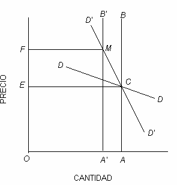
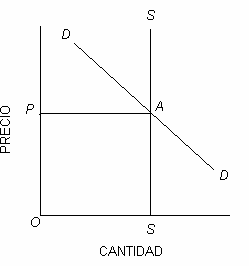
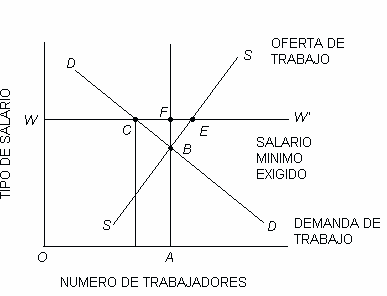
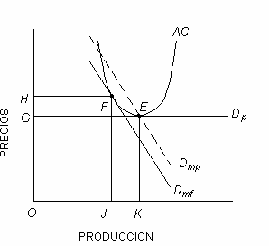
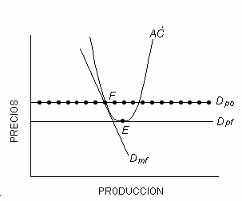
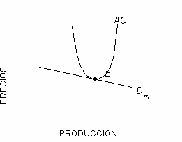
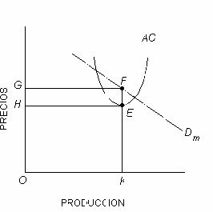

# MONOPOLIO Y COMPETENCIA   Murray N. Rothbard

[web](https://peronia.org/books/monopolio-y-competencia/) |
[markdown](https://peronia.org/books/monopolio-y-competencia/README.md)

[mobi](https://peronia.org/books/monopolio-y-competencia/book.mobi) |
[epub](https://peronia.org/books/monopolio-y-competencia/book.epub) |
[pdf](https://peronia.org/books/monopolio-y-competencia/book.pdf)

[peronia.org](https://peronia.org)

## 1. EL CONCEPTO DE LA SOBERANÍA DEL CONSUMIDOR <a name="bookmark-asterisk-1" href="#footnote-asterisk-1">\*</a>

### A. Soberanía del consumidor versus soberanía individual

Hemos visto que en la economía de mercado libre, la gente tiende a producir aquellos bienes de los que haya más demanda por parte de los consumidores. <a name="bookmark1" href="#footnote1">(1)</a> Algunos economistas han llamado a este sistema “la soberanía del consumidor”. Con todo, esto no implica compulsión alguna. Se trata de una elección que reside única e independientemente en manos del productor, cuya dependencia del consumidor es puramente voluntaria, resultado de su propia elección, con el fin de aumentar todo lo posible la utilidad, y puede decidir en cualquier momento dejarla sin efecto. Muchas veces hemos puesto de manifiesto que el hecho de perseguir el provecho monetario (consecuencia de la demanda del consumidor) es algo a lo cual cada individuo se dedica *sólo en la medida en que no se alteren otras cosas*. Esas otras cosas son las evaluaciones psíquicas individuales del productor, y pueden actuar en contra de las influencias monetarias. Un ejemplo sería el caso del obrero o del dueño de un factor productivo que se dedica a cierto tipo de tarea por una retribución monetaria menor que la correspondiente a otra ocupación cualquiera. Lo hace por la satisfacción que le produce ese trabajo particular y también debido a que le disgustan otras oportunidades.

En lugar de hablar de “soberanía del consumidor”, sería más preciso afirmar que en el mercado libre hay *soberanía del individuo*: soberano en cuanto a su persona y a sus propios bienes. <a name="bookmark2" href="#footnote2">(2)</a> Esto puede denominarse *propia soberanía individual*. Para obtener un provecho monetario, el productor individual tiene que satisfacer la demanda del consumidor, pero el punto hasta el cual persigue ese provecho monetario, y el grado hasta el que se afana por otros motivos no monetarios, son exclusivamente materia librada a su propia elección.

La expresión *soberanía del consumidor* constituye un ejemplo típico del abuso, en materia económica, de un término (soberanía) que sólo es apropiado para el campo *político*. Es un caso ilustrativo para demostrar cuán peligroso resulta el uso de metáforas extraídas de diferentes disciplinas. “Soberanía” indica la calidad del último y definitivo poder político; es el poder que se apoya en el uso de la violencia. En una sociedad auténticamente libre, todo individuo es soberano en cuanto a su persona y bienes y, en consecuencia, tal “autosoberanía” es la que predomina en el mercado. Nadie es “soberano” respecto de los actos o intercambio de cualquier otro. Ya que los consumidores no tienen facultad para ejercer coerción sobre los productores obligándolos a dedicarse a diversas ocupaciones o trabajos, los primeros no son “soberanos” en relación con los últimos.

### B. El profesor Hutt y la soberanía del consumidor

La expresión metafórica “soberanía del consumidor” ha desencaminado aun a los mejores economistas. Muchos la utilizaron como un ideal para contraponer a la pretendida imperfección del sistema de mercado libre. Un ejemplo es el profesor W. H. Hutt, de la Universidad de Capetown, quien ha hecho la defensa más completa del concepto de la soberanía del consumidor.<a name="bookmark3" href="#footnote3">(3)</a> Ya que se trata del creador de este concepto, con uso difundido en la literatura, su artículo merece particular atención. Se lo utilizará como base para hacer la crítica del concepto de la soberanía del consumidor y de sus implicancias con respecto a los problemas que presentan la competencia y el monopolio. En la primera parte de su artículo, Hutt defiende su concepto de la soberanía del consumidor contra la crítica de que no toma en cuenta los deseos de los *productores*. Lo hace afirmando que si un productor desea un *medio* como si fuera un *fin* en sí mismo, resulta que está “consumiendo”. En ese sentido *formal*, como vimos, la soberanía del consumidor, por definición, siempre prevalece. Formalmente, nada hay de objetable en tal definición, pues, como ya lo hemos destacado en otra parte, un individuo valora los fines (el consumo) de acuerdo con su escala de valores, y su valoración de los medios (para la producción) depende de la primera. En ese sentido, pues, el consumo es siempre rector de la producción.

Pero el sentido formal no tiene mayor utilidad para el análisis de la situación en lo referente al *mercado*. Y es precisamente ese sentido el que tienen en cuenta Hutt y otros. Entonces, supongamos que el productor A retraiga del mercado su trabajo, su tierra o el servicio de su capital. Por cualquier razón, ejercita su soberanía sobre su persona y sus bienes. Por otro lado, si lleva aquellos elementos al mercado, se está sometiendo, en cuanto pretende obtener una ganancia monetaria, a las exigencias de los consumidores. Mas la cuestión crítica está en saber: ¿*Cuál* consumidor? ¿El consumidor de bienes intercambiables en el mercado, que los adquiere con dinero, o el productor de bienes intercambiables en el mercado, que los vende por dinero?

Para contestar la pregunta es necesario distinguir entre el “productor de bienes intercambiables” y el “consumidor de los mismos bienes”, ya que por definición el mercado sólo puede comerciar con esos bienes. En suma, podemos designar a las personas como “productores” y como “consumidores” aun cuando todo individuo deba actuar como consumidor y toda persona deba actuar también, en otro sentido, como productor (o como perceptor de un obsequio proveniente de un productor).

Al hacer esta distinción descubrimos que, contra lo expuesto por Hutt, en el mercado libre todos los individuos tienen *propia soberanía* sobre su persona y sus bienes. El productor, y sólo el productor, es quien decide si habrá de mantener sus bienes, y hasta su misma persona, ociosos o no, y si habrá de vender bienes y servicios en el mercado, con lo que el resultado de su producción va a manos de los consumidores a cambio del dinero de éstos. La decisión acerca de cuánto ha de destinar al mercado y cuánto debe conservar en su poder está librada al productor y sólo a él.

Con todo, Hutt reconoce esto en forma implícita, ya que pronto desplaza su argumentación y comienza a sostener caprichosamente la “soberanía del consumidor” como un *ideal ético, que debe servir para juzgar las actividades del mercado libre*. La soberanía del consumidor se convierte casi en lo Bueno Absoluto, y cualquier acto de los productores para contrariar ese ideal se considera poco menos que como una traición moral. Oscilando entre la idea de la soberanía del consumidor como un *hecho necesario* y el concepto contradictorio de la soberanía del consumidor como *ideal*, susceptible de ser violado, Hutt intenta establecer diversos criterios para determinar cuándo ese ideal *se ve* violado. Por ejemplo, afirma que cuando un productor retrae su persona o sus bienes fuera del mercado, obedeciendo al deseo de utilizarlos para su satisfacción como bienes *de consumo*, se trata, en ese caso, de un acto legítimo, al atenerse a la regla a que el consumidor está sujeto. Por otro lado, cuando el productor actúa retrayendo sus bienes con el fin de alcanzar un beneficio monetario mayor que el que de otra manera obtendría (presumiblemente, aunque Hutt no lo dice, sacando ventajas de la curva de demanda no elástica que su producto tenga), incurre en una violación inmoral de la voluntad del consumidor. Puede llegar a ese resultado restringiendo el suministro de su propio producto personal, o la elaboración de un producto similar elaborado por otros, actuando de consuno con ellos para restringir la producción para elevar el precio. Ésta es la doctrina del precio de monopolio, al cual se pretende señalar como el instrumento de que se valen los productores para pervertir su legítima función.

Hutt reconoce la enorme dificultad que existe para distinguir entre los diversos motivos a que obedece el productor en un caso concreto dado. El individuo que retrae su trabajo puede hacerlo para disfrutar de tiempo libre, y hasta el dueño de tierra o capital puede proceder así con el fin de obtener una satisfacción estética al contemplar bienes no utilizados. Suponiendo que exista una *combinación* de motivos en ambos casos, Hutt decididamente se inclina por resolver estas dificultades *negando* al productor el beneficio de la duda, sobre todo en el caso de los bienes.

Pero la dificultad es mucho mayor que lo que Hutt imagina. Todo individuo productor está siempre empeñado en tratar de aumentar todo lo posible su “beneficio psíquico”, en llegar hasta el punto más alto en su escala de valores. Para hacerlo, aquilata, con referencia a esa escala, el beneficio monetario y diversos factores no monetarios, de acuerdo con sus valoraciones particulares. Tomemos, para empezar, al productor como *vendedor de trabajo*. En su juicio acerca de cuánto trabajo habrá de vender y a qué precio, el productor tomará en cuenta el beneficio monetario que obtendrá, el beneficio psíquico derivado del tipo de trabajo y las “condiciones de trabajo”, así como también las horas de ocio a que renuncia; pondrá todo en la balanza, de acuerdo con la influencia que tenga sobre sus diversas utilidades marginales. Por cierto, si puede ganar mayores ingresos trabajando menos, así lo hará, puesto que de este modo también disfrutará de más horas de ocio. Y aquí surge el interrogante: ¿Por qué ha de ser eso algo contrario a la moral?

Más aun: 1) Es *imposible*, no simplemente impracticable, separar el tiempo libre, las horas de ocio, de las consideraciones monetarias, ya que ambos elementos se encuentran entremezclados y nadie más que la persona misma puede conocer el intrincado juego entre sus propias valoraciones. 2) Lo que es más importante, el acto *no* contraría la verdad de que el productor únicamente puede ganar dinero sirviendo a los consumidores. ¿Por qué ha estado en condiciones de obtener un “precio de monopolio” gracias a haber restringido su producción? Sólo porque la demanda de sus servicios (sea directamente por parte de los consumidores mismos, o indirectamente por intermedio de productores de orden inferior <a name="bookmark-asterisk-2" href="#footnote-asterisk-2">\*\*</a>) no tiene carácter *elástico*, de modo que una producción reducida del bien y un precio mayor conducen a mayores inversiones en la adquisición de su producto y, por ello, a un incremento de sus ingresos. Con todo, ese tipo inelástico de demanda es resultado exclusivo de las *exigencias voluntarias* de los consumidores. Si éstos realmente desaprobaran su “acción monopolística”, fácilmente podrían hacer que sus curvas de demanda se volvieran elásticas, procediendo a *boicotear* al productor y también aumentando su demanda en el nivel de la producción “competitiva”. El hecho de que no lo hagan significa que están conformes con el estado de cosas existente y demuestra que ellos, al igual que el productor, se benefician con los intercambios voluntarios que se llevan a cabo.

¿Qué pasa con el productor en su calidad de vendedor de bienes, blanco preferido de la escuela del “antiprecio de monopolio”? Para empezar, el principio es virtualmente el mismo. Los productores individuales pueden restringir la producción y vender su tierra y sus bienes, sea de manera individual o conjunta (por medio de un “cartel”), con el fin de aumentar sus esperados ingresos monetarios, derivados de aquella venta. Una vez más, nada hay en ese procedimiento que sea manifiestamente contrario a la moral. Los productores, siempre que las demás circunstancias permanezcan iguales, intentan acrecentar el ingreso monetario que obtienen de sus factores de producción. Más aun, sólo pueden proceder así *sirviendo a los consumidores*, ya que, una vez más, la venta es voluntaria tanto por parte de los productores como de los consumidores. De nuevo, si tal “precio de monopolio” es establecido, sea por un individuo o por varios que cooperan dentro de un cartel, sólo resulta posible en caso de que la curva de demanda sea de tipo no elástico (por actuación directa o indirecta de los consumidores). Tal inelasticidad *resulta de elecciones puramente voluntarias que hacen los consumidores*

que se esfuerzan por aumentar su satisfacción. d” en cuestión es simplemente un rótulo que se emplea para designar una situación en la que los consumidores gastan más dinero en adquirir un bien cuando el precio es más elevado que el que invertirían si el precio fuera más bajo. Si los consumidores estuvieran realmente en contra de la acción del cartel y si los intercambios resultantes fueran verdaderamente perjudiciales para ellos, “boicotearían” a la empresa o empresas “monopolistas”, disminuirían sus compras de manera que la curva de demanda se convirtiera en elástica, y la empresa se vería obligada a aumentar su producción y a volver a reducir los precios. Si quienes hubieran actuado en procura del “precio de monopolio” fueran empresas reunidas en un cartel y éste no presentara otras ventajas, en el sentido de hacer más eficiente la producción, tendría que disolverse, debido a la nueva elasticidad puesta de manifiesto por la demanda.

Pero, puede preguntarse, ¿acaso no es verdad que los consumidores habrían de *preferir* un precio más bajo y que, en consecuencia, el establecimiento de un precio de monopolio constituye un hecho que “coartaría la soberanía del consumidor”? La respuesta es la siguiente: Por supuesto, los consumidores preferirían precios más bajos; siempre los preferirían. En realidad, cuanto más bajo fuera el precio, más les agradaría. ¿Acaso lo dicho significa que el precio ideal sea cero, o aproximadamente cero, para todos los bienes, debido a que eso representaría el mayor grado de sacrificio por parte de los productores en favor de los deseos de los consumidores?

En su calidad de consumidores, a todas las personas les agradarían precios menores para hacer sus compras; en su calidad de productores, a los hombres les agrada que los precios sean elevadísimos para la venta de sus mercancías. Si la naturaleza hubiera proporcionado originariamente una situación de verdadera utopía, sería un caso en el que todos los bienes susceptibles de intercambios se obtendrían naturalmente y no habría necesidad de trabajo alguno destinado a ganar beneficios monetarios. Tal utopía sería igualmente “preferida”, pero es también una situación puramente imaginaria. El hombre tiene que trabajar necesariamente dentro de un medio ambiente dado que es *real*, de tierra heredada y capital durable.

En *este* mundo no hay más que dos, y sólo dos, maneras de establecer cuáles han de ser los precios de los bienes. Una es el camino del mercado libre, en el que los precios son establecidos en forma voluntaria por cada uno de los individuos que participan en el mercado. En esta situación, los intercambios se realizan en términos de beneficio para todos los que intercambian. El otro camino es la intervención violenta en el mercado, la vía hegemónica en oposición a la contractual. Tal establecimiento hegemónico de los precios significa la exclusión de los intercambios libres y la institución de la explotación del hombre por el hombre, ya que hay explotación siempre que se efectúa un intercambio sujeto a coerción. Si se adopta el camino del mercado libre –el del beneficio mutuo–, no puede haber otro criterio de justicia que el del precio de mercado libre, y esto incluye los pretendidos precios “competitivos” y “de monopolio”, tanto como la actuación de los carteles. En el mercado libre, consumidores y productores regulan sus actos en cooperación voluntaria.

En el caso del trueque, esta conclusión aparece evidente; los diversos productores-consumidores, o bien determinan sus relaciones de mutuo intercambio en el mercado libre o, de lo contrario, los valores quedan fijados por la violencia. No parece haber razón alguna para que sea más o menos “moral”, con cualquier fundamento que se tome, que el precio, en caballos, del pescado, sea más elevado o menor que lo que es en el mercado libre; o, en otras palabras, el motivo por el cual el precio, en pescado, de los caballos, deba ser más alto o más bajo. Con todo, no es menos evidente el caso cuando se pregunta por qué un precio en dinero debe ser mayor o menor que el precio fijado en el mercado. <a name="bookmark4" href="#footnote4">(4)</a>

## 2. LOS CARTELES Y SUS CONSECUENCIAS

### A. Cartel y “precio de monopolio”

Pero ¿acaso no es un acto monopolístico la restricción de la producción, y tal restricción no constituye un acto antisocial demostrable? Empecemos por examinar el caso en que aquel acto aparece en su peor aspecto posible: la destrucción material de parte de un producto, ejecutada por un cartel. Se lleva a cabo para sacar ventajas de una curva de demanda no elástica y con el fin de elevar el precio y obtener mayor beneficio monetario para todo el grupo. Podemos observar, por ejemplo, el caso de un cartel de café que destruye grandes cantidades de ese producto quemándolo.

En primer lugar, tales actos seguramente ocurrirán con muy poca frecuencia. La destrucción material del producto se observa como un acto sumamente ruinoso, hasta para un cartel; resulta obvio que los factores de producción invertidos por los cultivadores para producir café se han gastado en vano. Advertimos que la producción total del café, en sí misma, ha probado ser un error, y el acto de quemarlo sólo es consecuencia y reflejo de tal error. Con todo, debido a la incertidumbre del futuro, a menudo se cometen errores. El hombre podría esforzarse trabajando e invirtiendo durante años en la producción de un bien que, por último, interese poco o nada a los consumidores. Por ejemplo, si el gusto de los consumidores hubiera variado tanto que ninguna persona se interesara por el café, fuese cual fuere su precio, otra vez habría que destruirlo, habiendo cartel o no.

Por cierto, el error es algo infortunado, pero no puede considerárselo como antisocial ni contrario a la moral; nadie se dedica deliberadamente a incurrir en error. <a name="bookmark5" href="#footnote5">(5)</a> Es evidente que si el café fuera un bien no perecedero, el cartel *no* lo destruiría, sino que lo almacenaría para venderlo gradualmente en el futuro a los consumidores, con lo cual sacaría provecho del “excedente”. En una economía de giro uniforme <a name="bookmark-asterisk-3" href="#footnote-asterisk-3">\*\*\*</a>, en la que los errores, por definición, están excluidos, no podría haber destrucción de bienes, ya que las existencias, en cantidad óptima para conseguir ingresos monetarios, se producirían con anticipación. La producción de café sería menor desde el comienzo. *El despilfarro superfluo está en la producción excesiva de café*, a expensas de otros bienes que hubieran podido producirse. *El despilfarro no está en el hecho actual de que el café sea quemado*. Después de disminuir su producción, los demás factores que se hubieran dedicado a sembrar y cosechar café quedan en disponibilidad; la tierra, el trabajo, etcétera, pasarán a empleos diferentes y más productivos. Cierto que el excedente de factores específicos permanecerá sin uso; pero tal es siempre la suerte que corren los factores específicos, cuando la realidad de la demanda de los consumidores no justifica que se los utilice en la producción. Por ejemplo, si se produce una súbita contracción en la demanda consumidora de un bien dado, hasta el punto de que no resulte remunerativo el trabajo con determinadas maquinarias especializadas, esa “capacidad ociosa” *no* constituye un desperdicio desde el punto de vista social, sino que más bien es algo socialmente útil. Queda demostrado que fue un error haber producido esas máquinas, y ahora, cuando están listas, resulta que emplearlas es menos beneficioso que trabajar en otras tierras, con otras maquinarias, para producir algo diferente. En consecuencia, el procedimiento económico está en dejar ociosas aquellas maquinarias, o tal vez en transformar el material de que están construidas para dedicarlo a otros usos. Por supuesto, en una economía libre de todo error no se producen en exceso alguno los bienes de capital específicos.

Supóngase, por ejemplo, que antes de iniciar sus actividades el cartel de café, se estuviera utilizando, para producir 100 millones de libras al año, una cantidad X de trabajo e Y de tierra, y, sin embargo, el cartel de café determinara que la producción más remunerativa es de 60 millones de libras, reduciendo la producción anual a esa cifra. Habría sido absurdo, por supuesto, continuar con una producción excesiva de 100 millones de libras, para luego quemar 40 millones. Pero, ¿qué ocurre ahora con el exceso de tierra y de trabajo? Esos factores se trasladan a la producción de otra cosa, digamos, 10 millones de libras de caucho y 50.000 horas a la prestación de servicios de guías para la selva, etcétera. ¿Quién puede decir que la segunda estructura de producción, la segunda aplicación de los factores, sea menos “justa” que la primera? En verdad, podríamos decir que es *más* justa, puesto que la nueva aplicación de los factores habrá de resultar más provechosa y, de ahí, más *productora de valor* para los consumidores. En el sentido del valor, la producción total habrá quedado, pues, *expandida*, y no contraída. No podríamos decir, evidentemente, que la producción en conjunto se haya *restringido*, pues la de los bienes restantes, fuera del café, ha aumentado, y la única comparación posible entre la disminución de un bien y el aumento del otro tiene que efectuarse en estos amplios términos de valoración. En realidad, el traslado de factores a la producción de caucho y al servicio de guías no *restringe* más la de café que lo que un anterior traslado de factores a la producción de café habría *restringido* la de caucho y el servicio indicados.

Todo el concepto de “restringir la producción” es, pues, una falacia cuando se aplica al mercado libre. En el mundo real, de escasez en cuanto a recursos, comparados con las finalidades posibles, *toda* producción implica elegir y colocar los factores al servicio de aquellas finalidades a las que se atribuya más valor. En suma, la producción de *todo* es siempre y necesariamente “restringida”. Tal “restricción” es una simple consecuencia de la escasez universal de factores y de la decreciente utilidad marginal de todo producto dado. Luego, es absurdo hablar en absoluto de “restricción”. <a name="bookmark6" href="#footnote6">(6)</a>

No podemos decir, entonces, que el cartel haya “restringido la producción”. Después de que la corrección en la aplicación de los factores ha eliminado el error de los productores, los actos del cartel determinan un aumento en los ingresos de éstos por sus servicios a los consumidores; lo mismo ocurre con las demás aplicaciones de los factores de la producción en el mercado libre. Ése es el resultado que la gente tiende a obtener en el mercado, en consonancia con su habilidad como empresarios previsores, y es ésa la única situación en la cual el hombre, como consumidor, se encuentra en armonía con el hombre como productor.

De nuestro análisis se desprende que la producción originaria de 100 millones de libras fue un error lamentable, corregido después por los productores. En lugar de tratarse de una maliciosa restricción de la producción, en detrimento de los consumidores, el proceso descripto es, por el contrario, sólo la rectificación del error en que antes se incurrió. Puesto que únicamente el mercado libre puede destinar los recursos para servir al consumidor, de acuerdo con la rentabilidad monetaria, deducimos que en la situación anterior se estaba produciendo “demasiado” café y “poco” caucho y servicios de guías para la selva, etcétera. El cartel, al reducir la producción de café y determinar un aumento en la de caucho y en diversos servicios, ha conducido a un *incremento* del poder productivo de los recursos destinados a satisfacer los deseos de los consumidores. En caso de que haya anticartelistas en desacuerdo con la afirmación precedente, convencidos de que la estructura productiva *anterior* servía mejor al consumidor, tienen siempre total libertad para efectuar ofertas por la tierra, el trabajo y los factores de capital, quitando tales elementos a los productores de caucho y a las agencias de guías, etcétera, y dedicándose *ellos mismos* a la producción de las presuntamente “faltantes” 40 millones de libras de café. Desde el momento en que *no lo hacen*, están muy mal situados para atacar a los productores de café existentes, en razón de que no adoptan el mismo procedimiento. Como lo ha dicho concisamente Mises: “Los que se dedican a la producción de acero no pueden, ciertamente, ser responsabilizados por el hecho de que otras personas no hayan ingresado a ese campo de la producción [...]. Si alguien merece reproche debido a que no sea mayor el número de quienes han ingresado a la organización voluntaria de la defensa civil, no son, pues, aquellos que ya han ingresado, sino quienes no lo han hecho”. <a name="bookmark7" href="#footnote7">(7)</a> La posición de los anticartelistas implica que alguien está produciendo *demasiado* de algún otro producto; con todo, no ofrecen otro criterio para determinar *cuál* es la producción excesiva que sus propios decretos arbitrarios.

La crítica a los dueños de las empresas productoras de acero, o a los cultivadores de café, porque no producen “suficiente” acero o café implica también la existencia de un sistema de castas por medio del cual hay una permanentemente destinada a producir acero, otra a producir café, etcétera. Sólo en semejante sociedad de castas tendrían sentido las críticas. Sin embargo, el mercado libre es lo inverso de un sistema de clases. En verdad, la elección entre diversas opciones implica la posibilidad de que unas puedan ser sustituidas por otras, y esa movilidad es válida con respecto a los empresarios y los prestamistas que tienen dinero para invertir en la producción.

Además, como ya lo hemos señalado, la curva correspondiente a una demanda no elástica resulta exclusivamente de una elección hecha por los consumidores. Supongamos que se han producido 100 millones de libras de café, las que se encuentran almacenadas, y un grupo de cultivadores, en forma conjunta, decide que quemando 40 millones de libras de café, el precio se duplicará de un grano de oro por libra a dos granos de oro, con lo que recibirán un ingreso total más elevado con su acción concertada. Esto sería algo imposible si los cultivadores de café tuviesen conocimiento de que podrían verse frente a un efectivo boicot por parte de los consumidores cuando rigiera el precio más alto. Más aun, los consumidores disponen de otro camino, *si así lo desean*, para impedir la destrucción del artículo. Varios consumidores, procediendo en forma individual o conjunta, podrían hacer una oferta para comprar el café en existencia *a un precio más alto que el corriente*, a causa de su deseo de tener café, debido a su filantrópica aflicción frente al sacrificio de un artículo útil, o bien por una combinación de ambos motivos. En cualquier caso, si procedieran así impedirían que el cartel de productores disminuyera la oferta para vender en el mercado.

El boicot frente a un precio más alto, así como también el aumento de oferta al precio menor, modificarían la característica de la curva de demanda, convirtiéndola en elástica, al actual nivel de existencias, con lo que se eliminaría todo incentivo o necesidad para la constitución de un cartel.

La consideración del cartel como algo contrario a la moral, o que de cierta manera obstruye una especie de soberanía del consumidor, es, en consecuencia, totalmente infundada. Lo dicho se confirma aun en el aparentemente “peor” de los casos, un cartel que supuestamente se ha formado “sólo” con propósitos destructivos y en el cual, como consecuencia de un error anterior y del carácter perecedero de los artículos, se lleven a cabo destrucciones materiales. Si los consumidores realmente quieren impedir tal cosa, no tienen más que modificar el tipo de su demanda con respecto al producto, sea mediante un cambio efectivo en su afición por el café, sea por medio de una acción de boicot y filantropía combinadas. El hecho de que en ninguna circunstancia se adopte tal procedimiento significa que los productores aún maximizan sus ingresos monetarios sirviendo al consumidor mediante la intervención del cartel, tanto como por cualquier otro método. Algunos lectores podrán objetar la mayor demanda de los consumidores frente a las existencias disponibles como soborno a los productores, lo que constituye una forma de extorsión injustificable. Esa imputación no puede sostenerse. Los productores persiguen el propósito de aumentar todo lo posible sus beneficios monetarios; no extorsionan, simplemente tratan de producir en el punto en que sus ganancias son mayores, por intermedio de intercambios voluntariamente acordados, tanto por parte de los productores como de los consumidores. Aquí hay tanta extorsión como en el caso de un trabajador que se traslada de una ocupación no muy bien retribuida a otra en la cual el salario es más elevado, o en el de un empresario que se dedica a un proyecto por juzgarlo más provechoso que otro.

Debe reconocerse que, una vez cometido un error, como en el caso antes contemplado, el procedimiento racional no consiste en lamentarse por lo pasado ni en intentar “recuperar” costos anteriores, sino en sacar la mejor ventaja posible (*ceteris paribus*, la mayor cantidad de dinero) dentro de la situación que se presenta. Esto fue planteado en el caso de maquinarias o de otros bienes de capital, producidos con anterioridad, frente a una disminución de la demanda respecto de lo que producen. Como lo hemos visto en el proceso de producción, las energías laborales actúan sobre factores naturales y otros anteriormente elaborados, para obtener los artículos que con mayor urgencia requiere la demanda de los consumidores. Ya que el error es algo inevitable, ese proceso puede concluir acumulando considerable cantidad de bienes de capital “inactivo” en cualquier momento dado. Así también, mucho suelo quedará inactivo debido a que el factor trabajo encuentra tareas más provechosas en otras tierras. Para terminar, el café acumulado está “inactivo” como consecuencia de un error de previsión y no debería ser considerado más criticable o reprensible que la “capacidad ociosa” referente a cualquier otro tipo de bienes de capital.

Lo que sostenemos es igualmente aplicable a una empresa individual, productora de un artículo único, con demanda inelástica, y a un cartel de empresas. Una empresa cuyo producto tiene demanda inelástica podría también destruir individualmente parte de sus existencias de mercancía después de haber cometido un error en sus previsiones.

Nuestras críticas a la doctrina de “oposición al precio de monopolio” y de la “soberanía del consumidor” son igualmente aplicables al caso de la acción individual.

### B. Carteles, fusiones y sociedades de capitales

Un argumento común califica de colusión lo que el cartel hace, puesto que una empresa puede conseguir un “precio de monopolio” por medio de su habilidad natural o del entusiasmo del consumidor por su particular producto, mientras que un cartel de varias empresas, según se pretende, contiene elementos “colusivos” y “conspirativos”. Sin embargo, esas expresiones no son sino términos emotivos, destinados a provocar una reacción desfavorable. Hay en realidad una *cooperación* con el fin de acrecentar los beneficios de los productores. Porque, ¿cuál es esencialmente la acción del cartel? Cierta cantidad de productores individuales acuerdan reunir sus fortunas en un conjunto común, y la organización central unificada debe tomar decisiones, en cuanto a políticas de producción y precios, por cuenta de todos los dueños, distribuyendo luego entre ellos las ganancias monetarias. Pero, ¿*acaso no es ése el mismo procedimiento que sigue cualquier clase de sociedades, o una sociedad de capitales, individualmente*? ¿Qué ocurre cuando se forma una sociedad común o de capitales? Distintos individuos acuerdan reunir sus bienes bajo una gerencia central, que debe fijar la política por cuenta de los dueños y distribuir entre ellos los beneficios monetarios. En ambos casos, la reunión de bienes, el ejercicio de la autoridad y la distribución de ganancias se llevan a cabo de acuerdo con reglas acordadas entre todos desde el comienzo. *Luego, no hay diferencia esencial entre un cartel y una sociedad común de capitales o de personas*. Podría objetarse que las sociedades comunes sólo comprenden a *una* empresa, mientras que el cartel incluye a la totalidad de una “industria” (o sea, a todas las empresas que producen cierto artículo). Pero tal distinción no es necesariamente válida. No hay obstáculo para que varias empresas se rehúsen a ingresar en un cartel, en tanto que, por otro lado, una sola empresa bien puede ser “monopolista” en la venta de su artículo particular y único, con lo que llega a dominar una “industria” entera.

La similitud entre una sociedad integrada para cooperar o una de capitales –que en general no se consideran reprensibles– y un cartel resulta más evidente si se observa el caso de la *fusión* entre varias empresas. Las fusiones han sido tachadas de “monopolistas”, pero no con tanta vehemencia como los carteles. Las empresas que se fusionan reúnen sus bienes de capital, y los dueños de las empresas individuales se convierten parcialmente en dueños de la nueva empresa fusionada. Acordarán las normas con respecto a la proporción en que deben intercambiarse las acciones de las diversas empresas. En caso de que las empresas fusionadas comprendan a toda la industria, la fusión no es otra cosa que una forma permanente de cartel. La única diferencia entre una fusión y la *originaria formación de una única sociedad de capitales* resulta clara: la fusión reúne bienes de capital ya existentes, mientras que, en su nacimiento originario, la sociedad de capitales reúne bienes en *dinero*. Es evidente que, desde el punto de vista económico, la diferencia es escasa. Una fusión es un acto realizado por personas, cada una con cierta cantidad de bienes de capital ya producidos, que se someten a un ordenamiento respecto de las condiciones actuales y las futuras que se esperan, reuniendo aquellos bienes para actuar en colaboración.

La formación de una nueva compañía implica un ordenamiento destinado a regir situaciones futuras esperadas (antes de haberse incorporado bienes de capital) a través de la reunión de bienes en forma cooperativa. La similitud esencial reside en que se trata siempre de una reunión voluntaria de bienes dentro de una organización más centralizada, con el propósito de aumentar los beneficios monetarios.

Aquellos teóricos que atacan tanto a carteles como a monopolios no reconocen la identidad de las actividades que hemos analizado. El resultado es que una fusión se considera menos reprensible que un cartel e, individualmente, una sociedad de capitales, muchísimo menos peligrosa que una fusión. Con todo, la fusión que abarque a toda una industria es, en su efecto, un cartel permanente, una fusión y combinación permanentes. En cambio, un cartel que por acuerdo voluntario mantenga la identidad separada de cada empresa es por naturaleza un arreglo sumamente transitorio y efímero, con tendencia, como en general veremos más adelante, a desintegrarse en el mercado. La realidad es que, en muchos casos, un cartel puede considerarse simplemente como un paso de sondeo hacia una fusión de carácter permanente. Y, como hemos visto, no hay diferencia esencial entre una fusión y la originaria formación de una sociedad de capitales. La primera es la adaptación –en dimensión y número– a condiciones nuevas de las empresas que actúan en una industria, o es la corrección de un error de previsión en que antes se incurrió. La segunda consiste en una tentativa inicial de adaptación a las condiciones actuales y futuras del mercado.

### C. Economía, tecnología y dimensión de la empresa

Desconocemos, y la ciencia económica no puede informarnos al respecto, cuál es la dimensión óptima de una empresa en una industria dada. Esa dimensión óptima depende de las circunstancias tecnológicas que se presenten en cada situación,

tanto como del estado en que se encuentre la demanda de los consumidores en relación con la oferta de los diversos factores dentro de la industria de que se trate y dentro de las demás industrias. Todos estos complejos asuntos influyen sobre las decisiones que adoptan los productores y, al final, los consumidores, con respecto a la dimensión que deben tener las empresas en las diversas ramas de la producción. Poniéndose a tono con la demanda del consumidor y con los costos de oportunidad de los diversos factores, los propietarios de los factores y los empresarios se dedicarán a producir en aquellas industrias y empresas en que puedan maximizar su beneficio monetario (manteniendo constantes los demás factores psíquicos). Ya que prever es función que corresponde a los empresarios, aquellos que hayan de tener éxito deberán reducir sus errores cuanto sea posible, con el fin de que igualmente se reduzcan sus pérdidas. De lo dicho resulta que *en el mercado libre toda situación tenderá a presentarse como la más favorable que se pueda alcanzar para satisfacción de la demanda del consumidor (incluyendo las aspiraciones no monetarias de los productores)*.

Ni los economistas ni los ingenieros pueden decidir con respecto a la dimensión más eficiente para una empresa, en ninguna de las situaciones que puedan presentarse. Sólo los empresarios mismos están en condiciones de determinar cuál es la dimensión en que la empresa puede funcionar con mayor eficiencia y es presuntuoso e infundado que los economistas, o cualquier otro observador de afuera, pretenda dar normas al respecto. En éste, como en otros asuntos, los deseos y exigencias de los consumidores son “telegrafiados” a través del sistema de precios, y el esfuerzo que de ahí resulte por obtener todo el beneficio y ganancia monetaria posibles siempre tiende a determinar que se produzca el mejor destino de los factores productivos y la fijación de precios óptima. No hay necesidad de consejos externos por parte de los economistas.

Claro es que, cuando varios millares de individuos resuelven *no* producir ni ser dueños personalmente de fábricas de acero, sino, en cambio, integrar una sociedad de capitales organizada – que habrá de comprar los factores, hacer inversiones y dirigir la producción, como también vender el producto, para luego distribuir las ganancias monetarias entre los dueños–, ellos están aumentando enormemente su eficiencia. Comparada con la de cientos de pequeñas fábricas, la cantidad de producción, en relación con los factores empleados, se incrementará de modo considerable. La gran empresa estará en condiciones de adquirir maquinarias que representan capitales importantes y de realizar también el esfuerzo financiero necesario para disponer de mejores organizaciones de comercialización y distribución. Todo esto resulta evidente cuando se trata de millares de individuos que reúnen su capital para formar una empresa de aceros. ¿Y por qué no ha de ser igualmente cierto cuando *varias empresas de aceros se fusionan en una compañía grande*? Podría replicarse que en esa fusión, en especial en el caso de un cartel, la acción conjunta responde, no al propósito de aumentar la eficiencia, sino únicamente al de incrementar las ganancias por medio de la restricción de las ventas. Sin embargo, no hay manera alguna de que un observador, desde afuera, pueda distinguir entre una actividad “restrictiva” y otra que se aplique al acrecentamiento de la eficiencia. En primer lugar, no se puede pensar que las plantas o fábricas constituyan los únicos factores productivos cuya eficiencia es susceptible de aumentar; la comercialización, la publicidad, etcétera, son también *factores de producción*, puesto que “producción” no es sólo la transformación física de un producto, sino asimismo su colocación y transporte hasta llegar a manos de los usuarios. Esto último incluye tanto los gastos requeridos para informar a los usuarios acerca de la existencia y naturaleza del producto, como la venta. Puesto que un cartel se dedica siempre a la comercialización en conjunto, ¿cómo podría negarse que se encuentra en condiciones de conducir a una comercialización más eficiente? Por tal motivo, ¿cómo es posible separar esa eficiencia del aspecto “restrictivo” que tiene el procedimiento? <a name="bookmark8" href="#footnote8">(8)</a>

Más aun, jamás debe considerarse que los factores tecnológicos de la producción actúan en un vacío. El conocimiento tecnológico nos enseña todo un conjunto de alternativas que se presentan ante nosotros. Pero las cuestiones esenciales: ¿en qué se debe invertir?, ¿cuánto?, ¿qué método de producción adoptar?, sólo tendrán respuesta en relación con consideraciones de índole económica, o sea, *financiera*. Sólo pueden contestarse dentro de un mercado que funciona impulsado por el deseo de obtener ingresos y ganancias en dinero. Entonces, ¿cómo adoptará decisiones el productor respecto de los materiales que debe utilizar para la construcción de un túnel subterráneo? Desde el ángulo puramente tecnológico, lo mejor sería el platino sólido, por ser el de mayor duración, etc. Pero ¿acaso eso significa que deba elegir el platino? Únicamente puede elegir entre factores, métodos, bienes a producir, etcétera, haciendo una comparación entre las inversiones monetarias requeridas (que son iguales al rédito que los factores podrían devengar en cualquier otra parte) y el ingreso monetario que se espera de la producción. Sólo a través de maximizar el beneficio monetario se logra que los factores se pongan al servicio de los consumidores; de otra manera, y con fundamentos puramente tecnológicos, nada podría impedir la construcción por todo el continente de subterráneos hechos de platino. La única razón que lo impide es, en las condiciones actuales, el elevado “costo” en dinero cuando se malgastan factores y recursos al desviarlos de aplicaciones más urgentemente demandadas por los consumidores. Pero esa urgente demanda alternativa –y así *el hecho de malgastar*– sólo puede descubrirse si la registra un sistema de precios activado por el afán de los productores de obtener beneficios en dinero. Nada más que la observación empírica del mercado puede revelarnos el absurdo de construir un subterráneo transcontinental fabricado con platino.

Además, no hay unidades físicas con ayuda de las cuales comparar los diferentes tipos de factores y productos físicos. Así, supóngase que un productor intente determinar cuál es la utilización más eficiente que puede dar a dos horas de su trabajo. En un momento de romanticismo, trata de aquilatar la eficiencia en cuestión, absteniéndose por completo de tomar en cuenta toda “sórdida” consideración de ganancia monetaria. Supongamos que se ve frente a tres alternativas tecnológicas conocidas: las consignamos en la siguiente tabla:

| FACTORES           | PRODUCTO            |
| ------------------ |:--------------------|
| &nbsp;             | &nbsp;              |
| A                  |                     |
| 2 horas de trabajo |                     |
| 5 libras de yeso   | : 1 vasija          |
| 1 hora de horno    |                     |
| &nbsp;             | &nbsp;              |
| B                  |                     |
| 2 horas de trabajo |                     |
| 1 trozo de madera  | : 1 pipa            |
| 1 hora de horno    |                     |
| &nbsp;             | &nbsp;              |
| C                  |                     |
| 2 horas de trabajo |                     |
| 1 trozo de madera  | : 1 modelo de barco |
| 1 hora de horno    |                     |
| &nbsp;             | &nbsp;              |

¿En cuál de esas alternativas, A, B o C, se encuentra la manera más eficiente, más tecnológicamente “útil” para la aplicación de su trabajo? Es evidente que el productor “idealista”, con espíritu de sacrificio, ¡*no dispone de medio alguno para averiguarlo*!, no tiene ninguna manera racional de decidir si ha de producir la vasija, la pipa o el barco. Sólo el productor “egoísta”, que busca su propio provecho, tiene a su alcance un medio racional para decidir en lo que respecta a la aplicación de su trabajo. En la búsqueda del mayor beneficio monetario posible, el productor compara los costos en dinero (inversiones necesarias) de los diversos factores con los precios de los productos. Considerando los casos A y B, por ejemplo: si la adquisición del yeso y de una hora de horno costara una onza de oro y la vasija pudiera venderse por 2 onzas de oro, su trabajo le reportaría una onza de oro. Por otro lado, si la madera y la hora de horno le costaran 1 ½ onza de oro y la pipa pudiera venderse por 4 onzas, ganaría 2 ½ onzas de oro con sus dos horas de trabajo, y elegiría producir el último artículo. Los precios, tanto del producto como de los factores, son reflejo de la demanda de los consumidores y de los intentos que hace el productor de ganar dinero sirviendo al consumidor. La única manera en que el productor podría determinar el artículo a producir es comparar las ganancias monetarias esperadas. En caso de que el modelo de barco se vendiera por 5 onzas, habría de producir el barco y no la pipa, satisfaciendo así una demanda más urgente del consumidor, tanto como su propio deseo de obtener ganancias monetarias.

No puede haber, entonces, una separación entre la eficiencia tecnológica y las consideraciones de índole financiera. La única manera de establecer si un producto tiene más demanda que otro y si un proceso de fabricación es más eficiente que otro es recurrir a la actuación concreta del mercado libre. Podemos, por ejemplo, considerar evidente de por sí que la dimensión óptima de una fábrica de acero sea mayor que la de una peluquería. Pero esto no lo sabemos por ser economistas, mediante un razonamiento praxeológico o elaborado *a priori*, sino exclusivamente a través de la observación empírica del mercado libre. No hay medio por el cual los economistas u otros observadores de afuera puedan fijar el estado tecnológico óptimo de ninguna fábrica o empresa. Eso únicamente se puede hacer en el mercado. Ahora bien, siendo lo anterior una verdad en general, también es cierto en los casos específicos de las fusiones y los carteles. La imposibilidad de aislar un elemento tecnológico se pone en mayor evidencia recordando que el problema crítico no es la dimensión de la *fábrica*, sino la de la *empresa*. Ambas expresiones no significan en modo alguno la misma cosa. Cierto es que la empresa habrá de tener en vista la fábrica de dimensiones óptimas, cualquiera que sea la escala en que opera, y además que, *ceteris paribus*, una fábrica de mayores dimensiones requerirá una empresa de mayor dimensión. Pero el alcance de sus decisiones se extiende a un campo mucho más amplio: cuánto se debe invertir, qué bienes deben producirse, etcétera. Una empresa puede abarcar una o más fábricas o productos, y siempre contiene lo relacionado con la comercialización, la organización financiera, etcétera, a todo lo cual no se presta atención cuando se tiene en vista sólo la fábrica. <a name="bookmark9" href="#footnote9">(9)</a>

Diremos, de paso, que estas consideraciones sirven para refutar la muy frecuente distinción entre “producción para uso” y “producción para obtener ganancia”. En primer lugar, *toda* producción es para uso; de otro modo no se llevaría a cabo. En la economía de mercado esto casi siempre significa bienes para el uso de otros, los consumidores. Sólo se puede obtener beneficio prestando servicios a los consumidores mediante la producción de bienes. Desde otro punto de vista, no puede haber producción que sea racional, por encima del más primitivo de los niveles, basada únicamente en consideraciones de carácter tecnológico o utilitario, haciendo abstracción de la ganancia monetaria. <a name="bookmark10" href="#footnote10">(10)</a>

Es importante que se comprenda bien qué es lo que *no* hemos dicho en esta sección. No hemos dicho que los carteles han de ser siempre más eficientes que las empresas individuales, ni que las “grandes” empresas han de ser siempre más eficientes que las pequeñas. La conclusión a que hemos llegado se refiere a que la ciencia económica sólo puede hacer pocas afirmaciones válidas en cuanto a la dimensión óptima de una empresa, *como no sea* la de que el mercado libre se acercará todo lo posible a la prestación del máximo servicio a los consumidores, sea considerando la dimensión de una empresa o cualquier otro aspecto de la producción. Todos los problemas concretos que presenta la producción: dimensión de la empresa, de la industria, la ubicación, los precios, la cantidad y naturaleza de los bienes producidos, etcétera, deben ser resueltos por los empresarios, no por los economistas.

No debemos abandonar el problema de la dimensión de la empresa sin considerar una preocupación muy común entre quienes escriben sobre economía: ¿Qué hacer en el caso de que la curva de costo medio de una empresa continúe bajando indefinidamente? ¿Acaso de ese modo la empresa no llegaría a ser tan grande como para constituir un “monopolio”? Suele señalarse, con mucho pesar, que en esa situación la competencia se “derrumba”. Gran parte del énfasis que se pone al presentar este problema proviene, sin embargo, de la preocupación por el caso de la “competencia pura”, la cual, como después veremos, es sólo una ficción inaceptable. En segundo lugar, es obvio que jamás empresa alguna ha sido o puede llegar a ser infinitamente grande; de modo que los obstáculos limitativos –los costos en ascenso, o disminuyendo con menos rapidez– tienen que aparecer en cualquier momento, de alguna manera y en forma considerable, en toda empresa. <a name="bookmark11" href="#footnote11">(11)</a> En tercer lugar, es evidente que si una empresa, mediante una mayor eficiencia, llega a obtener en cierto sentido un “monopolio” dentro de su industria, alcanza ese resultado, en el caso que examinamos (la disminución en el costo medio), con la rebaja de sus precios y con beneficio para los consumidores. Y si aquello que tiene de malo el “monopolio” fuera precisamente la restricción de la producción y el aumento de los precios (acerca de lo cual todos los teóricos que atacan el monopolio están de acuerdo), es obvio que nada podría haber de malo en un “monopolio” al que se llegara siguiendo un camino diametralmente opuesto. <a name="bookmark12" href="#footnote12">(12)</a>

### D. La inestabilidad del cartel

El análisis permite verificar que el funcionamiento de un cartel es inherentemente falto de estabilidad. Si a la larga se demuestra que la reunión de capitales para una causa común es provechosa para cada uno de los integrantes individuales del cartel, éstos procederán formalmente a *fusionarse* en una sola gran empresa, con lo cual el cartel desaparecerá. En cambio, si la acción conjunta demuestra no ser provechosa para uno o más de los integrantes, la empresa o empresas disconformes se separarán del cartel y, como veremos enseguida, cualquier acto independiente de esta índole casi siempre destruye el cartel. La forma cartel es, pues, propensa a tener un carácter muy inestable y está sujeta a fácil desintegración.

Si la actuación conjunta es el procedimiento más eficaz y eficiente para cada uno de los integrantes, pronto habrá de tener lugar una fusión. El mismo hecho de que cada una de las empresas que integran el cartel conserve su independencia potencial significa que en cualquier momento puede resolverse la separación. El cartel tiene que adjudicar totales de producción y cuotas a cada una de las empresas que lo constituyen. Ello tiene probabilidades de conducir a no pocas disputas entre las empresas acerca de la asignación de las cuotas, y cada uno de los integrantes tratará de conseguir una participación mayor. Toda cuota básica que se asigne tendrá necesariamente que ser arbitraria y estará siempre sujeta a ser cuestionada por uno o más integrantes. <a name="bookmark13" href="#footnote13">(13)</a> En una fusión, o en la formación de una sociedad de capitales, los accionistas, por resolución de la mayoría, forman una organización capacitada para adoptar resoluciones. En el caso de un cartel, en cambio, se producen disputas entre entidades que tienen derechos de propiedad independientes.

Particularmente propensos a rebeldía dentro de la acción de conjunto que se imponga, se encontrarán aquellos productores más eficientes, cuyos deseos los impulsarán a expandir sus negocios y no verse obstaculizados por limitaciones y cuotas, destinadas a proteger a sus competidores menos eficientes. Claro está que serán las empresas más eficientes las que habrán de provocar la disolución del cartel. Esto será cada vez más real a medida que pase el tiempo y se modifiquen las condiciones que imperaban cuando se formó el cartel. Las cuotas, los arreglos celosamente consumados, que anteriormente les parecían plausibles a todos, se convierten después en intolerables restricciones que perjudican a las empresas más eficientes y el cartel pronto queda disuelto, porque una vez que una empresa decide separarse, aumenta su producción y reduce los precios, las demás tienen que seguirla.

En caso de que el cartel no se desintegre desde adentro, es todavía más probable que se disuelva por influencia externa. En la medida en que haya conseguido inusitados beneficios de monopolio, habrá más empresas y productores, entre los que estén fuera, dispuestos a dedicarse al mismo ramo de producción. En suma, lo que ocurre es que los de afuera se precipitan a sacar ventaja de los beneficios más elevados. Pero una vez que un fuerte competidor se presenta a desafiar al cartel, este último está perdido. Dado que las empresas que lo integran se encuentran atadas por las cuotas de producción, al verse obligadas a vigilar la expansión de los nuevos competidores y a quitarles ventas a ritmo acelerado, el resultado es que el cartel tiene que disolverse bajo la presión de la nueva competencia. <a name="bookmark14" href="#footnote14">(14)</a>

### E. Libre competencia y carteles

Existen otros argumentos que los adversarios de los carteles esgrimen para desacreditar su actuación. Una tesis afirma que hay cierta perversidad en el hecho de que empresas que antes eran competidoras lleguen a unirse, es decir, en la “restricción de la competencia” o del “comercio”. Se supone que tales restricciones perjudican la libertad de elección del consumidor. Como lo dice Hutt en el artículo citado anteriormente: “Los consumidores son libres [...] y es factible la soberanía del consumidor, tan sólo en la medida en que exista la facultad de sustituir”.

Empero, con seguridad se trata de una concepción completamente equivocada del significado de la libertad. Crusoe y Viernes, al regatear en una isla desierta, tienen muy poca “medida” o “facultad” de elección; la facultad de sustitución de que disponen es limitada. Sin embargo, si no se interpone ningún otro en lo relativo a sus personas o bienes, ambos son completamente *libres*. Pretender lo contrario significa incurrir en la falacia de confundir la libertad con la abundancia o con la diversidad de las elecciones posibles. *Ningún productor individual es responsable o puede responder por la facultad de sustitución de que los demás dispongan*. Ningún productor de acero o cultivador de café, sea que actúe individual o conjuntamente, puede verse obligado a responder, ante persona alguna, por el hecho de haber resuelto no producir más. Si el profesor X o el consumidor Y creen que no hay bastantes productores de café, o que no es suficiente lo que ellos producen, tales críticos tienen libertad para dedicarse a los negocios de acero o café en la forma en que les parezca mejor, con lo que aumentarán tanto el número de competidores como la cantidad del bien producido.

En caso de que la demanda de consumo realmente hubiera justificado la existencia de más competidores, más cantidad o mayor diversidad de productos, los empresarios habrían aprovechado la oportunidad de sacar provecho satisfaciendo aquella demanda. El hecho de que no se dé ningún caso en que tal cosa ocurra demuestra la inexistencia de esa demanda por parte de los consumidores. De esta verdad se desprende que *no hay acciones humanas que puedan mejorar la satisfacción de la demanda del consumidor en mayor medida que la actuación del mercado libre de trabas*.

La confusión entre la libertad y la abundancia se origina en un error de distinción entre las condiciones que la naturaleza ofrece y las a*cciones humanas encaminadas a transformar la naturaleza*. En un estado de naturaleza indomada no existe abundancia; en verdad, si hay algunos bienes, éstos son pocos. Crusoe se encuentra en completa *libertad*, y sin embargo, a punto de perecer de inanición. Por supuesto, para todo el mundo sería más grato el caso en que las condiciones ofrecidas por la naturaleza significaran mucho mayor abundancia; pero ésas son vanas fantasías. Frente a la naturaleza, éste *es* el mejor de los mundos posibles, debido a que es el *único* posible. La situación del hombre sobre la Tierra es tal, que tiene que trabajar dentro de las condiciones dadas y mejorarlas por medio de la acción humana. *Es reflexión que corresponde referir a la naturaleza, no al mercado libre, la de que todo el mundo tiene “libertad para morirse de hambre”*.

La ciencia económica demuestra que los individuos que entran en relaciones mutuas en un mercado libre, dentro de una sociedad libre –y sólo con esa clase de relaciones–, pueden favorecer el nacimiento de la abundancia para sí y para la sociedad entera (en este trabajo la palabra “libre” siempre se usa en el sentido impersonal de no verse molestado por otras personas). El empleo de la expresión libertad, como si en sí fuera equivalente a abundancia, dificulta la comprensión de las verdades expuestas.

En el mundo de la producción, el mercado libre puede calificarse como de “libre competencia” o “libre entrada”, para significar que en una sociedad libre todo el mundo tiene libertad para competir y producir en cualquier terreno que elija. “Libre competencia” es la aplicación de la libertad al ámbito de la producción: libertad de comprar, vender y transformar los propios bienes sin intromisión violenta de ningún poder externo.

Hemos visto antes que en un régimen de competencia libre, la satisfacción de los consumidores tiende a maximizarse, dentro de las condiciones naturales existentes. Quienes hacen mejor sus previsiones tienen posibilidad de surgir como empresarios destacados, y si alguno ve una oportunidad no aprovechada, está en libertad para sacar ventaja de su mejor capacidad especulativa. El régimen que tiende a la mayor satisfacción del consumidor no es, pues, el de la “competencia pura” o “perfecta” o el de la “competencia sin acción cartelista”, <a name="bookmark15" href="#footnote15">(15)</a> ni el de otra cosa que no sea simplemente *libertad económica*.

Ciertos críticos hacen la imputación de que en un sistema de mercado libre no existe “verdadera” libertad de acceso o de competencia. Dicen: ¿Cómo puede alguien competir o tener entrada a un determinado campo de producción en el que se requiere una enorme cantidad de dinero para la adquisición de fábricas y constitución de empresas? Fácil es tener “acceso” a la “industria” de los carritos de mano, debido a que requiere tan escaso capital; pero es casi imposible establecer una nueva fábrica de automóviles, con las elevadas inversiones de capital que se requieren para ello.

Este argumento no es más que una nueva variante de la confusión que impera entre libertad y abundancia. En este caso, la abundancia se refiere al capital en dinero que una persona haya sido capaz de acumular. Todos tienen completa libertad para convertirse en jugadores de béisbol, pero tal libertad no implica que se debe llegar a ser tan buen jugador de béisbol como el vecino, ya que los límites del campo o capacidad de acción de un hombre dependen de su habilidad y del valor de intercambio que sus cualidades tengan. Se trata de algo completamente diferente de su libertad. Como lo hemos dicho ya, a largo plazo, la sociedad libre conduce a la abundancia general, y la libertad es condición necesaria para que tal abundancia se concrete. Pero ambas cosas deben permanecer conceptualmente distintas, sin incurrir en confusiones que pueden provocarse con expresiones tales como “verdadera libertad” o “libertad real”. En consecuencia, el hecho de que todo el mundo tenga “libertad” para ingresar en una industria no significa que todos estén *capacitados* para ello, ni en materia de cualidades personales ni en lo relativo a capital monetario. En las industrias que requieren mayor capital habrá menos gente que se encuentre en condiciones de aprovechar la libertad que tiene para instalar una empresa nueva, en comparación con el caso de las industrias que necesitan menos capital. Precisamente, ocurre lo mismo cuando son menos los obreros en condiciones de hacer uso de su libertad para ingresar en ocupaciones altamente especializadas que los que pueden ingresar a puestos que exigen capacitación menor. No hay, pues, nada misterioso en ninguna de las dos situaciones.

En realidad, la falta de capacidad tiene mucho mayor importancia en el caso de los trabajadores que en el de la competencia en el terreno empresario. ¿Qué son los dispositivos modernos, tales como las sociedades de capital, sino medios para que muchas personas reúnan sus capitales, sean éstas más o menos acaudaladas? La “dificultad” de hacer inversiones en una nueva empresa de automóviles no debiera considerarse referida a los cientos de millones de dólares que se requieren en la inversión total, sino relacionada con algo así como cincuenta dólares, destinados a la compra de una acción. Pero el caso es que, en tanto el capital puede ser reunido, comenzando por las unidades más pequeñas, la habilidad para desempeñar tareas laborales no puede ser reunida.

Hay casos en los cuales la argumentación llega a extremos absurdos. Por ejemplo, a menudo se afirma que hoy, en nuestro mundo moderno, las empresas son tan grandes que la gente nueva no puede entrar a competir o dedicarse a la industria, porque le resulta imposible conseguir el capital necesario. Estos críticos no parecen ver que el conjunto de capitales y riquezas de los individuos se ha elevado junto con el aumento en la cantidad de riqueza que se requiere para poner en marcha una nueva empresa. En realidad, son dos caras de la misma moneda. No hay razón alguna para suponer que fuera más fácil conseguir el capital requerido para poner en marcha un nuevo almacén minorista hace muchos siglos, que lo que es hoy la obtención de capital para una nueva empresa de automóviles. Si hay capital suficiente para la financiación de las grandes empresas que hoy existen, lo habrá también para financiar una más; en verdad, el capital que se encuentra en las grandes empresas existentes en la actualidad podría ser retirado y trasladado a otras nuevas, si se advirtiera la necesidad de ellas. Por supuesto, si se trata de una empresa nueva que no ha de producir ganancias y, por eso, que no ha de prestar servicios a los consumidores, fácil es darse cuenta del motivo por el cual, en el mercado libre, tiene que existir poca disposición para embarcarse en semejante aventura. A nadie debería sorprender que en el mercado libre exista desigualdad en cuanto a capacidad o ingreso monetario. Como vimos, los hombres no son “iguales” en sus gustos, intereses, habilidades o ubicaciones. Los recursos no se encuentran distribuidos de una manera “igual” sobre la Tierra. <a name="bookmark16" href="#footnote16">(16)</a> Esa desigualdad o diversidad en habilidades y distribución de recursos determina en el mercado libre la desigualdad de los ingresos. Y ya que los bienes monetarios de un hombre provienen de sus habilidades y de las de sus antepasados para prestar servicio a los consumidores dentro del mercado, nada hay de sorprendente en que exista *del mismo modo* desigualdad de riqueza monetaria.

La expresión “libre competencia” resultará, pues, equívoca a menos que se interprete como que significa libertad de acción, es decir, libertad para competir o no competir, según sea la voluntad de los individuos.

Del examen precedente debería haber resultado claro que no hay nada que sea particularmente reprensible ni contrario a la libertad del consumidor en el establecimiento de un “precio de monopolio” ni en la actuación de un cartel. Tratándose de un cartel voluntario, su actividad no puede perjudicar a la libertad de competir y, si resulta provechosa, más bien *beneficia* a los consumidores en lugar de causarles perjuicio. Se encuentra en perfecta consonancia con la existencia de una sociedad libre, con la propia soberanía individual y con el hecho mismo de ganar dinero prestando servicios a los consumidores.

A esa conclusión llega en forma brillante Benjamín R. Tucker cuando trata el problema de los carteles y la competencia:

> “El derecho de cooperar es tan incuestionable como el derecho de competir; el derecho de competir incluye el de abstenerse de entrar en competencia; a menudo la cooperación es un método para competir, y la competencia, desde el punto de vista más amplio, es un método para cooperar [...] ambos derechos constituyen un ejercicio de la voluntad individual, legítimo, ordenado y no invasivo, dentro de la ley social de igualdad en la libertad [...]. Contemplado a la luz de estas irrefutables proposiciones, el trust, pues, como toda otra combinación industrial para tratar de hacer en forma conjunta lo que todo integrante de la combinación podría esforzarse individualmente por realizar, es *per se* una institución inobjetable. El ataque, control o negación respecto de esta forma de cooperación, con el fundamento de que, en sí, impide la competencia, es un absurdo, y lo es porque contiene redundancia en lo que prueba. *El trust no es una negación de la competencia en ningún otro sentido que no sea aquel en que la competencia se niegue a sí misma* [la bastardilla es nuestra]. El trust niega la competencia sólo por el hecho de que produce o vende más barato que lo que pueden hacerlo quienes se encuentran fuera de él; pero es el caso que, en ese sentido, todo competidor individual que tiene éxito niega también la competencia [...]. El hecho es que existe una negación de la competencia a que todos tienen derecho, y que hay otra negación de la competencia a que nadie tiene derecho. Todos nosotros, estemos dentro de un trust o fuera de él, tenemos derecho de obstaculizar la competencia entrando a competir, pero nadie, esté dentro o fuera de un trust, tiene derecho a negar la competencia por medio de un decreto arbitrario, de trabas al esfuerzo voluntario o de supresión obligatoria de la iniciativa”. <a name="bookmark17" href="#footnote17">(17)</a>

Por supuesto, esto no quiere decir que la cooperación conjunta o las combinaciones sean necesariamente “mejores que” la competencia entre empresas. Simplemente llegamos a la conclusión de que la extensión relativa de las áreas *dentro* de las empresas o *entre* ellas en el mercado libre estará, precisamente, en la proporción que resulte más conducente para el bienestar, tanto de los consumidores como de los productores. Es ésta igual a nuestra conclusión anterior de que la dimensión de una empresa tiende a quedar establecida al nivel que mejor sirva a los consumidores. <a name="bookmark18" href="#footnote18">(18)</a>

### F. El problema de un cartel de grandes dimensiones

El mito del cartel dañino ha tenido gran apoyo en la aterradora imagen de un cartel de “grandes dimensiones”. “Todo eso estará muy bien”, podrá decirse, “pero supongamos que todas las empresas de un país se amalgamen o cartelicen dentro de Un Cartel Enorme. ¿Qué horrores no se producirían?

Puede obtenerse respuesta a esa pregunta haciendo referencia a lo que hemos expuesto en otra parte, donde vimos que el mercado libre pone límites definidos y efectivos a la dimensión de la empresa; los límites relativos a la *posibilidad de calcular* en el mercado. Con el fin de hacer el cálculo de ganancias y pérdidas de cada actividad, la empresa tiene que estar en condiciones de poder referir sus operaciones internas a los mercados externos, con respecto a cada uno de los diversos factores y productos intermedios. Cuando desaparece cualquiera de esos mercados externos a causa de que se ven absorbidos dentro del radio de acción de una sola empresa, desaparece la posibilidad de calcular y a la empresa no le queda ningún medio racional para asignar los factores dentro de un área específica. Mientras más se avance sobre esas limitaciones, será cada vez mayor la zona donde lo racional no impere, y más difícil resultará evitar las pérdidas. Un cartel de grandes dimensiones no estaría en condiciones de dar destino racional a los bienes de producción y, en consecuencia, no podría evitar pérdidas graves. Por lo tanto, en realidad jamás llegará a establecerse y, si se hiciera el ensayo, pronto quedaría desintegrado.

En la esfera de la producción, el socialismo equivale a “Un Cartel Enorme”, organizado y controlado compulsivamente por el Estado. <a name="bookmark19" href="#footnote19">(19)</a> Quienes abogan por la “planificación central” socialista, pretendiendo que es el método de producción más eficiente en lo que respecta a satisfacer las necesidades del consumidor, tienen que contestar la siguiente pregunta: ¿Si esa planificación central es realmente más eficiente, por qué no ha sido establecida por los individuos que persiguen ganancias en el mercado libre? El hecho de que jamás se haya constituido voluntariamente Un Cartel Enorme y que se requiera el poder coercitivo del Estado para formarlo demuestra que no habría posibilidad alguna de que fuera el método más eficiente para satisfacer las exigencias de los consumidores. <a name="bookmark20" href="#footnote20">(20)</a>

Supongamos por un momento que pudiera establecerse *Un Cartel Enorme* en el mercado libre y que no se presentara el problema de la imposibilidad de calcular. ¿Cuáles serían las consecuencias económicas? ¿Estaría el cartel en condiciones de “explotar” a alguien? En primer lugar, los consumidores no podrían ser “explotados”, puesto que sus curvas de demanda seguirían siendo elásticas o inelásticas, según fuera el caso. Ya que, como después veremos, esas curvas, respecto de una empresa, son siempre elásticas por encima del precio de equilibrio del mercado, se deduce que el cartel no podrá elevar los precios ni aumentar su ganancia a costa de los consumidores.

¿Y en cuanto a los factores de producción? ¿Acaso *sus* dueños no podrían ser explotados por el cartel? En primer lugar, para que el cartel universal resultara efectivo, tendría que excluir a los dueños de la tierra primaria; de otra manera, fueran cuales fuesen las ganancias obtenidas, habrían podido ser imputadas a la tierra. Para presentar esto en su aspecto más contundente, ¿acaso un cartel universal de toda la tierra y bienes de capital podría explotar a los trabajadores pagándoles sistemáticamente menos que el valor descontado de su producto marginal?<a name="bookmark-asterisk-4" href="#footnote-asterisk-4">\*\*\*\*</a> ¿Acaso los integrantes del cartel no podrían ponerse de acuerdo para pagar una suma ínfima a tales trabajadores? Sin embargo, si ocurriera eso, habrían aparecido oportunidades muy grandes psara los empresarios, sea para surgir fuera del cartel o para abandonarlo, obteniendo beneficios al contratar obreros por un salario mayor. Tal competencia tendría el doble efecto de a) quebrantar el cartel universal y b) renovar la tendencia a retribuir a los trabajadores con su producto marginal. Mientras la competencia sea libre, sin las trabas de restricciones gubernamentales, no hay cartel universal que pueda ni explotar a los trabajadores ni continuar siendo universal durante ningún período. <a name="bookmark21" href="#footnote21">(21)</a>

## 3. LA ILUSIÓN DEL PRECIO DE MONOPOLIO

Hemos dejado establecido ya que no hay nada “maligno” en un precio de monopolio, ni cuando lo establece una empresa ni cuando es obra de un cartel; también que, en realidad, cualquiera que sea el precio que el mercado libre (no trabado por la violencia o la amenaza de violencia) llegue a establecer, será invariablemente “el mejor” precio. Igualmente, hemos puesto de manifiesto la imposibilidad de separar, en la acción del cartel, la “monopolización” de las consideraciones relativas a eficiencia y de independizar la tecnología de la rentabilidad en general, y hemos visto la gran inestabilidad que tiene la forma cartelista.

En esta sección investigamos un nuevo problema: admitido que no hay nada de “maligno” en los precios de monopolio,  ¿cuán sostenible es el propio concepto de “precio de monopolio” dentro del mercado libre? ¿Acaso puede de algún modo distinguirse del “precio de competencia”, su supuestamente diametral oposición? Para responder a este interrogante, tenemos que averiguar a qué se refiere toda esa teoría del precio de monopolio.

### A. Definiciones de monopolio

Antes de estudiar la teoría del precio de monopolio, debemos empezar por definir el término *monopolio*. A pesar del hecho de que, por cierto, los problemas del monopolio son materia de una enorme cantidad de obras sobre economía, hay poca o ninguna claridad en las definiciones. <a name="bookmark22" href="#footnote22">(22)</a> Existe realmente mucha imprecisión y confusión en ese asunto. Pocos son los economistas que hayan formulado una definición de monopolio que sea coherente y tenga significado.

Un ejemplo común de definición confusa es la siguiente: “Existe monopolio cuando una empresa tiene control sobre sus precios”. Esta definición es una mezcla de lo confuso y lo absurdo. En primer lugar, en el mercado libre no existe lo que se llama “control” sobre el precio en un intercambio; el precio de venta se conviene *voluntariamente* entre ambas partes en todo intercambio. Ninguna de las partes ejerce “control” alguno; el único control que existe es el que cada persona tiene sobre sus propios actos –emanado de su propia soberanía– y, en consecuencia, tiene control sobre su propia decisión con respecto a participar o no en un intercambio, a un precio hipotético. No hay control directo sobre el precio, debido a que éste es un fenómeno de carácter *mutuo*. Por otra parte, toda persona tiene *absoluto* control sobre sus propios actos, y por tal razón lo tiene también sobre el precio que intenta cobrar por cualquier bien en particular. Toda persona puede fijar el precio que desee por cierta cantidad de un artículo que tenga en venta; la cuestión está en que pueda encontrar algún comprador a ese precio. Por supuesto, de la misma manera, todo comprador puede fijar el precio a que está dispuesto a adquirir un determinado artículo; la cuestión está en que pueda encontrar vendedores a ese precio. En verdad, es este proceso de mutuas ofertas y exigencias lo que determina los precios corrientes en el mercado.

Sin embargo, con demasiada frecuencia nos encontramos con la idea de que al comparar, digamos, a Henry Ford con un pequeño cultivador de trigo, ambos acusan una enorme diferencia en cuanto a sus respectivos poderes de control. Se cree que para el cultivador de trigo el precio lo “da” el mercado, en tanto que Ford puede “administrar” o “fijar sus propios precios”. Se pretende que el cultivador de trigo está sometido a las fuerzas impersonales del mercado y, por último, al consumidor, mientras que Ford, en mayor o menor medida, es dueño de su propio destino, si no es en verdad un dictador sobre los consumidores. Además, se piensa que el “poder monopolístico” de Ford emana de que es “grande” en relación con el mercado de automóviles, mientras que el cultivador es un “competidor puro” debido a que es “pequeño” en comparación con la producción total de trigo. Habitualmente no se considera a Ford como un monopolista “absoluto”, sino como alguien que detenta una vaga “porción de poderío monopolístico”.

En primer lugar, es completamente falso afirmar que el cultivador y Ford presenten alguna diferencia en cuanto a su control sobre el precio. Ambos tienen exactamente en el mismo grado la facultad de controlar y de no controlar: es decir, ambos ejercen absoluto *control* sobre la cantidad que producen y sobre el precio que intentan obtener, <a name="bookmark23" href="#footnote23">(23)</a> y tienen absoluta *falta de control* sobre las transacciones que finalmente realicen, en lo referente a cantidad y precio. El cultivador tiene libertad para pedir el precio que se le ocurra, precisamente tal como Ford la tiene, y está en libertad para buscar comprador a ese precio. No tiene la menor obligación de vender su producto a los mercados “organizados”, si puede hacerlo en mejores condiciones en otra parte. En un mercado libre, todo productor, de cualquier producto, tiene libertad para producir tanto como quiera –con lo que posea y pueda adquirir– y para tratar de venderlo al precio que pueda obtener, al comprador que encuentre. <a name="bookmark24" href="#footnote24">(24)</a> Naturalmente, todo vendedor, como lo hemos dicho repetidas veces, trata de vender su producto al precio más alto posible; de modo similar, todo comprador trata de comprar bienes al precio más bajo posible. Precisamente, la voluntaria acción mutua entre esos compradores y vendedores es lo que establece toda la estructura de la oferta y la demanda para los bienes de consumo y de producción. Acusar a Ford o a cualquier otra empresa de “cargar todo lo que resulte tolerable” y tomar esto como signo de monopolio es tontería pura, puesto que no es otra cosa lo que todo el mundo hace dentro de la economía: el pequeño cultivador de trigo, el obrero, el propietario, etcétera. “Cargar todo lo que resulte tolerable” es simplemente un sinónimo emotivo de cobrar el precio más elevado que se pueda conseguir libremente.

La cuestión de saber quién “fija” el precio en un intercambio es algo completamente trivial y desprovisto de toda trascendencia tecnológica; es un asunto relacionado con la conveniencia institucional y no con el análisis económico. El hecho de que la casa Macy exhiba todos los días sus precios no significa que Macy tenga alguna especie de misterioso “control” de sus precios sobre el consumidor; <a name="bookmark25" href="#footnote25">(25)</a> de manera similar, cuando los compradores industriales de materias primas en gran escala anuncian a menudo los precios que ofrecen, no quiere decir que ejerzan un mayor control sobre el precio que obtienen los cultivadores. La exhibición o anuncio de precios, en verdad, lejos de tener efecto como mecanismo de control, simplemente suministra información que necesita todo potencial adquirente o vendedor. El proceso que determina los precios, a través de la interacción de sus escalas de valores, se produce precisamente de igual manera, sin que tengan importancia los detalles concretos ni las condiciones institucionales de los arreglos del mercado. <a name="bookmark26" href="#footnote26">(26)</a>

Todo productor individual es, pues, soberano en cuanto a sus propios actos; tiene libertad para comprar, producir y vender todo lo que quiera, y a quien esté dispuesto a comprar. El cultivador no está obligado a vender en ningún mercado determinado ni a ninguna compañía en particular, en mayor medida que lo que Ford se encuentra compelido a vender a John Brown, si no es su voluntad venderle (digamos, porque en otra parte puede obtener mejor precio). Pero, como vimos, en lo que respecta al deseo del productor de aumentar su beneficio monetario, él mismo se somete al control de los consumidores, y de acuerdo con eso regula su producción. Esto es verdad con referencia al cultivador, a Ford o a cualquier otro dentro de toda la economía –ya se trate de un terrateniente, un obrero, un productor de servicios, un dueño de productos, etcétera–. Luego, Ford no tiene mayor “control” sobre el consumidor que el que tiene el cultivador.

Con frecuencia se objeta que Ford está en condiciones de alcanzar “poder de monopolio” o “poderío monopolístico” debido a que su producto tiene un nombre acreditado o marca registrada, de lo que carece el cultivador de trigo. Con seguridad se trata de un caso en el cual se pone el carro delante del caballo. El nombre acreditado y el difundido conocimiento de la marca se originan en el interés que tienen los consumidores por el producto que corresponde a esa marca en particular y, en consecuencia, son *resultado* de la demanda del consumidor y no medios preexistentes para llegar a una especie de “poderío monopolístico” sobre los consumidores. En verdad, el cultivador Hiram Jones tiene perfecta libertad para estampar el nombre distintivo “Trigo Hiram Jones” sobre su producto al tratar de venderlo en el mercado. El hecho de que no proceda así significa que no sería una medida beneficiosa, dentro de la situación concreta de su producto en el mercado. El punto principal reside en que, en algunos casos, los consumidores y los empresarios de orden inferior consideran cada denominación como si representara un producto *único*, mientras que en otros casos, los compradores consideran lo que produce una empresa –un dueño de productos o un conjunto de dueños que operan conjuntamente– como de valor de uso idéntico al de los productos de otras empresas. Cuál ha de ser la situación que se presente, es asunto que depende enteramente de las valoraciones que hagan en cada caso concreto los compradores.

Más adelante analizaremos con mayor detalle la desordenada maraña de falacias que contienen las diversas teorías sobre “competencia monopolística”; en el punto actual tratamos de llegar a una definición del monopolio *per se*. Continuando: hay tres posibles definiciones coherentes de monopolio. Una deriva de sus orígenes lingüísticos: *monos* (solo) y *polein* (vender), o sea que la definición es *el único vendedor de cierto bien*. Se trata por cierto de una definición legítima, pero es extraordinariamente amplia. Significa que siempre y cuando exista la menor diferenciación entre los productos individuales, el productor y vendedor individual es un “monopolista”. El abogado John Jones es monopolista respecto de los servicios jurídicos de John Jones. Tom Williams, médico, es “monopolista” de sus propios y únicos servicios médicos, etcétera. El dueño del Empire State Building es “monopolista” en cuanto a los servicios de arrendamiento que presta su edificio. Por tales razones, la definición cubre todas las distinciones que hace el consumidor entre productos individuales, titulándolos: establecimiento de “monopolios”.

Debe recordarse que únicamente los *consumidores* pueden decidir, en caso de que dos mercancías se ofrezcan en el mercado, si se trata de un mismo artículo o de dos artículos diferentes. El caso no puede resolverse por medio de la inspección física del producto. La naturaleza física elemental del artículo puede constituir sólo *una* de sus propiedades; en la mayoría de los casos, un nombre acreditado, la “buena voluntad” que merece una compañía en particular o una atmósfera más agradable en una tienda diferenciarán a un producto de sus rivales, en la opinión de muchos de sus clientes. Entonces los productos se convierten en un *artículo* diferente para los consumidores. Nadie puede, por adelantado, tener seguridad –y el economista menos que nadie– acerca de que una mercancía que vende A será tratada en el mercado como homogénea al bien vendido por B, físicamente igual. <a name="bookmark27" href="#footnote27">(27)</a>,
 <a name="bookmark28" href="#footnote28">(28)</a>

De ahí que existan pocos aspectos en los que la primera definición de “monopolio” pueda utilizarse con éxito, pues tal definición depende de que sea posible seleccionar un “bien homogéneo”, cosa que jamás puede ser decidida por el economista. ¿Qué es lo que constituye una mercancía homogénea (o sea, una industria)? ¿Acaso las corbatas, los pañuelos, los pañuelos moteados, etcétera, o los pañuelos que fabrica Jones? Únicamente lo decidirán los consumidores, y es probable que ellos, como consumidores diferentes que son, adopten distintas decisiones en cada caso concreto. Por eso el uso de la primera definición probablemente nos reduzca a una escueta definición de monopolio, *como el exclusivo derecho de propiedad que toda persona tiene sobre lo que le pertenece*, y esto, en forma absurda, ¡haría de toda persona individual, un monopolista! <a name="bookmark29" href="#footnote29">(29)</a>

La primera definición, pues, es coherente, pero de muy poca utilidad. La posibilidad de valerse de ella es muy limitada, y la expresión ha adquirido connotaciones emocionales de mucha importancia, originadas en el uso anterior de definiciones sustancialmente diferentes. Por razones que más adelante señalaré, la expresión “monopolio” tiene para la mayoría de la gente connotaciones siniestras y malignas. Por lo general, “monopolista” es un calificativo que implica abuso; aplicarlo a la gran mayoría de la población, y hasta a todo el mundo, generaría confusión e incluso sería risible.

La segunda definición se relaciona con la anterior, aunque presenta diferencias significativas. Fue, en verdad, la definición originaria de monopolio y, precisamente, aquella a que responden las connotaciones siniestras que tiene esta palabra para el espíritu popular. Retornemos a la expresión clásica que tuvo en las palabras del gran jurista del siglo XVII, lord Coke:

> “Monopolio es el establecimiento u otorgamiento por parte del rey, mediante merced, concesión suya, o de otra manera [...] a cualquier persona o personas, cuerpos políticos o corporativos, para la *exclusiva* venta, compra, fabricación, elaboración o uso de alguna cosa, por medio de lo cual cierta persona o personas, cuerpos políticos o corporativos, resultan restringidos en cuanto a libertades que anteriormente tenían, o entorpecidos en su legítimo comercio”. <a name="bookmark30" href="#footnote30">(30)</a>

En otras palabras, diremos que, según esta definición, *monopolio es una merced de privilegio especial que otorga el Estado, por la que se reserva en favor de un individuo o grupo particular cierto campo de la producción*. Queda prohibido a los demás el ingreso a ese campo, y los gendarmes del Estado hacen respetar esa prohibición.

Esta definición de monopolio se remonta al sistema del *common law* y tuvo en Inglaterra gran importancia política durante los siglos XVII y XVIII, cuando se libró una lucha histórica entre los partidarios de la libertad y la Corona acerca del asunto del monopolio, como opuesto a la libertad de producción y de empresa. Con referencia a tal definición, no puede sorprender que “monopolio” adquiriera, en el sentir del público, connotaciones de siniestro interés y tiranía. Las enormes restricciones a la producción y al comercio, tanto como el establecimiento por el Estado de una casta monopolista de favoritos, fueron objeto de vehementes ataques durante varios siglos. <a name="bookmark31" href="#footnote31">(31)</a>

En la siguiente cita de uno de los primeros economistas americanos, Francis Wayland, queda clara la importancia que anteriormente tuvo esa definición para el análisis económico:

> “Monopolio es un derecho exclusivo otorgado a un hombre o a un monopolio de hombres para que utilicen su trabajo o capital de alguna manera especial”. <a name="bookmark32" href="#footnote32">(32)</a>

Es obvio que este tipo de monopolio *jamás* puede aparecer dentro del mercado libre, no trabado por la intervención del Estado. De acuerdo con la definición estudiada, no puede haber problemas de monopolio dentro de la economía libre. <a name="bookmark33" href="#footnote33">(33)</a> Muchos autores han hecho la objeción de que los nombres distintivos y las marcas registradas, generalmente considerados como parte del mercado libre, en realidad constituyen un mercado de privilegio especial, concedido por el Estado. Ninguna otra empresa puede competir con los chocolates Hershey produciendo su propio artículo y denominándolo chocolate Hershey. <a name="bookmark34" href="#footnote34">(34)</a> ¿Acaso no es ésa una restricción impuesta por el Estado sobre la libertad de ingreso al mercado? ¿Y cómo puede haber “verdadera” libertad de ingreso en esas condiciones?

Sin embargo, semejante argumentación equivoca por completo la naturaleza de la libertad y la propiedad. Dentro de la sociedad libre, todo individuo tiene derecho de propiedad sobre *sí mismo* y sobre el uso exclusivo de sus propios bienes. Incluido en éstos se encuentra su *nombre*, rótulo lingüístico que es suyo exclusivamente y que está identificado con él. El nombre es parte esencial de la identidad del hombre y, en consecuencia, de sus bienes. Decir que es “monopolista” con respecto a su nombre no es otra cosa que decir que es monopolista en cuanto a su voluntad y sus bienes; y tal extensión del significado de la palabra “monopolista” a todas las personas del mundo significaría utilizar el vocablo de un modo absurdo. La función “gubernamental” en defensa de la persona y los bienes, tan pronto como alguien pretenda invadirlos, de vital importancia para la existencia de una sociedad libre, involucra la defensa del nombre particular o marca registrada de toda persona contra el fraude que significa la *falsificación* o el *engaño*. Significa hacer ilegal que John Smith pretenda ser Joseph Williams, destacado letrado, cobrando por sus opiniones legales después de haber dicho a los clientes que son las de Williams. Tal fraude no sólo es robo implícito en perjuicio del consumidor, sino uso abusivo del derecho de propiedad que tiene Williams sobre su nombre y su persona. Y el uso de la marca Hershey por parte de alguna empresa de chocolates constituiría un acto equivalente de invasión, de fraude y falsificación. <a name="bookmark35" href="#footnote35">(35)</a>

Antes de adoptar esa definición de monopolio, por considerarla apropiada, debemos examinar la tercera definición: el monopolista como *persona que ha logrado obtener un precio de monopolio*. Tal definición no ha sido jamás presentada de una manera explícita, pero se ha encontrado implícita en las más valiosas de las obras neoclásicas sobre el asunto. Tiene el mérito de destacar la importante cuestión económica del precio de monopolio, su naturaleza y sus consecuencias. A este respecto, examinaremos ahora la teoría neoclásica del precio de monopolio para averiguar si realmente tiene el contenido que a primera vista parece poseer.

### B. Teoría neoclásica del precio de monopolio <a name="bookmark36" href="#footnote36">(36)</a>

En secciones anteriores nos hemos referido al precio de monopolio como al establecido, sea por un monopolista, sea por un cartel de productores. En este punto, debemos examinar la teoría más ajustadamente. Mises ha dado una sucinta definición de monopolio:

> “De ser las condiciones tales como para que el monopolista pueda conseguir mayores ganancias netas, vendiendo una cantidad menor de su producto a un precio por encima del que obtendría vendiendo más cantidad de lo que produce a un precio menor, surge en esa situación un *precio de monopolio*, más elevado que lo que habría sido el potencial de mercado en ausencia del monopolio”. <a name="bookmark37" href="#footnote37">(37)</a>

La doctrina del precio de monopolio puede resumirse de la manera siguiente; cierta cantidad de un artículo, al ser producida y vendida, determina en el mercado *un precio competitivo*. Un monopolista, o un cartel de empresas, en caso de que, *al nivel del precio competitivo*, la curva de demanda sea inelástica, pueden restringir las ventas y elevar el precio con el fin de alcanzar el punto de máximos resultados. Si aquélla, en cambio, es “elástica” al nivel del precio competitivo, el monopolista o el cartel no restringen sus ventas con miras a conseguir mayor precio. De ahí resulta, como lo señala Mises, que no hay motivo para preocuparse por el “monopolista” (en el sentido de la primera definición mencionada); que sea o no productor único de una mercancía es asunto que carece de importancia y gravitación en cuanto a los problemas catalácticos. El hecho recién adquiere relevancia en caso de que la configuración de su correspondiente curva de demanda permita la restricción de las ventas, con mayor ganancia al precio de monopolio. <a name="bookmark38" href="#footnote38">(38)</a> Si descubre la existencia de una curva de demanda inelástica *después* de haber producido por error una excesiva cantidad de mercancía, el productor tiene que destruir o mantener apartada de la venta una parte de sus existencias; posteriormente restringe la producción al nivel más remunerativo.

El análisis del precio de monopolio queda representado en el diagrama de la figura 1. El supuesto básico que generalmente queda implícito es que hay cierta existencia susceptible de ser identificada, digamos OA, y cierto precio de mercado, también identificable, AC, que habrán de resultar de condiciones competitivas.

> Fig. 1. Formación del precio de monopolio, de acuerdo con la doctrina neoclásica.

Así, AB representa la línea de las existencias dentro de la “competencia”. Luego, de acuerdo con la teoría, en caso de que la curva de demanda sea “elástica” por encima de aquel precio, no habrá oportunidad de restringir las ventas obteniendo un precio más elevado o de “monopolio”. Tal curva de demanda sería DD. Por otro lado, si la curva de demanda fuera inelástica por encima del punto de precio competitivo, como en D’D’, le sería provechoso al monopolista restringir sus ventas a, digamos, OA’ (representando la línea de existencias por A’B’), obteniendo un precio de monopolio A’M. Esto proporcionaría al monopolista el máximo beneficio monetario. <a name="bookmark39" href="#footnote39">(39)</a>

La curva de demanda inelástica, al ofrecer la oportunidad de monopolizar, puede presentarse a un monopolista único, respecto de un producto dado, o a una “industria en su conjunto”, cuando se organiza en un cartel formado por los diferentes productores. En este último caso, la *curva de demanda, tal como se presenta para cada empresa, es elástica*. En el precio competitivo, si una empresa sube sus precios, la mayoría de sus clientes traslada sus compras a la competencia. En cambio, si las empresas se encuentran cartelizadas, en muchos casos el menor margen de sustitución que tienen los consumidores convierte en *inelástica* la curva de demanda que *se presenta ante el cartel*. Esta situación es la que da impulso a la formación de los carteles que estudiamos anteriormente.

### C. Consecuencias de la teoría del precio de monopolio

#### 1. El medio ambiente competitivo

Antes de emprender el análisis crítico de la teoría del precio de monopolio, podemos examinar algunas de las consecuencias que de ella derivan. En esta sección, por el momento, supondremos que la teoría del precio de monopolio es válida. <a name="bookmark40" href="#footnote40">(40)</a> En primer lugar, *no* es verdad que el “monopolista” (dando a la expresión el significado de la tercera definición: “el que obtiene un precio de monopolio”) quede a salvo de la influencia de la competencia o esté en condiciones de imponerse a voluntad sobre los consumidores. Los más autorizados entre los teorizantes del precio de monopolio admiten que el monopolista se encuentra sometido a las fuerzas de la competencia, como lo están las demás empresas. No puede fijar precios tan elevados como quiera, y se encuentra limitado al respecto por la configuración de la demanda de consumo. En verdad, y por definición, al presentarse la demanda ante el monopolista, *por encima del precio de monopolio se convierte en elástica*. Ha sido una tendencia infortunada entre los autores hablar de “curva de demanda elástica” o “inelástica”, omitiendo señalar que toda curva tiene diferentes “tramos” a lo largo de los cuales pueden existir grados variables de elasticidad o inelasticidad. Por definición, el precio de monopolio es aquel en el cual el beneficio de la empresa o el cartel se encuentran en el punto más alto; por encima de ese precio, toda nueva “restricción” de producción y ventas habrá de reducir el beneficio monetario del monopolista. *Esto implica que la curva de demanda se convertirá en elástica, por encima de ese punto*, al establecerse en el mercado. Los consumidores convierten en elástica la curva por medio de su facultad de sustituir los bienes adquiridos por otros al hacer sus compras. Hay artículos que entran en competencia “directamente” en cuanto al valor de uso que tienen para el consumidor. Si alguna empresa o combinación de empresas, por ejemplo, obtuviera precio de monopolio para la pastilla de jabón, las amas de casa podrían usar detergentes, limitando así la gravitación del precio de monopolio. Pero además, *todos los artículos* sin excepción están en competencia por conseguir los dólares u onzas de oro. Si los yates se hacen demasiado costosos, el consumidor puede sustituir esa inversión gastando en casas de recreo, o puede sustituir los libros por aparatos de televisión, etcétera. <a name="bookmark41" href="#footnote41">(41)</a>

Más aun, a medida que el mercado avanza, que se invierte capital y que el mercado se hace cada vez más especializado, la curva de demanda por cada producto tiende a hacerse cada vez más elástica. A medida que el mercado se desarrolla, la diversidad de bienes disponibles aumenta enormemente. Mientras crece el número de artículos disponibles, más bienes pueden ser adquiridos por la clientela y, *ceteris paribus*, la demanda por cada artículo alcanza mayor elasticidad. El resultado será que las oportunidades para establecer precios de monopolio mostrarán tendencia a disminuir, a medida que el mercado y los “métodos capitalistas” progresen.

#### 2. Beneficio monopolístico vs. ganancia de monopolio para un factor de producción

Muchos teorizantes del precio de monopolio han afirmado que el establecimiento de esa clase de precios significa que el monopolista queda en condiciones de alcanzar “beneficios monopolísticos” permanentes, y comparan esto con las ganancias y pérdidas en “competencia”, las que desaparecen dentro de la economía de giro uniforme. Cuando impera la “competencia”, si se observa que una empresa obtiene grandes ganancias de un determinado proceso de producción, hay otras empresas que tratan de aprovechar con premura las perspectivas que se presentan, y aquellas ganancias desaparecen. En cambio, en el caso del monopolista, según se afirma, su posición única le permite seguir obteniendo los beneficios en forma permanente. <a name="bookmark42" href="#footnote42">(42)</a>

La utilización de semejante terminología revela incomprensión de la “ganancia” y la “pérdida”. Ambas son resultado exclusivo de la actividad empresaria, la cual a su vez aparece como consecuencia de la incertidumbre con respecto al futuro. La acción empresaria en el mercado es la que obtiene provecho de las estimadas discrepancias entre los precios de venta y los de compra correspondientes a los factores de producción. Aquellos cuyas previsiones son mejores y más acertadas consiguen ganancias; los que se equivocan sufren pérdidas. En la economía de giro uniforme, donde todos han quedado asentados en un invariable ciclo de actividad, no puede haber ganancia ni pérdida porque en el mercado no existe incertidumbre alguna. Lo dicho se verifica también con respecto al monopolista. En la economía de giro uniforme obtiene su “específica” ganancia de monopolio, *no* en carácter de empresario, sino como dueño del producto que vende. Su ganancia de monopolio representa un *rédito* agregado a su producto monopolizado: sea para un individuo o para un cartel, es ese producto el que devenga más rédito por intermedio de la restricción de su oferta.

Surge la pregunta: ¿Por qué no pueden otros empresarios echar mano a la beneficiosa oportunidad y dedicarse a la producción del artículo en cuestión, tendiendo así a que la oportunidad desaparezca? En el caso del cartel, ésa será la tendencia que habrá de prevalecer precisamente, conduciendo al quebrantamiento de la situación de precio de monopolio. Aun en el caso de que las empresas, recientemente ingresadas a la industria, sean “compradas” mediante el ofrecimiento de cuotas dentro del antiguo cartel, y tanto las empresas nuevas como las antiguas se pongan de acuerdo en cuanto a cupos de producción y rédito, tales actos no serán suficientes para mantener a salvo al cartel. Porque habrá nuevas empresas que se sentirán tentadas de adquirir una participación en las ganancias de monopolio, y siempre aparecerán más, hasta que el funcionamiento íntegro del cartel deje de ser provechoso debido a la existencia de demasiadas empresas que participan de los beneficios. Ante situaciones tales, la presión acrecentará su fuerza en las empresas más eficientes para que se aparten del cartel, rehusándose a seguir proporcionando cómodo amparo a una cantidad de empresas ineficientes.

En el caso de un monopolista único, será su marca o la particular buena voluntad de los consumidores lo que impida que otros productores le arrebaten sus beneficios de monopolio; de lo contrario, tiene que ser beneficiario de algún privilegio especial de monopolio otorgado por el gobierno, en cuyo caso, los demás productores se ven impedidos por la fuerza de producir el mismo artículo.

Prosigamos nuestro análisis de la ganancia de monopolio. Hemos dicho que la ganancia deriva del ingreso obtenido por la venta de cierto producto. Pero tal producto debe ser producido por *factores*, y hemos visto que el provecho devengado por todo producto se resuelve en provecho para los factores que lo producen. La “imputación” mencionada tiene también que ocurrir, dentro del mercado, en cuanto a las ganancias de monopolio. Digamos por ejemplo que la Staunton Washing Machine Company ha conseguido obtener, para su producto, un precio de monopolio. Es claro que la ganancia de monopolio no puede atribuirse a las máquinas, la fábrica, etcétera, que producen las lavadoras. Si la Staunton Company ha comprado aquellas máquinas a otros productores, paulatinamente, a medida que las maquinarias fueran reemplazadas, toda ganancia de monopolio iría a aumentar el patrimonio de quienes las fabricaron. Dentro de la economía de giro uniforme, en la que desaparecen las ganancias y las pérdidas del empresario, por igualar el precio del producto a la suma de los precios de sus factores, toda ganancia de monopolio sería devengada por un *factor*, no por un producto. Más aun, ningún rédito, salvo el del tiempo, podría corresponder al dueño de un bien de capital, debido a que todo bien de capital tiene a su vez que ser producido por factores de orden superior. Al final, todos los bienes de capital pueden resolverse en los factores *tierra*, *trabajo* y *tiempo*. Pero si la Staunton Company no puede por sí misma obtener, de un precio de monopolio, ganancias de monopolio, es obvio que no se beneficiaría restringiendo la producción para conseguir tal ganancia. En consecuencia, precisamente así como en la economía de giro uniforme *ningún* rédito puede específicamente corresponder a los dueños de bienes de capital, tampoco pueden éstos recibir ganancias de monopolio.

Las ganancias de monopolio tienen, pues, que ser imputadas a los factores trabajo o tierra. En el caso de un nombre-*marca*, por ejemplo, se monopoliza cierta especie de factor trabajo. El nombre, como lo hemos visto, es un rótulo de identificación único para una persona (o grupo de personas que actúan en cooperación) y es por eso atributo de la *persona* y de su energía. Considerado *en general*, trabajo es el término que designa los esfuerzos productivos de la energía personal, cualquiera que sea su contenido concreto. Un nombre-marca es, por tal motivo, atributo específico de un factor trabajo, el del dueño o dueños de la empresa. O bien, considerado catalácticamente, el nombre-marca representa la renta compensatoria del hecho de adoptar decisiones, que enriquece al dueño y a su nombre. Si la pericia en el juego de béisbol determina para Mickey Mantle un precio de monopolio, se trata de una específica ganancia de monopolio atribuible al factor trabajo. En ambos casos, pues, el precio de monopolio se origina, no simplemente en la posesión única del producto final, sino, de una manera más fundamental, en la posesión única de uno de los factores necesarios para el producto final.

Cabría también la posibilidad de imputar una ganancia de monopolio a la propiedad de un recurso natural único, o factor “tierra”. Así, un precio de monopolio para los diamantes podría atribuirse al monopolio de las minas de diamantes, de las cuales éstos, al final, tienen que ser producto.

Si dentro de la economía de giro uniforme analizamos el precio de monopolio, encontramos que no puede existir “ganancia de monopolio” alguna; sólo existen específicas ganancias de monopolio para los dueños de los factores trabajo o tierra. Ningún beneficio de monopolio puede enriquecer al dueño de un bien de capital. Si se ha impuesto un precio de monopolio a causa de un privilegio de monopolio otorgado por el Estado, obviamente la ganancia de monopolio es imputable a ese privilegio especial. <a name="bookmark43" href="#footnote43">(43)</a>

#### 3. ¿Un mundo de precios de monopolio?

Dentro de la estructura correspondiente a la teoría del precio de monopolio, ¿cabe afirmar acaso que *todos los precios* del mercado libre sean precios de *monopolio*? <a name="bookmark44" href="#footnote44">(44)</a> ¿*Pueden* todos los precios de venta ser de monopolio?

Hay dos maneras de analizar este problema. Una es dedicar nuestra atención a la industria monopolizada. Como lo hemos visto, la industria que tiene precio de monopolio restringe dentro de ella la producción (y lo hace sea un cartel o una empresa aislada), con lo que deja libres los factores inespecíficos para que ingresen a otros campos productivos. Pero es evidentemente imposible concebir un mundo de precios de monopolio, porque eso implicaría la acumulación de factores inespecíficos sin utilizar. Puesto que las necesidades no quedan insatisfechas, el trabajo y los otros factores inespecíficos serán utilizados en alguna otra parte, y las industrias que adquieren *más* factores y producen más no pueden ser industrias de precios de monopolio, los precios de todos se encontrarán *por debajo* del nivel del precio competitivo.

Podemos también considerar la demanda de consumo. Hemos visto que para el establecimiento de un precio de monopolio resulta condición necesaria la existencia de una demanda de consumo *inelástica* por encima del punto del precio competitivo. Es obvia la imposibilidad de que *toda* industria se vea frente a tal demanda de consumo inelástica; porque *inelástica* significa que los consumidores deberán gastar una mayor suma total de dinero en adquirir el artículo cuando el precio sea más elevado, y el caso es que los consumidores disponen de cierto stock total de dinero y de ingresos monetarios, así como de una cantidad determinada, en un momento dado, que pueden destinar a gastos de consumo. Si gastan más en un artículo, tienen menos para gastar en otros. En consecuencia, no pueden gastar más en la adquisición de todos y *cada uno* de los artículos, y no todos los precios pueden ser de monopolio.

Por lo tanto, jamás puede haber un mundo de precios de monopolio, incluso asumiendo la teoría del precio de monopolio. Debido a la estabilidad del stock monetario de los consumidores y al empleo de los factores desplazados, no podrían fijarse precios de monopolio en más de la mitad, aproximadamente, de las industrias de la economía.

#### 4. Competencia “despiadada”

Los pretendidos males de la “competencia despiadada” se han convertido en un tema trillado en la literatura. Es curioso que los críticos relacionen la competencia despiadada o “excesiva” con la conquista de un precio de monopolio. La imputación acostumbrada es que una “gran” empresa, por ejemplo, vende deliberadamente por debajo del precio más provechoso, hasta el punto de experimentar pérdidas. La empresa procede de tan peculiar manera con el fin de obligar a otra empresa productora del mismo artículo a que también rebaje sus precios. La empresa “más fuerte”, que tiene el capital necesario para soportar las pérdidas, hace desaparecer a la empresa “más débil” y establece un monopolio en el renglón.

Pero, en primer lugar, ¿qué hay de malo en tal monopolio? (según la primera definición). ¿Qué hay de malo en el hecho de que la empresa más eficiente en cuanto al servicio al consumidor sea la que subsista, en tanto que los consumidores se niegan a ser clientes de la menos eficiente? Cuando una empresa sufre pérdidas, eso significa que tiene menos éxito que otras en cuanto a satisfacer los deseos de los consumidores. En ese caso, los factores se trasladan de la empresa menos eficiente a la más eficiente. El hecho de que una empresa desaparezca no causa daño alguno al dueño del factor que aquélla utiliza y sólo sufre perjuicio el empresario que ha calculado mal para decidir acerca de su producción anticipada. Una empresa desaparece precisamente porque experimenta pérdidas empresariales, es decir que sus ingresos monetarios, provenientes de sus ventas a los consumidores, son menores que el importe en dinero que tuvo que pagar antes a los dueños de los factores. Pero hubo que pagar tanto dinero por los factores, o sea que los costos fueron tan elevados, debido a que aquellos factores podían devengar tanto como eso en alguna otra parte. Si el empresario en cuestión no puede emplear provechosamente los factores a los precios que tienen, eso se debe a que los dueños de los factores están en condiciones de vender sus servicios a otras empresas. Los costos monetarios totales pueden reducirse y mantener en funcionamiento a la empresa mientras los factores puedan ser específicos para ella y los dueños de estos factores acepten una reducción en su precio y en su rédito, a medida que el precio del producto que elabora la empresa se vea reducido. Por eso el fracaso de las empresas se debe únicamente al error empresarial al presupuestar y a la incapacidad empresaria para conseguir factores de producción, mejorando los precios de las empresas que tienen más éxito sirviendo al consumidor. <a name="bookmark45" href="#footnote45">(45)</a> De modo que la eliminación de empresas ineficientes no puede dañar a los dueños de factores ni llevar a éstos al “desempleo”, ya que el fracaso se debió precisamente a la existencia de ofertas competitivas más interesantes hechas por otras empresas (o, en algunos casos, a las alternativas de ocio o producción fuera del mercado). Su fracaso también favorece a los consumidores, al transferir recursos de manos de productores que los malgastan a las de los eficientes. En gran medida, son los empresarios quienes sufren por sus propios errores, en los que incurrieron a través de riesgos voluntariamente contraídos.

Resulta curioso que los críticos de la “competencia despiadada” sean en general los mismos que se quejan de que el mercado subvierte la “soberanía del consumidor”. La venta de productos a muy bajo precio, hasta con pérdida inmediata, es un gran beneficio para los consumidores, y no hay razón alguna para deplorar semejante donativo. Además, si esta forma de competencia realmente indignara a los consumidores, se negarían despreciativamente a aceptar el obsequio, y en cambio seguirían siendo clientes del competidor calificado como la presunta “víctima”. Al no hacerlo, sino, por el contrario, al precipitarse a usufructuar las oportunidades ofrecidas, están demostrando su perfecta conformidad con tal estado de cosas. Desde el punto de vista de la soberanía del consumidor o de la soberanía individual, no hay nada de malo en la “competencia despiadada”.

El único problema imaginable es el que habitualmente se menciona: que después de haber expulsado a todas las demás, mediante prolongadas ventas a bajo precio, la única empresa restante, el monopolista final, restrinja *entonces* las ventas y eleve el precio hasta que sea de monopolio. Aun cuando se admita momentáneamente como defendible el concepto de precio de monopolio, no parece muy probable que eso ocurra. En primer lugar, ya habrá tiempo de quejarse *después* de que se haya establecido el precio de monopolio, en especial después de haber visto que no podemos considerar al monopolio *per se* como un mal (primera definición). <a name="bookmark46" href="#footnote46">(46)</a> En segundo lugar, una empresa no siempre estará en condiciones de obtener un precio de monopolio. En todos esos casos, incluso: a) cuando no todas las demás empresas de la industria pueden ser expulsadas o b) cuando la curva de demanda es tal como para impedir que el monopolista consiga un precio de monopolio, la “competencia despiadada” sólo se traduce en una dádiva, sin efectos perjudiciales. Dicho sea de paso, de ninguna manera es cierto que las “grandes” empresas deban siempre ser las más fuertes en una “guerra de precios”. A menudo, según las condiciones concretas, la empresa pequeña, con mayor movilidad, sin el peso de gravosas inversiones, se encuentra en condiciones de “bajar sus costos” (en especial cuando sus factores le son más específicos, tal como el trabajo de su dirección), compitiendo favorablemente con la empresa grande. En tales casos, por supuesto, no hay problema alguno de precio de monopolio. El hecho de que los vendedores ambulantes, tan modestos, hayan soportado durante siglos la persecución de la violencia gubernamental, por requerimiento de sus más importantes y más capitalizados competidores, comprueba las posibilidades prácticas de esa situación. <a name="bookmark47" href="#footnote47">(47)</a>

Supongamos, sin embargo, que después de aquel largo y costoso proceso, una empresa ha quedado finalmente en condiciones de lograr un “precio de monopolio” por vía de la “competencia despiadada”. ¿Qué puede impedir que esa ganancia de monopolio atraiga a otros empresarios, dispuestos a socavar la empresa existente, consiguiendo para ellos una parte de la ganancia? ¿Qué puede obstaculizar el ingreso de nuevas empresas a la industria, determinando la vuelta de los precios a los bajos niveles competitivos? ¿Acaso una empresa habrá de adoptar nuevamente los métodos de “competencia despiadada”, para sufrir las consiguientes pérdidas? Si eso ocurre, los consumidores serán con mayor frecuencia beneficiarios de la generosidad que víctimas de los precios de monopolio. <a name="bookmark48" href="#footnote48">(48)</a>

El profesor Leeman <a name="bookmark49" href="#footnote49">(49)</a> ha señalado que la empresa más pequeña, desalojada por la “competencia despiadada”, siempre puede cerrar a la espera de que la gran empresa se apreste a recoger las ganancias que espera de un más alto precio “de monopolio”, y entonces, ¡volver a abrir sus puertas! El caso de la empresa pequeña arrastrada a la quiebra supera en importancia al ejemplo anterior. Sus instalaciones se mantienen *físicamente* intactas y pueden ser adquiridas por nuevos empresarios a precio de ocasión, con el resultado de que la nueva empresa estará en condiciones de producir a muy bajo costo y causar un daño considerable a la empresa “vencedora”. Para evitar ese peligro, la empresa grande tendría que demorar el alza de precios hasta que transcurriera el largo lapso requerido para que la pequeña fábrica quede obsoleta o desgastada.

Leeman también demuestra que la empresa grande no podría mantener alejadas a las nuevas empresas pequeñas sólo con su *amenaza* de competencia despiadada. Puesto que: a) probablemente las empresas nuevas interpretarán que el precio elevado del “monopolista” es índice de su falta de eficiencia, lo que les ofrece a ellas buenas posibilidades de obtener ganancias, y b) el “monopolista” no puede hacer una demostración satisfactoria de su poderío sino vendiendo *realmente* a precios bajos durante períodos apreciables. De ahí que únicamente a través de la disminución de sus costos y el mantenimiento de precios bajos, o sea sin perseguir un precio de monopolio, puede la empresa “vencedora” mantener alejados a sus rivales potenciales. Y esto significa que la competencia despiadada, lejos de haber llevado al precio de monopolio, sólo ha tenido como resultado una dádiva para el consumidor y pérdidas netas para el “vencedor”. <a name="bookmark50" href="#footnote50">(50)</a>

¿Qué decir de un típico problema mencionado con gran frecuencia por los críticos de la “competencia despiadada”?  ¿Acaso la empresa grande no puede obstaculizar el ingreso de pequeñas empresas eficientes mediante el sencillo arbitrio de comprar las instalaciones del nuevo rival, dejándolas fuera de la producción? Tal vez con un breve período de guerra despiadada de precios sea posible convencer a la nueva empresa pequeña de lo ventajoso que le resultaría vender, evitando así al monopolista los prolongados intervalos de pérdida que antes mencionáramos.

Sin embargo, nadie parece advertir lo elevado que resultaría el costo de esas compras. Leeman señala que la pequeña empresa, en verdad eficiente, puede exigir un precio tan importante por su activo como para que todo el procedimiento resulte prohibitivamente oneroso. Además, cualquier intento ulterior de la empresa grande de recuperar sus pérdidas cobrando el precio de monopolio, no será otra cosa que una incitación al ingreso de nuevas empresas, y así se repetirá, una y otra vez, el costoso proceso de las compras. Eso de comprar a los competidores sería, pues, aun más gravoso que la simple competencia despiadada, la cual, como hemos visto, no es provechosa. <a name="bookmark51" href="#footnote51">(51)</a>, <a name="bookmark52" href="#footnote52">(52)</a>

Por último, está el argumento contrario a las doctrinas sobre “competencia despiadada”, que afirma: *Es imposible determinar si se está produciendo tal competencia o no*. El hecho de que más tarde pueda surgir un monopolio no deja siquiera establecido el motivo ni sirve ciertamente para determinar la existencia de prácticas “despiadadas”. Un criterio propuesto a tales efectos es el de la venta “por debajo del costo”, más correctamente expresado así: por debajo de los que habitualmente se llaman “costos variables”, los gastos requeridos por la utilización de factores en la producción, suponiéndose ya efectuada la inversión en instalaciones fijas de la fábrica. Pero esto no puede en absoluto servir como criterio. Ya hemos señalado que *no existen tales cosas, una vez producida la mercancía en existencia* (independientemente de la especulación destinada a obtener un precio futuro más elevado). Los costos afectan la marcha de las decisiones durante el proceso productivo en cada paso correspondiente al camino de la inversión (en dinero y esfuerzo) que se hace adquiriendo factores. Las aplicaciones a determinados fines, las oportunidades no aprovechadas, ocurren a medida que hay que adoptar decisiones sobre producción futura y que se toman compromisos. Sin embargo, una vez que la existencia de mercancías se ha producido (y no se esperan aumentos de precio) *no hay costo* para las ventas, ya que no se pierden ventajas al vender el producto (para simplificar, se desprecian aquí los costos de venta). Como resultado se tenderá a que las existencias de productos alcancen cualquier precio de venta que pueda obtenerse. Luego, vender “por debajo del costo” no cuenta, en relación con las existencias ya producidas. La rebaja del precio puede obedecer tanto a falta de capacidad para colocar las existencias a un precio más alto, como a un acto de “competencia despiadada”, y para el observador resulta imposible diferenciar esos dos elementos.

### D. La ilusión del precio de monopolio en un mercado no intervenido

Hasta este momento hemos explicado la teoría neoclásica sobre el precio de monopolio, señalando varios conceptos erróneos con respecto a las consecuencias de tales precios. También hemos puesto de manifiesto que no hay nada de malo en el precio de monopolio, que no constituye una violación de la soberanía de los individuos, legítimamente interpretada, ni tampoco de la soberanía del consumidor. Sin embargo, la literatura económica ha demostrado muchas deficiencias en lo que se refiere a todo este asunto, incurriendo en el error de no comprender *lo que hay de ilusorio en todo el concepto de precio de monopolio*. <a name="bookmark53" href="#footnote53">(53)</a> Si volvemos a la definición de precio de monopolio, consignada previamente, o a la interpretación diagramática de la figura 1, encontramos que supone la existencia de un “precio competitivo” al que se opone un precio más elevado, el de monopolio, resultado de la acción restrictiva. Con todo, si analizamos el punto detenidamente, se pone en evidencia que la oposición es ilusoria. En el mercado *nada hay que se parezca a un precio competitivo, que pueda ser discernido e identificado*, y, en consecuencia, no hay manera de distinguir, ni siquiera conceptualmente, ningún precio dado como de “monopolio”. El pretendido “precio competitivo” no puede ser identificado ni por el productor mismo ni por un observador desinteresado.

Tomemos una empresa que se encuentre contemplando la producción de cierto artículo. Puede tratarse de una empresa “monopolista”, en el sentido de producir un artículo único, o ser “oligopolista” junto con otras pocas empresas. Carece de importancia la posición que tenga, pues sólo nos interesa que sea capaz o no de alcanzar un precio de monopolio, en comparación con el competitivo. Esto, a su vez, depende de la elasticidad que tenga la curva de demanda, tal como se presenta ante la empresa, *dentro de cierto rango*. Digamos que la empresa se encuentra ante cierta curva de demanda (figura 2).

El productor tiene que decidir cuánta cantidad del artículo debe producir y vender dentro de un período futuro, o sea, en el momento en que la curva de demanda se haga aplicable. Fijará su producción en el punto que le ofrezca mejores perspectivas de beneficios monetarios (manteniendo constantes todos los demás factores psíquicos), tomando en cuenta las inversiones de dinero necesarias para producir cada cantidad, o sea el nivel de producción obtenible con cada importe de dinero que se invierta. Como empresario, intentará lograr los mayores

> Fig. 2. Formación del precio en un mercado libre.

beneficios a su alcance; como poseedor del factor trabajo, se esforzará por aumentar todo lo posible sus ingresos monetarios, y como dueño de tierra, tratará de que el rédito de ese factor sea tan elevado como lo permitan las circunstancias.

El productor determina, sobre la base de la lógica indicada precedentemente, su inversión para producir cierta cantidad de existencias y, como dueño de los factores, vender cierta cantidad del producto, digamos OS. Suponiendo que haya estimado bien la curva de demanda, la intersección establecerá el precio de equilibrio del mercado OP o SA.

La cuestión que asume importancia crítica se traduce en la pregunta: ¿Es el precio de mercado OP “competitivo” o “de monopolio”? La respuesta que corresponde asegura: *No hay manera de saberlo*. Contra lo que la teoría pretende, no hay precio “competitivo” que en alguna parte se establezca con claridad y con el cual pueda compararse OP. Tampoco la curva de demanda establece criterio alguno. Aun sin tener en cuenta todas las dificultades que existen para descubrir e identificar la curva de demanda (identificación que, por supuesto, sólo puede hacer el mismo productor, y nada más que en forma experimental), hemos visto que el precio, si ha sido estimado correctamente, será siempre fijado por el vendedor, de una manera tal como para que *su alcance sea elástico, por encima del precio de mercado*. ¿Cómo puede saber alguien, incluso el mismo productor, si ese precio de mercado es competitivo o de monopolio?

Supóngase que después de haber producido OS, el productor encuentra que ganará más dinero produciendo menos cantidad del artículo en el próximo período. ¿Acaso el mejor precio a obtener mediante la reducción es necesariamente un precio “de monopolio”?

¿Por qué no podría igualmente tratarse de una variación, mediante la cual se va, desde un precio *subcompetitivo*, hacia el precio competitivo? En el mundo de la realidad, la curva de demanda no “se presenta” en forma simple ante el productor, sino que tiene que ser estimada y descubierta. Si ha producido con exceso en un período, el productor, con el fin de ganar mayores beneficios, produce menos en el próximo período; *eso es todo lo que puede decirse acerca de su manera de proceder*, porque no hay criterio alguno que permita determinar si lo que hace es mover un precio que está *por debajo* del pretendido “precio competitivo” o moverlo *por encima* de éste. Por eso no podemos valernos de la “restricción de producción” como prueba para establecer si el precio es competitivo o de monopolio. Mover un precio del nivel *subcompetitivo* hacia el de competencia también supone “restringir” la producción del artículo de que se trate, a lo que acompaña, por supuesto, el aumento productivo en otras ramas, originado por los factores liberados a raíz de la restricción. *No hay manera de distinguir tal “restricción” –junto con la expansión que le sirve de corolario– del estado que presenta un pretendido “precio de monopolio”*.

En caso de que la “restricción” cause mayor inactividad para los dueños de factores, en lugar de realizarse un aumento en la existencia de otro artículo destinado al mercado continuará el aumento de algo que es, asimismo, un bien de consumo: el ocio. Con todo, no es posible determinar si de la “restricción” resulta un precio “de monopolio” o “competitivo”, ni hasta qué grado estaba involucrado el motivo de incrementar el ocio.

Definir el *precio de monopolio* como aquel que se alcanza vendiendo una cantidad menor de un artículo a precio más alto carece de todo significado, ya que la misma definición es aplicable al “precio competitivo”, comparándolo con uno subcompetitivo. No hay modo de definir el “precio de monopolio”, en razón de que tampoco la hay para definir el “precio competitivo” a que aquél tiene que referirse.

Muchos autores han intentado establecer algún criterio para distinguir el precio de monopolio del competitivo. Algunos llaman *de monopolio* al precio que hace obtener “beneficios monopolísticos” a la empresa, en forma permanente y duradera. Esto se presenta como opuesto al precio “competitivo”, con el cual desaparecen los beneficios en la economía de giro uniforme. Sin embargo, como hemos visto, jamás existen beneficios de monopolio permanentes, sino ganancias de monopolio para los dueños de los factores tierra y trabajo. Los costos en dinero para el empresario que debe adquirir factores de producción tenderán a ser iguales a sus ingresos monetarios dentro de la economía de giro uniforme, sea el precio de monopolio, sea competitivo. Con todo, las ganancias de monopolio se obtienen como *rédito* para los factores tierra y trabajo. *De ahí que ningún elemento identificable puede proporcionar jamás criterio que sirva para determinar la ausencia de ganancias de monopolio*. Si éstas existen, la utilidad para el factor es mayor; de lo contrario, es menor. Pero, ¿dónde está el criterio para distinguir entre eso y una modificación en el rédito de un factor por razones “legítimas” consecuentes a la oferta y a la demanda? ¿Cómo distinguir una ganancia “de monopolio” de un simple aumento en el beneficio que toca a un factor?

Otra teoría intenta definir la ganancia de monopolio como el beneficio recibido por un factor en mayor proporción que otro factor similar. De modo que si Mickey Mantle recibe mayor rédito monetario que cualquier otro jugador, esa diferencia representa la “ganancia de monopolio”, resultado de su monopolio natural sobre su destreza única. La dificultad grave de tal enfoque reside en que adopta implícitamente la antigua falacia clásica de contemplar los diversos factores trabajo, y también los diversos factores tierra, como de algún modo homogéneos. Si todos los factores trabajo son, en cierta manera, *un único* bien, las variaciones en los beneficios que obtiene cada uno de aquellos factores deben explicarse refiriéndolas a una especie de misterioso elemento “monopolístico”, o lo que sea. Sin embargo, un artículo cuya oferta sea homogénea no es más que un único *bien*, en caso de que todas sus unidades sean intercambiables, como lo hemos visto antes. Pero el hecho de que Mantle y los demás jugadores reciban diferente trato significa que lo que venden no son bienes idénticos sino distintos. Exactamente como en el caso de mercancías tangibles, en el de servicios laborales personales (sea que se vendan a otros productores o directamente a los consumidores) el vendedor puede ofrecer una mercancía única y, con todo, encontrarse en competencia, atento a la mayor o menor posibilidad de sustitución, con todos los demás vendedores, respecto de las compras que hagan los consumidores (o productores de orden inferior). Pero si cada bien o servicio es único, es imposible afirmar que la diferencia entre los precios de dos de ellos represente algo parecido a una especie de “precio de monopolio”; este último, frente al precio competitivo, sólo puede referirse a precios que *el mismo bien* tenga alternativamente.

Mickey Mantle puede en verdad resultar una persona con destreza única y ser “monopolista” (*como cualquier otra persona*) en la disposición de sus propios talentos; pero el hecho de que alcance o no un “precio de monopolio” (y de ahí, ganancia monopolística) jamás puede ser determinado.

Ese análisis se aplica igualmente al caso del factor tierra. Tan ilegítimo es tildar de ganancia monopolística a la diferencia determinada por la ubicación del Empire State Building y la de un almacén rural de ramos generales, como aplicar el mismo concepto a la ganancia adicional de que disfruta Mickey Mantle. El hecho de que ambos lotes sean tierra no tiene más influencia, para determinar homogeneidad dentro del mercado, que considerar tanto a Mickey Mantle como a Joe Doakes jugadores de béisbol o, ampliando la categoría, que ambos sean trabajadores. El hecho de que cada uno de ellos sea remunerado con precio y rédito diferentes significa que, en el mercado, se los considera diferentes. Contemplar los beneficios diferenciados correspondientes a *distintos* bienes como casos de “ganancia monopolística” equivale a privar a la expresión de todo significado.

Tampoco tiene mayor valor el intento de apoyarse en la existencia de recursos inactivos como criterio para establecer que nos encontramos frente a una “retracción” monopolística de factores de producción. Los recursos laborales inactivos siempre significan un aumento del ocio, y, en consecuencia, esta última cuestión se encontrará siempre mezclada con el supuesto móvil “monopolístico”. Resulta, pues, imposible separarlos. La existencia de tierra inexplotada puede, en algún caso, obedecer a la relativa escasez de mano de obra, en comparación con la tierra disponible. Tal escasez relativa determina que sea de mayor servicio para los consumidores y, en consecuencia, más remunerativo, invertir en las tierras situadas en algunos lugares y no en otras. Los sitios en que la tierra rinde menos réditos en potencia forzosamente quedarán sin ocupar, y la medida en que tal cosa ocurra dependerá de la cantidad de mano de obra disponible. Debemos insistir en señalar que toda “tierra” (o todo recurso natural) queda comprendida en este punto, tanto los terrenos y recursos naturales de las zonas urbanas como los de las agrícolas. La decisión que se refiere a dedicar trabajo a la tierra es comparable a la de Crusoe cuando tuvo que decidir acerca del sitio en que iba a construir su vivienda, o en qué arroyo dedicarse a la pesca. Debido a las limitaciones, tanto voluntarias como naturales, a que estaba sometido su esfuerzo de trabajo, cultivó la tierra en la zona que prometía mayor utilidad, dejando lo demás sin explotar. Tampoco este elemento puede separarse de ninguno supuestamente monopolístico. Si alguien objetara que la tierra sin cultivar es de la *misma calidad* que la cultivada y que, en consecuencia, queda en pie el argumento de la restricción monopolística, siempre se podrá contestar que los dos pedazos de tierra *difieren necesariamente entre sí*, de no ser por otra cosa, debido a la *ubicación*, y que el hecho de que reciban trato diferente en el mercado tiende a confirmar esa diferencia. ¿Cuál es, pues, el criterio místico que puede utilizar alguien de afuera para afirmar que los dos terrenos son económicamente idénticos? En el caso de los bienes de capital, también se verifica que las limitaciones en la oferta de mano de obra serán causa frecuente de que permanezcan sin ocupar aquellos bienes de los cuales se aguarda menor producto, en comparación con otro capital en condiciones de utilizar aquella mano de obra. En este punto, la diferencia estriba en que los bienes de capital quedan siempre sin utilizar como resultado de un error *anterior* cometido por los productores, ya que tal vacancia sería innecesaria en caso de que las circunstancias actuales –demandas, precios y ofertas*–* hubieran sido correctamente previstas por todos aquéllos. Aun cuando todo error constituya siempre algo infortunado, el mantener inactivo un capital sin perspectivas remuneradoras es el mejor de los procedimientos que pueden adoptarse; significa sacar el mejor partido posible de la situación *existente*, no de la situación que hubiera podido presentarse en caso de haberse hecho previsiones correctas. Dentro de la economía de giro uniforme, jamás existirían, por cierto, bienes de capital sin ocupación; sólo existirían tierra y trabajo desocupados (hasta el punto en que tal ociosidad se prefiriera, voluntariamente, al rendimiento monetario). En ningún caso es posible llegar a identificar los actos de “retracción” puramente “monopolísticos”.

Hay otro criterio también propuesto para distinguir un precio de monopolio de uno competitivo, que se expresa de la manera siguiente: en el caso competitivo, el factor marginal no produce rédito alguno; en el caso del precio de monopolio, en cambio, se restringe el uso del factor monopolizado de modo que su utilización marginal *sí produce* rédito. Podemos contestar en primer lugar: no hay razón alguna para sostener que en el caso competitivo todo factor habrá de utilizarse hasta el punto de *no producir* rédito. Por el contrario, todo factor se aplica en una región de producto marginal *decreciente* pero positivo, no nulo. En verdad, como antes lo hemos expuesto, si el valor producido por la unidad de un factor fuese igual a cero, éste no sería utilizado en absoluto. Toda unidad de un factor se utiliza porque rinde algún valor productivo; de otra manera, no se emplea. Y en caso de rendir algún valor productivo, será retribuido según su valor de producción descontado.

Tal criterio jamás podría aplicarse tratándose de un factor trabajo monopolizado. ¿Qué factor trabajo gana salario cero en un mercado competitivo? Con todo, hay muchos factores monopolizados (de acuerdo con la primera definición) que son trabajo, tales como los nombres distintivos, los servicios de carácter único, la capacidad de adoptar decisiones en los negocios, etcétera. Hay más abundancia de tierra que de mano de obra y, en consecuencia, tiene que haber tierras sin trabajar, cuyo rédito sea cero. Sin embargo, hasta en este punto, sólo las tierras *sub*marginales son las que no devengan rédito alguno; las marginales *en explotación* reciben *algún* rédito, por pequeño que sea.

Más aun, si fuera cierto que el rédito de las tierras marginales es igual a cero, carecería de importancia para nuestro estudio. Sería de aplicación sólo a las tierras más “pobres” o “inferiores”, comparadas con las más productivas. Pero un criterio útil para determinar el precio de monopolio o el competitivo tiene que ser aplicable *no* a factores de *diferente* calidad, sino a factores homogéneos. El problema del precio de monopolio se refiere a la oferta de un factor homogéneo, y no a varios factores diferentes dentro de una categoría amplia, la tierra. En este caso, como lo hemos expuesto, todo factor devengará, dentro de una zona decreciente, algún valor de producción, y no cero. <a name="bookmark54" href="#footnote54">(54)</a>

Ya que, en el caso “competitivo”, todos los factores devengarán algún rédito, sigue sin haber base alguna para distinguir un precio “competitivo” del que es “de monopolio”.

Otro intento muy común de distinguir el precio competitivo del de monopolio se funda en la pretensión idealista de fijar los precios de acuerdo con el “costo marginal”. No fijar los precios en igualdad con el costo marginal se considera como un caso de comportamiento “monopolístico”. En semejante análisis, hay varios errores fatales. Ante todo, como veremos más adelante, no puede existir algo parecido a la “competencia pura”, ese estado hipotético en que la curva de demanda para la producción de una empresa es elástica en grado infinito. Sólo en ese terreno, desde todo punto imposible, el precio se iguala, en perfecto equilibrio con el costo marginal. De otra manera, el costo marginal es igual al rédito marginal dentro de la economía de giro uniforme, o sea el rédito que un incremento dado en los costos devengará a la empresa. En el único caso de que la curva de demanda fuera perfectamente elástica, el rédito marginal se reduciría hasta ser “rédito promedio” o precio. No hay, pues, manera de distinguir entre situaciones “competitivas” y “de monopolio”, ya que el costo marginal, en *todos* los casos, tenderá a igualarse con el rédito marginal.

En segundo lugar, esa igualdad es sólo una “propensión”, *resultado* de la competencia, no un requisito previo para la competencia. Es una propiedad del equilibrio de la economía de giro uniforme hacia el que siempre tiende la economía de mercado, sin alcanzarlo jamás. Postularlo como “ideal de bienestar” para el mundo de la realidad, ideal que sirva de medida para las situaciones existentes –como lo han hecho muchos economistas– es equivocarse por completo respecto de la comprensión de la naturaleza del mercado y de la misma ciencia económica.

En tercer lugar, no habría razón para que las empresas, en circunstancia alguna, desistieran de guiarse por consideraciones relativas al costo marginal. De eso habrán de cuidar al perseguir los mayores beneficios netos que sea posible obtener. Pero es el caso que no existe el “costo marginal” simple y determinado, en razón de que, como antes vimos, no hay ningún período de “corto plazo” identificable, como lo supone la teoría. La empresa se encuentra frente a toda una gama de períodos variables para la inversión y uso de los factores, y sus resoluciones en materia de precios y producción dependen del período futuro que considere. ¿Se trata de comprar una nueva máquina o de vender productos viejos que se acumulan en los inventarios? En ambos casos, las consideraciones de costo marginal habrán de ser diferentes.

No cabe duda sobre la imposibilidad de distinguir entre procedimientos competitivos y de monopolio, adoptados por una empresa. No puede mayormente hablarse de precio de monopolio en el caso de un *cartel*. Cuando el cartel fija de antemano la cantidad de su producción para un próximo período, se coloca *exactamente en la misma postura* que una empresa individual: fija la cantidad de producción en el punto en que piensa que sus beneficios monetarios serán más elevados. No hay modo de distinguir entre un precio de monopolio y otro que sea competitivo o subcompetitivo.

Hemos visto también que no hay diferencia esencial entre un cartel y una fusión, ni entre una fusión de productores que tienen bienes monetarios y otra de productores que cuentan ya con bienes de capital, invertidos para la formación de sociedades de personas o de capitales. Se tiende a pasar por alto el hecho de que la mayoría de las empresas actuales se han formado mediante la reunión –o fusión– voluntaria de bienes monetarios, lo cual responde a la tradición, todavía evidente en la literatura, que propende a identificar a la empresa con un empresario o productor individual. Prosiguiendo la argumentación, supóngase que la empresa desea expandir su producción. ¿Acaso hay diferencia esencial entre el hecho de que compre más terreno y construya una fábrica nueva, y el de adquirir una fábrica vieja, perteneciente a otra empresa? Sin embargo, en este último caso, si esa fábrica es el único bien con que cuenta la empresa, implicará, de hecho, la fusión de ambas empresas. La medida en que la fusión exista, o en que se conserve independencia dentro de las diversas partes del sistema de producción, dependerá por completo de cuál sea el método más remunerativo para los productores interesados. Ese método será también el que preste mejor servicio a los consumidores. No hay manera, por lo tanto, de hacer distinciones entre un cartel, una fusión y una empresa individualmente más grande.

Podrá objetarse, a este respecto, la abundancia de conceptos teóricos, útiles y hasta indispensables que, dentro del mundo real, no pueden ser aislados en su forma pura. De ahí que la tasa de interés no puede diferenciarse de las ganancias, siendo los diversos componentes de la tasa de interés inseparables en la práctica, aun cuando puedan ser separables analíticamente. Pero *cada uno* de tales conceptos *es definible en términos* independientes entre sí, y también respecto de la compleja realidad sometida a examen. De modo que la tasa de interés “pura” puede no existir jamás en la práctica, aun cuando teóricamente los componentes de la tasa de interés de mercado sean analizables: la tasa pura de interés, el componente relativo al precio esperado y el componente de riesgo. Son analizables debido a que cada uno de ellos es susceptible de ser definido independientemente del complejo tasa de interés de mercado y, más aun, puede ser deducido de los axiomas de la praxeología. La realidad y determinación de la tasa de interés pura puede deducirse estrictamente de los principios relativos a la acción humana, de la preferencia temporal, etcétera. Luego, se llega a priori hasta cada uno de aquellos componentes, en relación con la misma tasa de interés de mercado en concreto, y se deduce de verdades previamente establecidas, referentes a la acción humana. Según lo expuesto, los componentes pueden definirse por intermedio de criterios teóricos establecidos independientemente. En este caso, sin embargo, no existe, como hemos visto, ninguna manera independiente mediante la cual un precio de “monopolio” pueda ser definido y distinguido de otro “competitivo”.

No se dispone de ninguna regla anterior que sirva de guía en la formulación del distingo. Decir que el precio de monopolio se forma cuando la configuración de la demanda es inelástica por encima del precio competitivo no aclara nada, puesto que ningún método nos permite definir el “precio competitivo” de una manera independiente. Reiteremos que los elementos que hay en otras zonas de la teoría económica, en apariencia imposibles de identificar, pueden deducirse en forma independiente de los axiomas relativos a la acción humana. La preferencia temporal, la incertidumbre, las variaciones en el poder adquisitivo, etcétera, todo eso puede establecerse independientemente mediante razonamiento previo, y se pueden analizar sus relaciones recíprocas a través del método de las construcciones mentales.

La economía de giro uniforme puede considerarse, según nuestro análisis del sentido en que se mueve la acción, como la meta –que se aleja siempre– perseguida por el mercado. Pero, en este punto, todo lo que sabemos por medio del anterior análisis de la acción humana es que los individuos colaboran en el mercado en la compra y venta de factores y su transformación en productos, esperando venderlos a otros, finalmente a los consumidores, y que los factores se venden, haciéndose los empresarios cargo de la producción con el fin de obtener ganancia monetaria.

Si las demás consideraciones de orden psíquico permanecen idénticas, la cuantía de cualquier bien o servicio que una persona produzca será la determinada por sus expectativas de mayor ganancia monetaria. Pero en parte alguna, dentro del análisis de tal acción, será posible diferenciar conceptualmente un acto supuesto como “restrictivo” de otro que no lo sea, y en ninguna parte puede definirse el “precio competitivo” de una manera que lo diferencie del *precio de mercado libre*. Algo similar ocurre para distinguir conceptualmente un “precio de monopolio” de un *precio de mercado libre*. Pero es el caso que cuando un concepto carece de fundamento posible en la realidad, estamos en presencia de un concepto vacío e ilusorio y no ante uno que tenga significado. Dentro del mercado libre, no hay modo de distinguir un precio “de monopolio” del “competitivo” o “subcompetitivo”, ni de identificar ninguna variación como constitutiva de cambios de una a otra de tales categorías de precios. No puede encontrarse criterio alguno que sirva para hacer esas distinciones. En consecuencia, el concepto de precio de monopolio, distinguiéndolo del precio competitivo, es insostenible. Sólo podemos hablar del *precio de mercado libre*.

Llegamos así no sólo a la conclusión de que no hay nada de “malo” en el precio de monopolio, sino también a la de que el concepto entero carece de significado. Mucho “monopolio” existe, en el sentido del dueño único, de un único bien o servicio (primera definición), pero hemos visto que se trata de una expresión inadecuada y, además, que carece de importancia cataláctica. Un monopolio tendría importancia sólo en el caso de que condujera al precio de monopolio, y hemos visto que en el mercado no existen ni el precio de monopolio ni el competitivo. Lo único que existe es el “precio de mercado”.

### E. Algunos problemas en la teoría de la ilusión del precio de monopolio

#### 1. Monopolio de localización

Podría objetarse que, en el caso de un *monopolio de localización*, el precio de monopolio *puede* distinguirse del competitivo en un mercado libre. Veamos lo que ocurre en el caso del cemento. Hay consumidores de cemento que habitan, digamos, en Rochester. Una empresa productora de Rochester podría cobrar un precio de competencia de X granos de oro por tonelada puesta en fábrica. El competidor más cercano se encuentra en Albany, y el costo del flete de esa ciudad a Rochester es de 3 granos de oro por tonelada. La empresa de Rochester está, pues, en condiciones de aumentar su precio (X + 2 granos de oro por tonelada) para sus clientes de Rochester.  ¿Acaso esa ventaja de la ubicación no confiere un monopolio, siendo monopolístico el mayor precio?

Primero, como lo hemos visto ya, el bien que debemos tomar en cuenta es el que se encuentra en manos de los consumidores. La empresa de Rochester, en cuanto a localización, tiene superioridad en el mercado de Rochester; el hecho de que la empresa de Albany no pueda competir no debe reprocharse a la empresa de Rochester. La ubicación es también factor de producción. Además, si otra empresa quisiera hacerlo, podría instalarse en Rochester para entrar en competencia.

Con todo, seamos generosos con los sostenedores de la teoría del monopolio de localización; admitamos que este monopolio (en el sentido de la primera definición) lo disfrutan *todos* los vendedores individuales de cualquier bien o servicio. Esto obedece a la eterna ley de la acción humana –en verdad, aplicable a toda materia–, según la cual *sólo una cosa puede encontrarse al mismo tiempo en el mismo lugar*. El almacenero minorista de la calle Cinco tiene monopolio para vender artículos de almacén en *esa calle*; el almacenero de la calle Cuatro disfruta de monopolio para la venta de artículos de almacén en *su calle*, etcétera. En el caso de tiendas agrupadas en la misma cuadra, existen también algunos espacios de vereda sobre los cuales cada propietario ejerce monopolio de localización. La ubicación es tan específica para una fábrica o empresa como lo es la capacidad para una persona. El hecho de que el elemento ubicación adquiera alguna importancia en el mercado es algo que depende de la configuración de la curva de demanda de los consumidores y de cuál sea la política más provechosa para el vendedor en un caso concreto. En algunos casos, el almacenero, por ejemplo, puede cobrar los artículos que vende más caros que otros, a causa del monopolio que tiene dentro de la cuadra. En ese caso, su monopolio sobre el artículo “huevos disponibles en la calle Cinco” ha adquirido tanta importancia para los consumidores de su cuadra que puede cobrarles un precio más alto que el marcado para los huevos de la calle Cuatro, sin perderlos como clientes. En otros casos, no podrá hacerlo porque buena parte de su clientela lo abandonará, pasándose al almacenero vecino si los precios de éste son más bajos. Pero un bien es homogéneo si los consumidores atribuyen igual valor a sus unidades. Si esa condición existe, las unidades se venderán en el mercado a un precio uniforme (o rápidamente tenderán a venderse en esa forma). Si luego son varios los almaceneros que tienen que adherir a un precio uniforme, *no hay* ahí monopolio de localización.

Pero, ¿y en el caso en que el almacenero de la calle Cinco *puede* cobrar un precio más alto que su competidor? ¿No se presenta así un claro ejemplo de precio de monopolio identificable? ¿Acaso no podrá decirse que el almacenero de la calle Cinco, en condiciones de cobrar más que su competidor por los mismos artículos, ha encontrado que la curva de demanda para sus productos es inelástica en cierta zona que se encuentra por encima del “precio competitivo”, tomándose éste como idéntico al precio que cobra su vecino? ¿Podríamos afirmarlo, aun cuando reconozcamos que no hay “violación de la soberanía del consumidor” en el acto en cuestión, ya que obedece a los gustos específicos de la clientela consumidora? La respuesta es un enfático NO, y la razón en que se funda es que el economista jamás puede considerar que un bien es igual a alguna sustancia física. Recordemos que *bien* es alguna cantidad de una cosa divisible en ciertas unidades homogéneas. Conviene repetir que tal homogeneidad debe encontrarse reconocida en la mente del público consumidor, sin referirse a su composición física. Si la leche malteada que se consume en un mostrador es, para la mente de los consumidores, el mismo bien que la leche servida en un restaurante de moda, en tal caso, en ambos sitios el precio será el mismo. Por otro lado, hemos visto que el consumidor no compra sólo el artículo físico, *sino todos los atributos que una cosa tiene*, incluso el nombre, la envoltura y la atmósfera donde se consume. Si la mayoría de los consumidores hacen diferencia entre la comida que consumen en un restaurante o en un mostrador, de modo que por la primera se cobra mayor precio, esa comida *es* un artículo diferente en cada caso. La leche malteada consumida en un restaurante se convierte para buen número de consumidores en un *artículo diferente* del que consumen en el mostrador. La misma situación se presenta en el caso de nombres acreditados, aun en aquellos en los que una minoría de consumidores considera positivamente que varias marcas amparan en realidad al mismo artículo. Mientras el grueso de los consumidores siga considerando los artículos como diferentes, *son* diferentes y sus precios serán distintos. De manera similar, los bienes pueden ser *físicamente* distintos, pero mientras los consumidores los consideren iguales, *son* el mismo bien. <a name="bookmark55" href="#footnote55">(55)</a>

El mismo análisis es aplicable al caso de la localización. Si los consumidores de la calle Cinco consideran que los artículos de almacén que se venden en esa calle son apreciablemente mejores que los de la calle Cuatro y están dispuestos a pagar más en vez de caminar alguna distancia adicional, *entonces los dos artículos se convierten en diferentes*. En lo que respecta a la localización, siempre habrá tendencia a que los dos bienes sean diferentes, pero la mayoría de las veces eso carecerá de significación en el mercado. Debido a que el consumidor puede preferir, y casi siempre habrá de hacerlo, los artículos de almacén existentes en su cuadra a los que se ofrecen en la cuadra vecina, a menudo esa preferencia *no será bastante* para neutralizar la gravitación del mayor precio de los artículos en su cuadra. Si el grueso de los consumidores sustituye el artículo de precio más elevado, *ambos serán el mismo bien en el mercado*. Y es la acción en el mercado, la verdadera acción, lo que nos interesa, y no las evaluaciones puras, carentes de significación por sí mismas. En materia de praxeología, sólo nos interesan las preferencias de las que resultan *reales actos de elección*, que sirven para demostrar estos últimos, y no las preferencias mismas. Un bien no puede quedar establecido como tal prescindiendo de la preferencia del consumidor en el mercado. Los artículos de almacén de la calle Cinco pueden merecer, para los consumidores de la calle Cinco, un precio más alto que los de la calle Cuatro. Si es así, los primeros son bienes diferentes para el consumidor. De la misma manera, el cemento de Rochester puede costar más que el de Albany, en *Albany*, para los consumidores de Rochester, pero los dos son bienes diferentes en virtud de su diferencia de ubicación. Y no hay procedimiento para determinar si el precio en Rochester o en la calle Cinco es “de monopolio” o “competitivo”. Ciertamente, no podría ser el que cobra la misma empresa en otro lugar, ya que se trata en realidad de precios que corresponden a dos artículos diferentes. No existe criterio teórico mediante el cual se pueda distinguir entre el rédito simplemente debido a la ubicación, que devengan algunos lugares, del pretendido rédito “monopolístico” de éstos.

Hay otra razón para descartar toda teoría sobre precio de monopolio basado en la localización. Si todos los sitios son puramente específicos en cuanto a valor de ubicación, no tiene sentido la afirmación de que devengan un “rédito monopolístico”, puesto que el precio de monopolio, de acuerdo con la teoría, sólo puede ser establecido vendiendo menos cantidad de un artículo, imponiendo así un precio más alto. *Todas* las propiedades derivadas de la ubicación de un sitio son diferentes en calidad debido a su diferente ubicación y, en consecuencia, no puede haber restricción de ventas de *parte* de un sitio. Un sitio está o no en uso. Pero los sitios no utilizados necesariamente tienen diferente ubicación que los que se usan y, por consiguiente, permanecen sin usar *a causa de que el valor de su productividad es inferior*. No están en uso porque son submarginales, y no porque sean una parte “monopolísticamente” sustraída de cierta existencia homogénea.

El teórico que sostiene la existencia del precio de monopolio de localización queda, pues, refutado, por cualquier lado que pretenda avanzar. En caso de atenerse a un aspecto limitado del monopolio ubicacional (en el sentido de la primera definición) sin ir más allá de ejemplos como el de Rochester vs. Albany, jamás se conseguirá establecer ningún criterio para el precio de monopolio, puesto que alguna otra empresa puede instalarse en Rochester, sea real o potencialmente, para disputar cualquier beneficio de ubicación de que disfrute la primera empresa. Sus precios no pueden compararse con los de sus competidores, debido a que venden artículos diferentes. Si el teorizante encara un aspecto amplio del monopolio ubicacional –con el fin de tomar en cuenta el hecho de que toda localización es necesariamente diferente de otra– y compara ubicaciones separadas por escasa distancia, carece de sentido hablar de “precio de monopolio”, puesto que: a) el precio de un producto en una ubicación no puede ser exactamente comparado con otro, debido a que se trata de artículos distintos, y b) cada sitio es diferente en cuanto a calidad de ubicación y, en consecuencia, ningún sitio puede ser conceptualmente dividido en distintas unidades homogéneas, de las que algunas se destinan a la venta y otras se retraen del mercado. Todo sitio constituye, en sí mismo, una unidad. Pero el caso es que tal división significa algo esencial para poder establecer una teoría sobre el precio de monopolio.

#### 1. Monopolio natural

Blanco favorito para los críticos del monopolio, el llamado “monopolio natural” o “servicio público” define casos en que “naturalmente la competencia es impracticable”. La provisión de agua para una ciudad es uno de los ejemplos típicos que se mencionan. Se considera que desde el punto de vista tecnológico, únicamente puede existir una sola empresa para prestar servicios de provisión de agua a una ciudad. De ahí que ninguna otra empresa esté en condiciones de competir, y se pretende que es indispensable una intervención especial con el fin de impedir la imposición de precios de monopolio por parte de la empresa que preste el servicio.

En primer lugar, tal “monopolio de espacio limitado” es, precisamente, el caso en que sólo una empresa, en un campo de acción, puede desempeñarse con beneficio. El número de empresas capaces de funcionar con provecho, en cualquier campo de la producción, traduce un problema de carácter institucional y depende de los datos concretos, tales como el grado que alcance la demanda de los consumidores, el tipo de producto que se vende, la productividad física de los procesos, la disponibilidad y precios de los factores de producción, la capacidad de previsión de los empresarios, etcétera. Las limitaciones de orden espacial llegan a carecer de importancia; como en el caso de los almaceneros, los límites espaciales llegan a no permitir más que el menos efectivo de los monopolios: el que se limita a actuar sobre la porción de acera que le corresponde al vendedor. Por otro lado, pueden presentarse situaciones circunstanciales de tal naturaleza como para determinar que sólo una empresa sea viable dentro de una industria. Sin embargo, hemos visto que eso no tiene importancia; “monopolio” es una expresión carente de significado a menos que se consiga implantar un “precio de monopolio”, y esto es aplicable a *toda* circunstancia, incluso a una empresa telefónica que abarque la nación entera, a una compañía local de provisión de agua o a un sobresaliente jugador de béisbol.

Todas esas personas o empresas significarán “monopolios” dentro de su respectiva “industria”. Y en todos esos casos, la dicotomía entre “precio de monopolio” y “precio competitivo” sigue siendo algo ilusorio. Más aun, no existe fundamento racional para reservar una esfera de acción separada para los “servicios públicos”, haciéndolos objeto de particulares ataques. Una industria de “servicios públicos” no es conceptualmente diferente de ninguna otra, y no existe ningún método que no sea arbitrario para clasificar a ciertas industrias como “identificadas con el interés público”, y a otras no. <a name="bookmark56" href="#footnote56">(56)</a>

Por eso, en ningún caso, dentro del mercado libre, puede distinguirse conceptualmente un “precio de monopolio” de un “precio competitivo”. En el mercado libre *todos* los precios son competitivos. <a name="bookmark57" href="#footnote57">(57)</a>

## 4. SINDICATOS OBREROS

### A. Precio controlado para el trabajo

Cabría afirmar que los sindicatos, en su acción para exigir salarios más elevados en el mercado, realizan algo susceptible de identificarse con los precios de monopolio, puesto que se distinguen fácilmente dos situaciones contrastantes: a) aquella en la cual los individuos venden por sí mismos su trabajo y b) la que se presenta cuando están afiliados a un sindicato obrero, que negocia los servicios salariales por cuenta de ellos. Además, resulta manifiesto que en tanto los carteles tienen que ser económicamente más eficaces en el servicio del consumidor, no puede decirse lo mismo para justificar la acción de los sindicatos. Puesto que quien trabaja es siempre el obrero individual y que la eficiencia en la organización proviene de los gerentes contratados para desempeñar esa tarea, la formación de sindicatos *jamás* promueve la eficiencia del trabajo de un individuo.

Cierto es que un sindicato presenta una situación identificable. En cambio, *no* es cierto que el tipo de salario resultante de la acción sindical pueda denominarse precio de monopolio, <a name="bookmark58" href="#footnote58">(58)</a> ya que la característica del monopolista es, precisamente, que monopoliza un factor de producción o una mercancía. Para conseguir un precio de monopolio, vende sólo una parte de su provisión y *retiene* otra parte de ella, debido a que vendiendo una cantidad menor, aumenta el precio dentro de una curva de demanda inelástica. Una característica singular del trabajo, en una sociedad libre, es su imposibilidad de ser monopolizado. Todo individuo es dueño de sí mismo y no puede ser propiedad de otro individuo o grupo. En consecuencia, en el campo laboral no hay persona o grupo capaz de ser dueño de toda la provisión y retener fuera del mercado una partida de ella. Toda persona tiene la propiedad de sí misma.

Designemos la existencia total del producto, en manos de un monopolista, como P. Al retener W unidades con el fin de obtener un monopolio P-W, el acrecentado rédito que obtiene de P-W deberá compensar con creces la pérdida de rédito que sufre al no vender W. La acción del monopolista se encuentra siempre limitada por la pérdida de rédito, consecuencia de la provisión que retiene. Pero en el caso de los sindicatos obreros faltan los requisitos indispensables para que se aplique semejante limitación. Desde que toda persona es dueña de sí misma, los oferentes “retenidos” son *personas diferentes* de las que obtienen el rédito incrementado. En caso de que un sindicato obtenga de alguna manera un precio superior al que sus afiliados podrían conseguir mediante ventas individuales, su actuación *no* se encuentra limitada por la pérdida de rédito que sufren los trabajadores “retenidos”. Si un sindicato consigue un salario más elevado, algunos obreros ganan un precio mayor, en tanto que otros quedan excluidos del mercado y pierden el rédito que hubieran podido obtener. Ese precio más alto (salario) se llama *precio restrictivo*.

Tal especie de precio, de acuerdo con cualquier criterio sensato, es algo “peor” que un “precio de monopolio”. Puesto que el sindicato restrictivo no tiene que preocuparse por los obreros excluidos y tampoco sufre una pérdida de rédito por esa exclusión, la acción restrictiva no se encuentra sometida a la elasticidad de la curva de demanda correspondiente al trabajo, pues lo único que necesitan los sindicatos es aumentar todo lo posible el rédito neto de los afiliados *que tienen trabajo* o, en verdad, el de la burocracia sindical misma. <a name="bookmark59" href="#footnote59">(59)</a>

¿Cómo puede un sindicato obtener un precio restrictivo? La figura 3 lo ilustra.

La curva de demanda es la que corresponde al factor trabajo dentro de una industria. DD es la curva de demanda de trabajo en la industria en cuestión, y SS, la curva de oferta. Ambas curvas representan el número de trabajadores en el eje horizontal y el tipo de salario, en el vertical. En el equilibrio de mercado, la oferta de trabajo de los obreros en esa industria interceptará a la demanda de trabajo en un punto determinado por el número de trabajadores OA y el tipo de salario AB. Supongamos ahora que un sindicato irrumpe en este mercado de trabajo y decide que sus afiliados deben exigir un salario más elevado que AB, digamos OW. Lo que en realidad hacen los

> Fig. 3. Formación de un tipo de salario restrictivo. sindicatos es exigir cierto tipo de salario, declarándolo un mínimo por debajo del cual los obreros no habrán de trabajar en esa industria.

El efecto que produce la decisión del sindicato es trasladar la curva de oferta de trabajo, disponible para la industria, en un plano horizontal al tipo de salario WW’, aumentando luego de llegar a la curva SS, en E. El precio de reserva mínimo para esta industria se ha elevado, y se ha elevado para todos los trabajadores, de modo que no hay ya trabajadores con precios más bajos de reserva dispuestos a trabajar por menos. Con la curva de oferta modificada hasta WE, el nuevo punto de equilibrio será C en lugar de B. El número de trabajadores ocupados será WC, al tipo de salario OW. De esta manera, el sindicato ha conseguido un tipo de salario restrictivo. Puede lograrse cualquiera que sea la forma que tenga la curva de demanda, con la única condición de que esté en descenso. Cae la curva de demanda, a causa del decreciente valor descontado del producto marginal de un factor y de la decreciente utilidad marginal del producto. Pero se ha hecho un sacrificio – específicamente, hay ahora menos trabajadores ocupados– en cantidad CF. *¿Qué les ocurre?* Esos trabajadores despedidos son los que más pierden con estos procedimientos. Como el sindicato representa a los trabajadores que siguen ocupados, no tiene que preocuparse –como tendría que hacerlo un monopolista– por la suerte de los que pierden su trabajo. En el mejor de los casos, tienen que volcarse (pueden hacerlo, como factor inespecífico) a otra industria en la que no exista sindicato. La dificultad está, sin embargo, en que los trabajadores se encuentran menos capacitados para las tareas de la nueva industria. El hecho de haber actuado en la industria que está sindicalizada implica que su valor descontado del producto marginal en esa industria era mayor que en la industria a la que se han visto obligados a volcarse; en consecuencia, su tipo de salario será ahora más bajo. Más aun, su ingreso a la otra industria comprime los tipos de salarios de los obreros que ya se encontraban trabajando en ella.

De ahí que, en el mejor de los casos, un sindicato pueda lograr un tipo de salario “restrictivo” más elevado para sus afiliados sólo a expensas de rebajar los tipos de salario de todos los demás trabajadores que actúan dentro de la economía. Los esfuerzos de producción quedan también distorsionados en la economía, pero además, mientras más amplio sea el radio de acción del sindicato, más difícil se hará para los trabajadores trasladar sus ubicaciones y ocupaciones en busca de paraísos no sindicalizados para trabajar. En cuanto a los trabajadores desplazados, habrá cada vez más tendencia a que permanezcan sin ocupación en forma permanente o casi permanente, ansiosos por trabajar pero sin encontrar oportunidades de empleo libres de maniobras restrictivas.

Cuanto mayor sea el alcance del sindicalismo, mayor será la tendencia a que se forme una masa permanentemente desocupada. Los sindicatos hacen lo posible para aprovechar todas las “debilidades” del antisindicalismo y para cerrar todas las puertas de escape mediante las cuales los trabajadores desplazados pueden encontrar ocupación. Denominan a eso “terminar con la competencia desleal del antisindicalismo y del trabajo por bajo salario”. Un restriccionismo y un control de alcance universal por parte del sindicato significaría una desocupación masiva permanente, que aumentaría cada vez más en proporción con el grado en que aquél impusiera sus restricciones.

Es común considerar como una verdad el mito de que sólo los sindicatos al estilo antiguo –las corporaciones de artesanos– que limitan deliberadamente su grupo ocupacional a oficios muy especializados, de número relativamente escaso, están en condiciones de restringir la oferta de trabajo. A menudo mantienen estrictas condiciones para admitir la afiliación y numerosos procedimientos destinados a reducir la oferta de trabajo dentro del oficio. Sin duda, esta restricción directa de la oferta de trabajo facilita la obtención de tipos de salario más elevados para los obreros restantes. Pero es sumamente engañoso pensar que los sindicatos del novedoso estilo “industrial” no restringen la oferta. La circunstancia de que den la bienvenida a tantos afiliados como pueden, dentro de la industria, encubre sus políticas restrictivas. El punto fundamental está en que los sindicatos exigen un tipo de salario más elevado que el que podría obtener el factor trabajo de que se trata sin la intervención del sindicato. Al hacerlo, como vimos en la figura 3, necesariamente tienen que hacer disminuir el número de personas que puede contratar el empleador. *Ergo*, la consecuencia de esa política es restringir la oferta de trabajo, en tanto que, al mismo tiempo, los sindicatos pueden sostener piadosamente que son acogedores y democráticos, en contraste con el esnobismo aristocrático de las corporaciones de artesanos.

En realidad, las consecuencias del sindicalismo industrial son más devastadoras que las producidas por los sindicatos de tipo corporativo. Estos últimos, por ser de pequeño alcance, desplazan y rebajan sólo los salarios de unos pocos trabajadores. Los sindicatos industriales, más grandes y abarcadores, rebajan salarios y desplazan obreros en gran escala, y, lo que es aun más importante, pueden provocar una desocupación masiva permanente. <a name="bookmark60" href="#footnote60">(60)</a> Hay otra causa para que un sindicato restrictivo abierto ocasione menos desocupación que otro que no lo es. El sindicato que restringe su afiliación previene francamente a los trabajadores que esperan ingresar a la industria en el sentido de que se les impedirá afiliarse al sindicato. El resultado será que rápidamente mirarán hacia otra parte, donde existan empleos disponibles. Supóngase, en cambio, que el sindicato sea democrático y abierto para todos. Siendo así, sus actividades pueden describirse utilizando la figura precedente; ha conseguido un tipo de salario más alto OW para sus afiliados con ocupación. Pero ese tipo de salario, como se observa en la curva SS, atrae más obreros a la industria. Dicho con otras palabras, en tanto que los trabajadores OA fueron contratados por la industria al salario anterior AB (no sindical), el sindicato ha conquistado un salario actual OW. A tal salario, sólo los obreros WC pueden tener empleo en la industria.

Pero es el caso que ese salario también *atrae más* obreros que antes, o sea, WE, de lo que resulta que en lugar de quedar sin empleo los trabajadores CF debido al tipo de salario restrictivo impuesto por el sindicato, quedarán aun más, CE, sin empleo en la industria.

De manera que el sindicato abierto carece hasta de la única virtud que tiene el cerrado: rápida expulsión de los obreros desplazados fuera de la industria sindicalizada. Por el contrario, atrae todavía más trabajadores *dentro* de la industria, con lo cual agrava y aumenta la desocupación. Al funcionar de manera deficiente las indicaciones del mercado, los obreros tardan mucho más tiempo en darse cuenta de que no hay puestos disponibles para ellos en la industria. Mientras más radio de acción tengan los sindicatos abiertos dentro de la economía, y mientras mayor sea la diferencia entre sus tasas de salarios restrictivas y las tasas de salario de mercado, más peligroso se tornará el problema de la desocupación.

La falta de empleo y el mal empleo del trabajo ocasionados por los tipos de salarios restrictivos no tienen por qué aparecer siempre en forma directa y visible. Así, una industria podría ser particularmente provechosa y próspera, ya debido a un aumento de la demanda del consumidor del producto, ya como resultante de una innovación que reduzca los costos dentro del proceso productivo. En ausencia de sindicatos, la industria se expandiría y emplearía mayor cantidad de trabajadores para responder a las nuevas condiciones presentadas por el mercado. Pero si el sindicato impone un tipo de salario restrictivo, tal vez no determine la desocupación de ningún obrero de los que se desempeñan en la industria, y en lugar de provocar ese desempleo, consiga simplemente impedir la expansión de la industria que intenta responder a las exigencias de la demanda del consumidor y a la situación del mercado. En suma, en este caso, el sindicato destruye ocupaciones *potenciales* que se están gestando e impone una mala asignación de recursos productivos.

Resulta evidente que, sin el sindicato, la industria habrá de elevar los salarios, *dentro del proceso* de expansión; pero si el sindicato impone un tipo de salario más elevado desde el comienzo, la expansión no ocurrirá. <a name="bookmark61" href="#footnote61">(61)</a>

Algunos adversarios del sindicalismo llegan al extremo de sostener que los sindicatos *jamás* pueden constituir un fenómeno de mercado libre y que son siempre instituciones “monopolistas” y coercitivas. Aun cuando esa teoría pueda ejemplificarse en la práctica real, no es *necesariamente* verdadera. Es muy posible que los sindicatos obreros surgieran en el mercado libre, y hasta consiguieran tipos de salarios restrictivos.

¿Cómo pueden los sindicatos llegar a este resultado dentro del mercado libre? La respuesta se encuentra al observar lo que ocurre con los obreros desplazados. El problema clave de éstos es el siguiente: ¿Por qué se *dejan* desplazar mediante el mínimo WW’ que impone el sindicato? Ya que antes estaban dispuestos a trabajar por menos, ¿cuál es la causa de que ahora, humildemente, se conformen con verse despedidos y tener que buscar una ocupación peor retribuida? ¿Por qué algunos se contentan con permanecer dentro de un sector de casi permanente desempleo, dentro de una industria, a la espera de verse contratados al tipo excesivamente alto de salario? La única respuesta posible, si no existe coerción, es que han colocado muy alto, en un sitio relevante dentro de su escala de valores, la meta de *no provocar la rebaja de los tipos de salario que fijan los sindicatos*. Éstos, naturalmente, tienen el mayor interés en persuadir a los obreros, afiliados o no, tanto como al público en general, de que contribuir a la rebaja de los tipos de salario sindical es algo francamente pecaminoso. Esto se demuestra con mayor claridad en aquellas situaciones en las que los afiliados al sindicato rehúsan seguir trabajando en una empresa por un tipo de salario por debajo de cierto mínimo (o en otras condiciones de empleo). Esa situación es lo que conocemos como de *huelga*. Lo más curioso en materia de huelgas es que los sindicatos han conseguido difundir en la sociedad entera la creencia de que los afiliados huelguistas continúan “realmente” trabajando en la empresa, a pesar de que en forma deliberada y arrogante *rehúsan* hacerlo. Por supuesto, el procedimiento natural para los empleadores es dirigirse a otra parte, contratando obreros dispuestos a trabajar en las condiciones que ofrecen. Con todo, un notable éxito de los sindicatos ha sido el de presentar ante la sociedad como la más baja expresión de la vida humana a quien acepte aquellas ofertas: el “rompehuelgas”.

Por ende, mientras los obreros se avergüencen, o se sientan culpables en lo que respecta a “romper huelgas” o a cualquier otro procedimiento que vulnere las escalas de salarios proclamadas por los sindicatos, los trabajadores desplazados o desocupados deberán soportar su propia suerte. Tales obreros, en efecto, quedan desplazados, porque así lo han decidido, hacia ocupaciones peor remuneradas y menos satisfactorias, y permanecen voluntariamente sin empleo durante largos períodos. Su situación es voluntaria como consecuencia de haber adoptado por sí mismos la *mística* de “no cruzar la línea de piquetes” o de no convertirse en rompehuelgas.

El economista, como tal, no puede cuestionar que una persona llegue voluntariamente a la conclusión de que es más importante mantener la solidaridad sindical que tener un buen empleo. Pero hay algo que *sí puede hacer*, y es señalar al trabajador las consecuencias que acarrea su decisión voluntaria. Hay, sin duda, innumerables trabajadores que no se dan cuenta de que su negativa a cruzar la línea de piquetes, su “adhesión firme” al sindicato puede tener como resultado la pérdida de sus puestos y su desocupación. No lo comprenden debido a que para ello se requiere el conocimiento de una sucesión de razonamientos praxeológicos similares a los que aquí hemos expuesto. El consumidor que adquiere servicios de los cuales puede disfrutar directamente no necesita ser esclarecido por los economistas; no le hace falta ninguna concatenación de razonamientos para saber que su ropa, su automóvil o los alimentos que consume pueden serle provechosos o prestarle servicios. Tiene ante sus ojos la materialización de tales servicios. De manera similar, tampoco el capitalista o empresario tiene necesidad del economista para que le diga cuáles son los actos que le reportarán provecho o no. Puede ver eso y comprobarlo por medio de las ganancias o pérdidas que experimenta. Pero para llegar a comprender las consecuencias que tienen los actos de intervencionismo gubernamental o las actividades sindicales en el mercado se requiere el conocimiento de la praxeología. <a name="bookmark62" href="#footnote62">(62)</a>

La ciencia económica no puede pronunciarse sobre asuntos éticos. Sin embargo, cualquiera debe conocer las consecuencias correspondientes a las disyuntivas que se le presentan sobre sus maneras de actuar para formar racionalmente sus juicios en materias relacionadas con la ética. La ciencia económica posibilita el conocimiento de esas consecuencias cuando ocurre la intervención del gobierno o de la acción sindical. Se hace necesario, entonces, el conocimiento de la ciencia económica, aunque no baste para formar un juicio ético racional en tales asuntos. Cuando las consecuencias de la actividad (o sea, el propio desplazamiento o desocupación) promovida por los sindicatos sean reveladas, la mayoría de la gente las considerará como algo lamentable. La difusión amplia de ese conocimiento hará, por supuesto, que mucho menos gente se pronuncie en favor del sindicalismo y, desde luego, en contra de los competidores “antisindicalistas”. <a name="bookmark63" href="#footnote63">(63)</a>

Tales conclusiones adquirirán aun mayor crédito al conocerse otra consecuencia de la actividad sindical: la de que el salario restrictivo eleva los costos de producción en una industria.

En otras palabras, dentro de la industria, las empresas marginales –aquellas en las que los empresarios sólo obtienen escaso rédito– quedarán desalojadas, ya que sus costos aumentarán hasta superar el mejor precio ofrecido por el mercado, y a cuyo nivel se llegó con anterioridad. Su expulsión del mercado y el aumento general en los costos de la industria significan una declinación general en productividad y rendimiento, y de ahí, pérdida para el consumidor. <a name="bookmark64" href="#footnote64">(64)</a> El desplazamiento y la desocupación también perjudican, sin duda, el nivel general de vida de los consumidores.

Los sindicatos originan otras importantes consecuencias económicas. No son organizaciones *que producen*; no promueven un aumento de producción por parte de los capitalistas. <a name="bookmark65" href="#footnote65">(65)</a>

Más bien tratan de persuadir a los trabajadores de que pueden mejorar mucho su suerte a expensas del empleador. Por lo tanto, invariablemente inciden todo lo posible para establecer condiciones de trabajo que obstaculicen las directivas de los que manejan las empresas. Reglas de trabajo que impiden a los gerentes distribuir el trabajo y los equipos en la forma que consideren más adecuada.

En otras palabras, en lugar de aceptar, a cambio de su paga, las órdenes de los gerentes relativas al trabajo, el obrero no sólo fija límites mínimos para el salario sino que también impone reglas y condiciones de trabajo, fuera de las cuales se rehúsa a trabajar. El efecto de tales reglamentaciones no es otro que disminuir la productividad marginal de todos los obreros sindicalizados. La reducción del valor del producto marginal determina un doble resultado: 1) por sí misma establece una escala de salarios restrictiva, con sus diversas consecuencias, ya que disminuye el valor del producto marginal, en tanto que los sindicatos exigen que la tasa de salarios continúe siendo igual;  2) los consumidores salen perdiendo con la reducción de los tipos generales de productividad y niveles de vida. Así es que las condiciones y reglas de trabajo también rebajan la producción desde el punto de vista cuantitativo. Todo esto resulta perfectamente compatible con una sociedad en la que sea respetada la soberanía individual siempre que, en ningún caso, los sindicatos hagan uso de la fuerza.

Abogar por la derogación coercitiva de las reglas sobre trabajo mencionadas sería como propiciar una literal esclavitud de los trabajadores a los dictados de los consumidores catalácticos. Pero, una vez más, debe señalarse que el conocimiento relativo a las diversas consecuencias de la actividad sindical debilitaría en gran medida la adhesión voluntaria de los trabajadores, y de los demás, a la *mística* del sindicalismo. <a name="bookmark66" href="#footnote66">(66)</a>

Los sindicatos no son, pues, teóricamente incompatibles con la existencia de un mercado enteramente libre. Sin embargo, cualquier observador perspicaz advierte en los hechos que casi todo su poderío es resultado de la aplicación de la fuerza, en particular contra los rompehuelgas y contra los bienes de los empleadores. La licencia implícita de que usan los sindicatos para valerse de la violencia contra los rompehuelgas es prácticamente universal. Por lo general, la policía se mantiene “neutral” cuando se los hace objeto de vejámenes o, si no, los culpa por “provocar” los ataques que sufren. Por cierto, pocos pretenden sostener que la institución en gran escala de piquetes huelguistas es simplemente una manera de advertir a los transeúntes, por parte de los sindicatos, acerca de la existencia de una huelga. Todas éstas, sin embargo, son cuestiones empíricas y no teóricas. Podemos decir que, en teoría, los sindicatos son posibles en un mercado libre, aun cuando empíricamente puede cuestionarse la magnitud de su campo de acción.

Desde el punto de vista analítico, podemos afirmar también que cuando el Estado permite a los sindicatos recurrir a la violencia, ha delegado implícitamente todo su poder en ellos, convirtiéndolos así en “Estados privados”. <a name="bookmark67" href="#footnote67">(67)</a>

En esta sección hemos estudiado las consecuencias de que los sindicatos obtengan precios restrictivos. Sin embargo, esto no implica que *siempre* consigan esos precios por medio de negociaciones colectivas. En verdad, y debido a que los sindicatos no son propietarios de los obreros, por lo cual no venden el trabajo de éstos, resulta que la negociación colectiva es un sustituto ficticio del fácil “regateo individual” dentro del mercado de trabajo. Puesto que los tipos de salario en el mercado de trabajo libre de acción sindical tienden siempre a llegar, en forma suave y armoniosa, a una situación de equilibrio, su reemplazo por negociaciones colectivas deja a los negociadores sin timón, con poca o ninguna guía respecto de cuáles deberían ser los tipos apropiados de salario. Aun en el caso de que ambas partes en negociación traten de *descubrir* cuál es la tasa de mercado, ni una ni otra pueden tener la seguridad de que un determinado convenio de salarios sea excesivamente alto, bajo o se aproxime a lo correcto. Casi de modo invariable, el sindicato *no se esfuerza* por encontrar el tipo de mercado, sino por imponer diversos “principios” arbitrarios para la determinación del salario, tales como atenerse al “costo de vida”, al “salario vital”, a la “tasa corriente” y, para trabajos comparables dentro de otras industrias o empresas, a un aumento en la “productividad” media anual, “diferenciales equitativos”, etcétera. <a name="bookmark68" href="#footnote68">(68)</a>

### A. Argumentos en favor de los sindicatos. Su crítica

#### 1. La indeterminación <a name="bookmark69" href="#footnote69">(69)</a>

La respuesta favorita de los que abogan en favor de los sindicatos es: “Todo eso está muy bien, pero ahí se omite la dificultad para determinar los tipos de salario. Éstos dependen de la productividad marginal en una *zona* y no en un punto dado, y dentro de esa zona, los sindicatos tienen posibilidad de negociar colectivamente en procura de salarios más altos sin que se experimenten los efectos –reconocidos como desagradables– de la desocupación o el desplazamiento de obreros hacia empleos con menos remuneración”. Resulta curioso que muchos autores se desempeñen sin tropiezos en rigurosos análisis de precios hasta que llegan a las tasas salariales; en ese momento, súbitamente, empiezan a dar gran importancia a las dificultades para determinarlas y a las dilatadas zonas dentro de las cuales el precio no hace diferencia alguna, etcétera.

En primer lugar, el alcance de la indeterminación es muy pequeño en el mundo moderno. Hemos visto antes que en una situación de trueque entre dos personas, probablemente haya una amplia zona de indeterminación entre las más elevadas de las ofertas de precio del comprador y el mínimo aceptable por el vendedor, para cierta cantidad de un bien. Dentro de esa zona, no se puede hacer más que determinar el precio mediante la negociación o regateo. Sin embargo, la característica de una economía monetaria avanzada es, precisamente, que esas zonas se hagan cada vez más estrechas y lleguen a perder importancia. La zona existe sólo entre las “parejas marginales” de compradores y vendedores, y *esa zona se contrae*

constantemente, a medida que aumenta el número de personas y las disyuntivas que el mercado presenta. La creciente civilización reduce, por ese motivo, cada vez más la importancia de las indeterminaciones.

En segundo lugar, no hay razón alguna para que una zona de indeterminación sea de mayor importancia para el mercado de trabajo que para el precio de mercado de cualquier otro bien.

En tercer lugar, supóngase que *existe* una zona de indeterminación para un mercado de trabajo libre de sindicatos. Esto significa que hay cierta zona cuya amplitud puede equipararse a la de una zona en correspondencia con el valor descontado del producto marginal atribuible al factor de que se trate. Entre paréntesis, lo dicho resulta mucho menos probable que la existencia de una zona referente a un artículo de consumo, ya que en el primer caso existe un importe específico, el valor descontado del producto marginal que debe ser estimado.

Pero el *máximo* de la supuesta zona es el punto más alto en el que el salario alcanza el nivel del valor descontado del producto marginal. Ahora bien, la competencia entre empleadores tenderá a elevar los precios del factor precisamente hasta el punto en que los beneficios quedan eliminados. Dicho de otra manera, se tenderá a elevar los salarios al *máximo* de cualquier zona correspondiente al valor descontado del producto marginal.

En lugar de que los salarios se encuentren por lo general en el punto más bajo de una zona –presentando a los sindicatos una brillante oportunidad para elevar los salarios hasta la cúspide–, la verdad es que ocurre todo lo contrario. Suponiendo el caso muy improbable de que llegue a existir alguna zona, habrá propensión a que los salarios se encuentren en el punto *más alto*, de modo que la única indeterminación se encontrará hacia abajo. Los sindicatos no tendrán sitio para el aumento de los salarios dentro de esa zona.

#### 2. Monopsonio y oligopsonio

Con frecuencia se argumenta que los compradores de trabajo – los empleadores– tienen cierta especie de monopolio y reciben una ganancia monopolística, y que, en consecuencia, hay posibilidad de que los sindicatos aumenten los salarios sin perjudicar a otros obreros. Sin embargo, tal “monopsonio” en la compra de trabajo tendría que comprender a todos los empresarios de la sociedad. Si así no fuera, el trabajo, que es un factor inespecífico, podría trasladarse a otras empresas y a otras industrias. Y hemos visto que un solo gran cartel sería imposible dentro del mercado. En consecuencia, el “monopsonio” carece de fundamentos para existir.

El “problema” del “oligopsonio” –los “escasos” adquirentes de trabajo– es un seudoproblema. Mientras no exista monopsonio, los empleadores en competencia se inclinarán a elevar los tipos de salarios hasta igualar los respectivos valores descontados de su producto marginal. El *número* de competidores carece de importancia; depende de las circunstancias concretas que presente el mercado. Veremos luego la falacia de la idea de la competencia “monopolística” o “imperfecta”.

Diciéndolo con brevedad, el caso del “oligopsonio” se funda en una distinción entre competencia “pura” o “perfecta”, en la que se pretende la existencia de una curva de oferta de trabajo horizontal e infinitamente elástica, y la “imperfecta” del oligopsonio, cuya curva de oferta se supone menos elástica. En realidad, ya que la gente no procede *en masse* y todos a la vez, la curva de oferta nunca es infinitamente elástica y la distinción carece de importancia. No existe sino la libre competencia y no pueden establecerse otras dicotomías, tales como las que se pretenden entre la competencia pura y el oligopsonio. La forma adoptada por la curva de oferta no tiene, además, influencia alguna sobre la validez de la afirmación de que tanto el trabajo como cualquier otro factor propende a obtener su correspondiente valor descontado del producto marginal en el mercado.

#### 3. Mayor eficiencia y el “efecto Ricardo”

Hay un argumento común en favor de los sindicatos según el cual éstos benefician a la economía al imponer a los empleadores salarios más elevados. Al ganar salarios más altos, los trabajadores se harían más eficientes, lo que daría por resultado una mayor productividad marginal. Sin embargo, si eso fuera cierto, no habría necesidad de que existieran sindicatos. Los empleadores, siempre deseosos de obtener mayores ganancias, advertirían el hecho e inmediatamente elevarían los salarios para cosechar más adelante los beneficios del supuesto incremento de la productividad. Por cierto que los empleadores a menudo preparan a algunos obreros, pagándoles mayor salario que lo justificado por su *actual* producto marginal, con el fin de recibir años después el beneficio del incremento de su productividad.

Una variante más elaborada de esta tesis fue expuesta por Ricardo y ha sido reeditada por Hayek. Esa doctrina sostiene que la elevación de salarios provocada por los sindicatos induce a los empleadores a sustituir la mano de obra por maquinarias. Éstas aumentan el capital invertido por trabajador y elevan la productividad marginal del trabajo, con lo que se compensan los más altos tipos de salario.

En esto, la falacia reside en que la única manera de conseguir que haya más capital disponible es aumentar el ahorro. El capital invertido está limitado por el ahorro. La elevación de salarios a través de los sindicatos no incrementa la oferta total de capital disponible. En consecuencia, no puede ascender el índice general de la productividad. En cambio, ocurre que la disponibilidad potencial de capital se ve *trasladada* (no aumentada) de otras industrias a las de tipos de salarios más elevados. Y el traslado se hace a industrias en las cuales el capital hubiera sido menos provechoso sin la actuación de los sindicatos. El hecho de que un tipo de salario a que no se haya llegado espontáneamente desvíe capitales hacia una industria no indica progreso económico, sino más bien un intento –nunca plenamente exitoso– de contrarrestar una regresión económica: el mayor costo en la fabricación del producto. De ahí que el traslado sea “antieconómico”.

Una teoría relacionada de algún modo con la expuesta es aquella según la cual los mayores tipos de salario habrán de servir de acicate para que los empleadores inventen nuevos métodos tecnológicos destinados a que el trabajo sea más eficiente. Como quiera que sea, nuevamente en este caso la oferta de bienes de capital se encuentra limitada por los ahorros de que se pueda disponer y, de todos modos, casi siempre existen oportunidades tecnológicas a la espera de más capitales. Además, el acicate de la competencia y el deseo del productor de conservar y aumentar su clientela son suficiente incentivo para aumentar la productividad de su empresa, sin la carga adicional del sindicalismo. <a name="bookmark70" href="#footnote70">(70)</a>

## 5. LA TEORÍA DE LA COMPETENCIA MONOPOLÍSTICA O IMPERFECTA

### A. Precio competitivo monopolístico

La teoría del precio de monopolio ha quedado generalmente suplantada en la literatura por las teorías de la competencia “monopolística” o “imperfecta”. <a name="bookmark71" href="#footnote71">(71)</a> En contraste con la anterior, las últimas teorías tienen la ventaja de formular un criterio *identificable* para establecer sus respectivas categorías, tal como es una curva de demanda perfectamente elástica para la competencia pura. Lamentablemente, esos criterios resultan completamente falaces.

La principal característica de las teorías sobre competencia imperfecta consiste, en esencia, en que sostienen como “ideal” el estado de “competencia pura” y no la “competencia” o “libre competencia”. La *competencia pura* se define como aquella situación en la cual la curva de demanda, para cada una de las empresas que actúan dentro de la economía, es *perfectamente elástica*, o sea que la curva de demanda, tal como se presenta ante la empresa, es completamente horizontal. En ese supuesto y primitivo estado de cosas, ninguna empresa, por medio de sus actos, puede tener la posibilidad de ejercer influencia alguna sobre el precio de su producto. Su precio queda, así, “fijado” por el mercado. Cualquier cantidad que produzca, puede ser y será vendida a ese precio imperante. En general, es ese estado de cosas, o situación carente de incertidumbre (la “competencia perfecta”), lo que ha sido objeto del más elaborado análisis en los últimos años. Esto es así no sólo para quienes creen que la competencia pura representa bastante bien la verdadera economía, sino también para sus adversarios, que la consideran sólo como un ideal útil contra el actual estado de cosas, de carácter “monopolístico”.

Con todo, ambos bandos coinciden en sostener a la competencia pura como sistema ideal para proponer el bienestar general, en contraste con diversas situaciones “monopoloides” que se presentan cuando surge una desviación del mundo puramente competitivo.

Como sea, la teoría de la competencia pura es totalmente falaz. Contempla la existencia de un estado de cosas absurdo, jamás realizable en la práctica y que, si lo fuera, estaría lejos de significar una situación de idílica felicidad. En primer lugar, no puede haber nada parecido a una empresa *sin* posible influencia sobre sus precios. El teorizante de la competencia monopolística hace contrastar aquella empresa ideal con las que tienen alguna influencia sobre la determinación del precio y que, por eso, son en cierta medida “monopolistas”. Sin embargo, es obvio que la curva de demanda para una empresa *no puede* ser perfectamente elástica en toda la línea. En algunos puntos tiene que descender, puesto que el aumento de oferta tenderá a rebajar el precio de mercado. Nuestra construcción de la curva de demanda indica, por cierto, la imposibilidad de que ninguna extensión de esa curva, no importa su pequeñez, llegue a ser horizontal, aun cuando pueden producirse pequeños tramos verticales. Al incorporar la curva de demanda de mercado vimos que, en correspondencia con cada precio hipotético, los consumidores deciden hacer compras de cierta magnitud. En caso de que el productor se esfuerce por vender una cantidad mayor, tendrá que realizar sus ventas a menor precio, para determinar así un aumento en la demanda. Hasta un incremento muy reducido en la oferta habrá de conducir a una rebaja de precios, tal vez muy limitada. La empresa individual, hasta la más modesta, tiene siempre apreciable influencia sobre la oferta total. En el caso de pequeñas explotaciones trigueras (modelo implícito de la “competencia perfecta”), cada una contribuye a la oferta total, y esta última no puede quedar completa sin el aporte de una sola de ellas. En consecuencia, cada chacra tiene una influencia apreciable, a pesar de su escasa dimensión. Ni aun en ese caso se puede hablar de una curva de demanda perfectamente elástica. El error de creer en la “elasticidad perfecta” se debe al empleo de conceptos matemáticos, tales como “infinitesimales de segundo orden” mediante los cuales cabe suponer la existencia de pasos infinitamente pequeños. Pero la ciencia económica analiza la acción humana real, y tal acción real debe siempre dar importancia a actos que sean discretos y perceptibles, y ocuparse de ellos, y nunca de los “infinitamente pequeños”.

Por supuesto, la curva de demanda para cada una de las chacras trigueras tiene probabilidad de llegar a ser, en alto grado, sumamente, y hasta *casi perfectamente*, elástica. Y con todo, el hecho de *no* ser perfecta destruye el concepto íntegro de la competencia pura. ¿En qué se diferencia esta situación del caso, digamos, de la Hershey Chocolate Co., cuya curva es también elástica? Una vez admitido que las curvas de demanda ante todas las empresas deben ser descendentes, el teorizante de la competencia monopolística no puede hacer más distinciones analíticas.

No podemos comparar ni clasificar las curvas basándonos en *grados de elasticidad*, puesto que ni en el análisis Chamberlin-Robinson sobre competencia monopolística ni en parte alguna de la praxeología existe nada que nos autorice a hacerlo, una vez rechazado el supuesto de la competencia pura. La praxeología no puede establecer leyes *cuantitativas*, sino sólo las de carácter *cualitativo*.

En verdad, el único recurso para los teorizantes de la competencia monopolística se concretaría en el retorno a los conceptos de curvas “inelásticas” opuestas a las “elásticas”, con lo que caerían otra vez en la anterior dicotomía de precios de monopolio frente a precios competitivos. Tendrían que decir, junto con los antiguos teorizantes del precio de monopolio, que, si la curva de demanda es más que unitariamente elástica en el punto de equilibrio, la empresa correspondiente se quedará en el precio “competitivo”, y que si fuera inelástica, la empresa se colocaría en una posición de precio de monopolio. Pero como ya lo hemos visto en detalle, la dicotomía entre precios de monopolio y precios competitivos es insostenible.

Según los teorizantes de la competencia monopolística, los dos influjos que sabotean las posibilidades de la competencia pura son “la diferenciación del producto” y el “oligopolio” o escasez de empresas, debido al cual una empresa influye sobre la acción de las demás. En cuanto al primero, se acusa a los productores de crear dentro de la mente del público una diferenciación artificial entre los productos, consiguiendo de ese modo para sí una fracción de monopolio y, originalmente, Chamberlin intentó distinguir los “grupos” de productores que venden artículos “ligeramente distintos”, de las “industrias” al estilo antiguo, en las que las empresas elaboran productos idénticos. Ninguna de esas tentativas tiene validez. Si un productor fabrica un artículo diferente del elaborado por otro, constituye así una industria “única”; no existe principio racional para ningún agrupamiento de diversos productores, especialmente en cuanto a la conformación de sus curvas de demanda. Además, el público consumidor es el que decide respecto de la diferenciación de los productos, de acuerdo con su escala de valores.

En la diferenciación no hay nada de “artificial” y, en verdad, sirve para poder atender mejor las diversas necesidades de los consumidores. <a name="bookmark72" href="#footnote72">(72)</a>

Claro está, por supuesto, que Ford tiene el monopolio de la venta de automóviles Ford; pero se trata de un “completo” monopolio y no de una tendencia “monopolística”. También es difícil de advertir la posible diferencia subordinada al número de empresas que producen el mismo artículo, en especial después de haber descartado los mitos de la competencia pura y la elasticidad perfecta. Mucho ruido se ha hecho, en verdad, en relación con “estrategias”, “guerras”, etcétera, entre los oligopolistas, pero tales discusiones tienen escaso fundamento. O las empresas son independientes y, por lo tanto, están en competencia, o proceden en forma conjunta, formando un cartel. No hay otra posibilidad.

Una vez descartado el mito de la elasticidad perfecta, resulta evidente lo insignificante de toda la inútil discusión acerca de la magnitud de las empresas o grupos y la diferenciación, etcétera. Conserva importancia únicamente para la historia de la economía, pero no la tiene para el análisis económico. Podría objetarse que existe un problema sustancial referente al oligopolio: en esa situación toda empresa debe observar atentamente las reacciones de las empresas competidoras, mientras que en la competencia pura o en la de productos diferenciados, sin oligopolio, cada empresa puede hacer sus operaciones con la feliz seguridad de que ningún competidor tendrá en cuenta sus procederes y, por consiguiente, tampoco se verá obligada a modificar los suyos.

Hiram Jones, el modesto cultivador de trigo, puede fijar sus políticas de producción sin preocuparse por lo que hará Ezra Smith cuando se entere de su manera de actuar. Ford, en cambio, tiene que tomar en consideración lo que hace General Motors y viceversa. En realidad, muchos autores llegan a sostener que la ciencia de la economía simplemente no es aplicable a esas situaciones de “oligopolio” en las que “puede suceder cualquier cosa”, pues son indeterminadas. Califican la curva de demanda que se presenta a una empresa como asumiendo que no hay *reacción* por parte de las empresas competidoras. En consecuencia, puesto que existen “pocas empresas” y cada una toma en cuenta las reacciones de las demás, llegan a la conclusión de que en el mundo real todo es caos, incomprensible para el análisis económico.

Sin embargo, esas pretendidas dificultades no existen. No hay razón para que la curva de demanda trazada para una empresa no pueda *contener* las reacciones de otras empresas. <a name="bookmark73" href="#footnote73">(73)</a>

La curva de demanda correspondiente a una empresa es el conjunto de las expectativas de la empresa, en cualquier momento, acerca de qué cantidad de unidades de su producto serán adquiridas por los consumidores, relacionando el hecho con una serie de precios diferentes. El productor se interesa en el conjunto hipotético de la demanda consumidora, a cada uno de los distintos precios. No le interesa cuál podría ser la demanda en diversos conjuntos de situaciones inexistentes. Las expectativas estarán fundadas en su manera de apreciar lo que habría de ocurrir realmente en cada caso, ante diferentes precios. Que sus competidores reaccionen de cierta manera ante la propia fijación de precios más altos o más bajos es el asunto *que debe prever toda empresa, la cual toma en cuenta esta reacción* en la medida en que afecte la demanda de los compradores sobre el producto de que se trate. Sería poco sensato no dar importancia a tales reacciones en caso de que afectaran la demanda del producto, como también tenerlas en cuenta si así no fuera.

Por consiguiente, la curva de demanda estimada de una empresa *ya incluye* cualquier supuesta reacción de los competidores.

La consideración relevante no es la escasez de empresas ni la actitud amistosa u hostil establecida entre ellas. Los autores que se refieren al oligopolio como si se tratara del juego de póker o de una guerra militar están en el más completo error. Lo que fundamentalmente corresponde a la producción es servir a los consumidores a cambio de ganancias monetarias, y no la práctica de una especie de “juego”, “guerra” ni cualquier otra clase de lucha *entre* productores. En el “oligopolio”, cuando varias empresas producen un artículo idéntico, nunca puede persistir la situación de que una de ellas cobre un precio más alto que otra, ya que siempre se tiende a la formación de precios uniformes para cada uno de los productos iguales. Cuando la empresa A trata de vender sus productos a un precio mayor o menor que el ya existente, intenta, en realidad, “ir descubriendo el mercado”, trata de averiguar cuál es el precio de equilibrio del mercado, de acuerdo con la situación en que actualmente se encuentra la demanda del consumidor. En caso de que a cierto precio de venta para el producto, la demanda de los consumidores exceda la oferta, las empresas tenderán a elevar el precio, y viceversa en caso de que no se vendan las existencias de artículos ya fabricados. Dentro de este conocido camino hacia el equilibrio, todas las existencias que las empresas quieran vender “limpian el mercado” al precio más alto que pueda obtenerse. Los regateos, alzas y bajas de precios que tienen lugar en las industrias “oligopolistas” no constituyen una misteriosa forma de guerrear, sino el proceso visible de los intentos efectuados para encontrar el equilibrio de mercado, o sea el precio en el cual la cantidad ofrecida sea igual a la demandada. En verdad, ese proceso tiene lugar en cualquier mercado, tal como los “no oligopolistas” que existen para el trigo o las frutillas.

En estos mercados, el proceso se presenta ante el observador como más “impersonal”, debido a que la acción de personas o empresas no es tan importante ni está tan a la vista como en las industrias más “oligopolistas”. Pero en esencia, el proceso es el mismo y no debemos inclinarnos a pensar de otro modo, seducidos por metáforas a menudo inadecuadas, como por ejemplo, “los automáticos mecanismos del mercado” o “las desalmadas e impersonales fuerzas del mercado”. Toda acción dentro del mercado es necesariamente *personal*; las máquinas pueden tener movimiento pero no pueden *actuar* en forma deliberada. Y en las situaciones de oligopolio, las rivalidades, la manera de sentir de un productor hacia sus competidores, pueden tener dramatismo histórico, pero carecen de importancia para el análisis económico.

A quienes siguen inclinados a considerar el número de productores, en cualquier terreno, como la demostración del mérito de la competencia, podríamos preguntarles, dejando de lado el problema de la prueba de la homogeneidad: ¿Cómo puede el mercado crear suficiente número de competidores? Cuando en la isla desierta Crusoe intercambia pescado por la madera que tiene Viernes, ¿ambos se benefician?, ¿o son “monopolistas bilaterales” que se explotan mutuamente al cobrarse entre sí precios de monopolio? Pero, si el Estado no tendría justificativo para poner preso a Crusoe o a Viernes –o a los dos–, ¿cómo puede justificarse que ejerza coerción dentro de un mercado en el que es obvio que existen *más* competidores?

En conclusión, el análisis económico no puede establecer criterio alguno para separar los elementos que forman el precio de mercado libre correspondiente a un producto. Asuntos tales como el número de empresas que hay en una industria, la dimensión y la clase de productos que éstas elaboran, las personalidades de los empresarios o los motivos a que obedecen, la ubicación de las fábricas, etcétera, se encuentran totalmente determinados por las condiciones y circunstancias concretas que presenta cada caso particular. El análisis económico nada tiene que decir al respecto. <a name="bookmark74" href="#footnote74">(74)</a>

### B. La paradoja de la capacidad en exceso

Tal vez, la conclusión más importante a que llega la teoría de la competencia monopolística o imperfecta consiste en que el mundo real de competencia monopolística (en el que la curva de demanda decrece necesariamente para toda empresa) es inferior al mundo ideal de la competencia pura (en el que ninguna empresa puede influir sobre los precios).

Tal conclusión quedó simple y efectivamente expresada con la comparación de dos estados finales de equilibrio: en condiciones de competencia pura y en las de competencia monopolística (figura 4).

AC es la curva de costo total promedio de una empresa –sus costos alternativos en dólares por unidad–, estando la producción en el eje horizontal y los precios (incluyendo costos) en el eje vertical. El único supuesto que debemos adoptar para trazar la curva de costo medio es el de que en toda fábrica, cualquiera que sea su ramo, tiene que haber algún *punto óptimo de producción*, es decir, algún nivel de la producción en el que el costo unitario medio se encuentra reducido al mínimo. Todo nivel de producción que sea más alto o más bajo que el óptimo tiene un mayor costo medio. En la competencia pura, donde la curva de demanda Dp es perfectamente elástica para toda

> Fig. 4. Estados de equilibrio final en condiciones de competencia pura y monopolística.

empresa, ésta, finalmente, hará ajustes para que su curva AC sea tangente en equilibrio a Dp; en este caso, en el punto E. Si el rédito promedio (precio) es mayor que el costo medio, la competencia habrá de actuar en otras empresas hasta determinar que las curvas sean tangentes, y si la curva de costos es irremediablemente más alta que la demanda, la empresa quedará eliminada. La tangencia ocurre en el punto E, el precio se encuentra en OG y la producción en OK. Como sucede en toda definición de equilibrio final, los costos totales igualan los ingresos totales, no importa la empresa considerada, y el beneficio es igual a cero.

Comparemos ahora este cuadro con el de la competencia monopolística. Ya que la curva de demanda (Dmf) desciende hacia la derecha, frente a la misma curva AC, tiene que ser tangente en algún punto (F) cuyo precio correspondiente es más elevado (JF) y la producción más baja (OJ) que en el caso de que imperara la competencia pura. En resumen, la competencia monopolística determina precios más altos y menor producción –es decir, un nivel de vida más bajo– que la competencia pura. Además, la producción no se encontrará en el punto del costo medio más bajo –claramente considerado como el *optimum*

desde el punto de vista social– y toda fábrica habrá de producir en un nivel menor que el óptimo, es decir, tendrá “capacidad en exceso”. Tal es el argumento de “beneficio general” que esgrimían los teorizantes de la competencia monopolística.

En los últimos años, mediante un proceso de revisión, originado en parte por los mismos iniciadores de la doctrina, la teoría quedó irreparablemente deteriorada. Como hemos visto, Chamberlin y algunos otros demostraron la inaplicabilidad de este análisis en caso de que se considere preciso satisfacer la afición de los consumidores a la diversidad, como siendo un bien en sí. <a name="bookmark75" href="#footnote75">(75)</a> Se han llevado a cabo muchos otros ataques efectivos y fundados desde diferentes ángulos. Un argumento básico es el de que las situaciones de competencia pura y de competencia monopolística no son comparables, debido a que las curvas AC en realidad no serían las mismas. Chamberlin ha proseguido su revisionismo, también en este ámbito, declarando que las comparaciones no son legítimas en absoluto; que aplicar el concepto de competencia pura a las empresas existentes significaría, por ejemplo, la suposición de que gran número de empresas similares producen un bien idéntico. Si se procediera así, digamos con la General Motors, significaría que ésta debería ser dividida conceptualmente en numerosos fragmentos o, de lo contrario, multiplicada. Si se sometiera a la división, los costos unitarios sin duda se elevarían, y así la empresa “competitiva”, aquejada por costos más altos, tendría que subsistir apelando a precios superiores, lo cual evidentemente se traduciría en perjuicio para los consumidores y para el nivel de vida. En esa forma, Chamberlin sigue a Schumpeter en sus críticas acerca de que la empresa “monopolista” bien puede tener, y probablemente tendrá, costos inferiores a los de su oponente “puramente competitivo”. Si en cambio aceptamos la idea de la multiplicación de gran número de compañías General Motors con su actual dimensión, no tendremos la posibilidad de relacionarla con el mundo de hoy, y toda comparación caerá en el absurdo. <a name="bookmark76" href="#footnote76">(76)</a> Además, Schumpeter ha puesto bien de manifiesto la superioridad de la empresa “monopolista” en cuanto a innovación y progreso, y Clark ha demostrado la inaplicabilidad, en varios sentidos, de esa teoría estática con respecto al dinámico mundo real. Recientemente, este último probó la falaz asimetría de argumentación respecto de precio y calidad. Hayek y Lachmann también señalaron la distorsión de la realidad dinámica, que antes hemos indicado. <a name="bookmark77" href="#footnote77">(77)</a>

Una segunda línea de ataque principal ha demostrado que las comparaciones tienen una importancia mucho menor que la aparente en los diagramas habituales, debido a que las curvas de costos son empíricamente mucho más planas que la versión dada por los libros de texto. Clark ha puesto de relieve que las empresas tienen en cuenta las consideraciones *a largo plazo*, y que las curvas de costo y de demanda, a la larga, son ambas más elásticas que a corto plazo; de ahí que las diferencias entre los puntos E y F sean despreciables y hasta pueden ser inexistentes. Clark y algunos otros han atribuido gran importancia a la competencia *potencial* contra todo pretendido aprovechador de los precios de monopolio, tanto por parte de empresas que están dentro de la industria como de las que están fuera, y también a la competencia de los sustitutos entre distintas industrias. Otro argumento ha sido el de que las curvas de costos son empíricamente planas dentro de la zona que tiene importancia, aun prescindiendo de los problemas relacionados con la brevedad o extensión de los plazos que se consideran. <a name="bookmark78" href="#footnote78">(78)</a>

Todas esas argumentaciones, agregadas al análisis que nosotros hemos presentado en páginas anteriores, han destruido, de la manera más efectiva, la teoría de la competencia monopolística pero, con todo, queda algo por decir. Toda la construcción, incluso en sus propios términos, tiene algo muy peculiar, aparte de su falaz enfoque de la “curva de costos”; no obstante, prácticamente nadie ha señalado estos otros graves defectos de la teoría. Dentro de una economía casi del todo “monopolísticamente competitiva”, ¿cómo puede una empresa producir muy poco y cobrar demasiado? ¿Qué ocurre con los factores sobrantes? ¿Qué hacen? El hecho de que no se formulen estas preguntas obedece al descuido moderno con respecto al análisis general de los economistas de la escuela austríaca y a una indebida concentración de la atención sobre una empresa o industria aislada. <a name="bookmark79" href="#footnote79">(79)</a> El excedente de factores tiene que ir a alguna parte, y siendo así, ¿no terminarán quizás al servicio de otras empresas monopolísticamente competitivas? En tal situación, la tesis se derrumba por contradecirse a sí misma. Sin embargo, los que la propugnan se han preparado una salida. Toman primero el caso de la competencia pura, con equilibrio en el punto E. Luego, suponen un súbito cambio hacia una situación de competencia monopolística, con la curva de demanda para la empresa en declive descendente. La curva de demanda pasa ahora de Dp a Dmo. Entonces la empresa restringe su producción, cosecha beneficios, atrae nuevas empresas que ingresan a la industria, la nueva competencia reduce la producción que cada empresa puede vender y la curva de demanda se inclina hacia abajo y hacia la izquierda, hasta ser tangente a la curva AC en el punto F. Por lo tanto –dicen los teorizantes de la competencia monopolística–, la competencia monopolística no sólo sufre por ser la producción excesivamente pequeña y los costos y precios demasiado altos en cada empresa, sino también por efecto de que haya *demasiadas empresas* en cada industria.

He aquí lo que ha ocurrido con el excedente de factores: quedan atrapados en demasiadas empresas antieconómicas.

Todo esto parece tener visos de verdad hasta que llegamos a darnos cuenta de que todo el ejemplo ha sido construido de una manera engañosa. Aislando una empresa o una industria, como se hace en el ejemplo, igualmente se podría partir de una situación de competencia monopolística, en el punto F, y luego, en forma súbita, pasar a la situación de competencia pura. Esto constituye una base de comparación no menos legítima o, mejor dicho, ilegítima. ¿Qué ocurre entonces? Como lo vemos en la figura 5, la curva de demanda para cada empresa se ha trasladado ahora de Dmf a Dpo. Ahora será provechoso para toda empresa aumentar su producción, con lo que obtendrá ganancias. Serán atraídas a la industria nuevas empresas y la curva de demanda caerá verticalmente hasta que llegue a ser otra vez tangente con la curva AC en el punto E. Con esto,  ¿acaso queda “probado” que hay *más* empresas dentro de una industria cuando se actúa en competencia *pura* que cuando impera la competencia monopolística? <a name="bookmark80" href="#footnote80">(80)</a>

Aquí el error fundamental reside en no haber observado que, dentro de la situación establecida por los supuestos, *toda* modificación que determine la posibilidad de obtener ganancias tiene que atraer nuevas empresas a la industria.

> Fig. 5. Consecuencias de un traslado desde la competencia monopolística hacia la pura.

Con todo, se supone que los teorizantes están comparando dos equilibrios estáticos diferentes, uno de competencia pura y otro de competencia monopolística, y no estudiando las vías de comunicación entre ambos. Por eso, los teorizantes de la competencia monopolística en modo alguno dejan resuelto el problema de los factores excedentes que se les presenta.

Pero aparte de este punto, hay más dificultades en la teoría, y uno de sus creadores, Sir Roy Harrod, es el único que ha comprendido la esencia de la dificultad central existente. Dice Harrod:

“Si el empresario prevé el sentido en que irán los acontecimientos, que a su debido tiempo habrá de limitar su producción a x - y unidades, ¿por qué no hacer sus planes para disponer de una fábrica que produzca x - y unidades de manera más barata, en lugar de cargar con las molestias del exceso de capacidad? Planear una fábrica para la producción de x unidades sabiendo que sólo podrá mantenerse una producción de x - y, sin duda revela un caso de esquizofrenia”.

Sin embargo –dice Harrod, muy intrigado– la “doctrina aceptada” ¡parece considerar “imposible ser empresario y no sufrir de esquizofrenia”!<a name="bookmark81" href="#footnote81">(81)</a> En pocas palabras, lo que la teoría supone es que una empresa que tiene que producir F a largo plazo habrá de construir, sin embargo, una fábrica cuyo costo mínimo se encuentre en el punto E. Existe, sin duda, una patente contradicción con la realidad. ¿Qué es lo que está mal? La respuesta que da el mismo Harrod es un excelente y novedoso estudio de las diferencias entre las curvas de demanda a corto plazo y a largo plazo, existiendo siempre, como factor para la planificación empresaria, la idea de lo que ocurrirá “a largo plazo”. Pero ese estudio no contesta con precisión la pregunta.

La paradoja se hace “cada vez más curiosa” cuando Harrod llega a la total comprensión de que todo estriba en un tecnicismo matemático. La razón por la cual una empresa no puede jamás producir en un punto de costo óptimo reside en que: a) tiene que producir al nivel de una tangencia entre las curvas de demanda y costo medio en equilibrio, y b) si la curva de demanda está cayendo, se sigue que puede ser tangente a una curva de costos en forma de U sólo en algún punto más alto y más hacia la izquierda del punto mínimo. Tenemos ahora que agregar dos consideraciones. Primero, no hay razón alguna, en realidad, para que la “curva” de costos deba ser curvada. En otras épocas, las curvas de demanda figuraban curvadas en los textos; en nuestros días son a menudo líneas rectas. Mayor razón hay aun para pensar que las curvas de costos sean una serie de líneas angulares. Por supuesto que la existencia de curvas continuas es: a) más conveniente para los diagramas y b) esencial para la representación matemática; pero nunca debe permitirse que la realidad resulte falsificada con el fin de encauzarla dentro de las representaciones matemáticas. En verdad, la producción no es otra cosa que una serie de alternativas discretas, como es discreta toda acción humana, y no puede ser suavemente continua, o sea, trasladarse por medio de pasos infinitamente pequeños de uno a otro nivel de producción. Pero una vez que se reconoce la naturaleza discreta y angular de la curva de costos, el “problema” del exceso de capacidad desaparece inmediatamente (figura 6). Es así que si la curva de demanda es descendente para la empresa “monopolista”, Dm, puede ahora ser “tangente” a la curva AC en E, el punto de mínimo costo, y quedará así en equilibrio final. Hay otra manera de que desaparezca este seudo problema, y es cuestionar todo el supuesto de tangencia.

Aparentemente, la tangencia entre costo medio y demanda, en equilibrio, se ha deducido de la propiedad del equilibrio: que los costos e ingresos de la empresa serán iguales, ya que tanto las ganancias como las pérdidas serán iguales a cero. Pero hay una pregunta clave que, o bien se ha omitido por descuido o ha sido mal formulada: ¿Por qué razón, después de todo, habría la empresa de producir *cosa alguna*, si al hacerlo no gana nada?

> Fig. 6. Determinación del precio en el punto de costo mínimo.

Pero, en estado de equilibrio, algo saldrá ganando, y será el rédito del *interés*.

La razón por la cual la ortodoxia moderna ha caído en este error es que omite tener en cuenta que los empresarios son también capitalistas y que, aun en caso de que en una economía de giro uniforme no se requiriera la función estrictamente empresarial, la función de adelantar capital sería todavía decididamente imprescindible.

La teoría moderna se inclina también a considerar el rédito del interés como *costo* para la empresa. Naturalmente, si eso se admite, la presencia del interés no modifica la cuestión. Pero el caso es, como lo hemos expuesto en otra parte, que el interés *no es* costo para la empresa; es algo devengado *por* la empresa.

La creencia contraria se funda en una observación superficial del interés sobre préstamos y de una separación no justificada entre empresarios y capitalistas.

En realidad, los préstamos carecen de importancia y constituyen sólo otra forma jurídica de la inversión empresariocapitalista. En resumen, en la economía de giro uniforme la *empresa* gana un rédito “natural” de intereses, determinado por la preferencia temporal social. De ahí que la figura 6 deba modificarse para que aparezca tal como el diagrama de la figura 7 (dejando de lado el problema de curvas vs. ángulos).

> Fig. 7. El rédito del interés en el equilibrio, como componente del precio.

La empresa habrá de producir OK, que es su nivel de producción óptimo, al costo medio mínimo KE. Sus curvas de demanda y costo *no serán* tangentes entre sí, pero dejarán sitio para el rédito del interés en el equilibrio representado por la zona EFGH. (Tampoco, como pudiera objetarse, será el precio más alto en esta versión corregida de la competencia monopolística, porque esta curva AC es en todo momento más baja que las anteriores, que habían incluido en el costo el rédito por intereses. Si no hubieran incluido el interés, suponiéndolo igual a cero en la economía de giro uniforme, estarían erradas, como antes lo hemos señalado). <a name="bookmark82" href="#footnote82">(82)</a>

De esta manera, queda completa y definitivamente sepultada la paradoja de la teoría sobre la competencia monopolística. <a name="bookmark83" href="#footnote83">(83)</a>

### C. Chamberlin y el costo de venta

Uno de los aportes más importantes que se pretende ha hecho el profesor Chamberlin es su neta distinción entre “costo de venta” y “costo de producción”. <a name="bookmark84" href="#footnote84">(84)</a> Se dice que los “costos de producción” son los legítimos gastos en que es necesario incurrir para aumentar la oferta, con el fin de hacer frente a *determinadas* escalas de la demanda consumidora. En cambio, se supone que los “costos de venta” están dirigidos a influir sobre los consumidores y a *aumentar* su demanda, en cuanto al producto que elabora la empresa.

Tal distinción es completamente espuria. <a name="bookmark85" href="#footnote85">(85)</a> ¿Cuál es el motivo por el que un hombre de negocios invierte dinero e incurre en *cualquier* clase de costos? Para suministrar la oferta correlativa a una demanda esperada por sus productos. Cada vez que mejora su producto, tiene la esperanza de que los consumidores responderán aumentando su demanda. En realidad, *todos* los costos en que se incurre en cuanto a la obtención de materia prima son un intento de aumentar la demanda consumidora, para que sea mayor de lo que hubiera sido en ausencia de aquellos costos. *En consecuencia, todo costo de producción es también “costo de venta”*.

Recíprocamente, los costos de venta no son los gastos directamente inútiles ni tampoco los actos de tiranía que los teorizantes de la competencia monopolística habitualmente han señalado como tales. Los diversos gastos que se titulan “costos de venta” realizan servicios bien definidos en favor del público. Fundamentalmente, le suministran información acerca de los bienes del que vende. Vivimos en un mundo donde no puede haber “conocimiento perfecto” respecto de los productos por parte de nadie, y en especial por parte de los consumidores, que se encuentran frente a miles de artículos disponibles. Los costos de venta tienen, pues, importancia para suministrar información, tanto sobre el producto como sobre la empresa. En algunos casos, como en el de las exposiciones, el propio “costo de venta” mejora en forma *directa* la calidad del producto en la mente del consumidor. Siempre se debe recordar que el consumidor no compra simplemente un *producto físico*; puede también comprar la “atmósfera”, el prestigio, los servicios, etcétera, todo lo cual tiene realidad tangible para él y está sujeto a la correspondiente valoración. <a name="bookmark86" href="#footnote86">(86)</a>

La idea de que el costo de venta es en cierto modo un artificio de la “competencia monopolística” sólo se origina en los peculiares supuestos de la “competencia pura”. Recordemos que en el mundo “ideal” de la competencia pura, a cada empresa se le *presenta* la demanda con carácter infinitamente elástico, de manera que puede vender todo lo que quiera al precio imperante.

Por supuesto que en esa situación no es necesario incurrir en costo de venta alguno, ya que el producto tiene un mercado automáticamente asegurado. Sin embargo, en el mundo real tal conocimiento perfecto no existe y las curvas de demanda ni son dadas ni infinitamente elásticas. <a name="bookmark87" href="#footnote87">(87)</a>

Por eso las empresas tienen que esforzarse por aumentar la demanda de sus productos y por conseguir para sí áreas de mercado. Otro error de Chamberlin es dar por sentado que los costos de venta, tales como la publicidad, “crean” demanda consumidora. Ésa es la falacia determinista. Toda persona, como dueña de sí misma, decide en cuanto a su propia escala de valores. Dentro del mercado libre, no hay quien pueda forzar a otro para que elija el artículo que elabora. Y ningún otro individuo puede jamás “crearle” su escala de valores; la valoración debe adoptarla la misma persona interesada. <a name="bookmark88" href="#footnote88">(88)</a>

## 6. LOS PRECIOS MULTIFORMES Y EL MONOPOLIO

Hasta ahora hemos llegado siempre a la conclusión de que el mercado acusa tendencia, en cualquier momento dado, al establecimiento de un *precio de mercado uniforme* para todo bien, sea en condiciones de competencia normal o de monopolio.

Un fenómeno que a veces aparece, sin embargo, es el de los precios *multiformes*. (Por supuesto, debemos contemplar el caso de un bien realmente homogéneo; de otro modo, no habría más que precios diferentes para bienes distintos.) Siendo así, ¿cómo pueden aparecer los precios multiformes?, y ¿acaso tiene de algún modo sentido atribuirles violación de las normas o de la ética, dentro de una sociedad de mercado libre?

Tenemos que empezar por separar los bienes en dos especies: los que pueden *revenderse* y los que no tienen esa cualidad. A la segunda categoría corresponden todos los servicios de carácter intangible, los que son consumidos directamente o se desgastan en el proceso de producción; en cualquier caso, esos mismos bienes no pueden ser revendidos por el primer adquirente. Los servicios no revendibles comprenden también el uso locativo de un bien tangible, ya que en ese caso, el bien en sí no se compra, sino que se adquieren sus servicios conjuntos durante un período. Puede servir como ejemplo el “alquiler” de espacio dentro de un camión fletero.

Ocupémonos primero de los bienes revendibles. ¿Cuándo puede haber precios multiformes para tales bienes?

Claro está que es condición necesaria la *ignorancia* por parte de algún vendedor o comprador. El precio de mercado de cierta clase de acero puede, por ejemplo, ser de una onza de oro por tonelada; pero un vendedor, únicamente por ignorancia, puede seguir vendiéndolo a media onza de oro por tonelada.

¿Qué ocurrirá? En primer lugar, alguna persona despierta le comprará el acero al vendedor desinformado y lo revenderá al precio de mercado, estableciendo así la efectiva uniformidad. En segundo lugar, se presentarán otros compradores que ofrecerán más que el primer interesado para aprovechar la ocasión, con lo cual informarán al vendedor acerca de su precio bajo. Por último, el vendedor que persiste en su ignorancia no podrá continuar comerciando durante mucho más tiempo. (Por supuesto, puede ocurrir que el vendedor tenga vehemente inclinación a vender acero por debajo del precio de mercado en virtud de motivos “filantrópicos”.) Pero si persiste, su acción se traduce sencillamente en comprar algo que para él es un bien de consumo: la filantropía, cuyo precio paga al recibir menores ingresos. Procede así como consumidor y no como empresario, tal como ocurriría si contratara a un pariente inepto a expensas de disminuir sus ganancias. Por ende, no se trataría de un ejemplo de auténtica fijación multiforme de precios, para cuyo caso el bien tiene *siempre* que ser homogéneo.

Tampoco el comprador se encuentra en situación diferente. Si el comprador es un ignorante y continúa adquiriendo acero a dos onzas de oro la tonelada, cuando el precio de mercado es de una onza de oro, algún otro vendedor pronto disipará el error al ofrecerle en venta el acero por mucho menos. En caso de que no haya más que un solo vendedor, el comprador que adquiere más barato puede aún revender con ganancia al comprador que tenga un precio más alto. Y un comprador que persista en su ignorancia también quedará eliminado de los negocios.

No hay más que un único caso en el que existiría la posibilidad de establecer un precio multiforme para un bien susceptible de ser revendido: el de aquel adquirido por sus consumidores, sus últimos compradores. Mientras que los compradores que no adquieren para consumir habrán de estar alerta con respecto a las diferencias en los precios, y uno de ellos puede revender un bien a otro, al que le cobra un precio más alto, en cambio los consumidores definitivos no contemplan habitualmente la posibilidad de revender lo que compran. Un caso clásico se presenta cuando los turistas americanos van a un bazar oriental. <a name="bookmark89" href="#footnote89">(89)</a>

El turista no tiene ni tiempo ni inclinación para un estudio cuidadoso de los mercados de consumo, y, en consecuencia, todo turista ignora el precio corriente de cualquier bien.

Por lo tanto, el vendedor está en condiciones de aislar a cada comprador, cobrando mayores precios a los compradores más interesados, precios menos elevados a los que no demuestren tanto interés, y totalmente bajos a los compradores marginales, siempre por el mismo bien.

De esa manera, el vendedor alcanza un objetivo vedado en general a todos sus colegas: sacarles algo más que el “excedente del consumidor” a los compradores. En este caso se cumplen las dos condiciones: los consumidores ignoran el precio corriente y no entran al mercado para revender.

¿Acaso –como a menudo se imputa– los precios multiformes distorsionan la estructura de la producción y son hasta cierto punto algo contrario a la moral o abusivos? ¿En qué afectan a la moral? Como siempre, el vendedor se propone aumentar todo lo posible sus ganancias dentro de un intercambio voluntario y, ciertamente, no puede ser responsabilizado por la ignorancia del comprador. Si los compradores no se toman la molestia de obtener información sobre la situación del mercado, se hallan, entonces, dispuestos a que parte de su excedente psíquico resulte aprovechado en su regateo por el vendedor.

Tampoco se trata de un acto irracional por parte del comprador. Su manera de proceder nos indica que *prefiere permanecer en la ignorancia antes que hacer el esfuerzo o pagar la información referente a la situación del mercado*. La adquisición de conocimientos, en cualquier terreno que sea, requiere tiempo y esfuerzo, y con frecuencia cuesta dinero, por lo que es perfectamente razonable que una persona, no importa el mercado de que se trate, prefiera correr riesgos en materia de precios, utilizando sus escasos recursos en otra dirección. La elección es absolutamente clara en el caso del turista en vacaciones, pero también es posible en cualquier otro mercado. El turista impaciente que prefiere pagar más caro y no gastar tiempo y dinero en averiguaciones sobre el mercado, y el compañero suyo que dedica varios días a un estudio intensivo del mercado de bazares, proceden de acuerdo con sus preferencias y la praxeología no puede considerar más racional al segundo que al primero. Además, no hay manera de medir los excedentes del consumidor, ganados o perdidos en el caso de ambos turistas. En consecuencia, debemos aceptar que el establecimiento de precios multiformes, en el caso de bienes revendibles, no distorsiona en absoluto la distribución de los factores productivos; por el contrario, es compatible con ella y, en el caso del turista, es la *única* manera de fijar precios compatible con la satisfacción de las preferencias del consumidor.

Debemos destacar aquí que no obstante lo mucho que el vendedor del bazar sustraiga al excedente psíquico de su cliente, no le quita todo; si así fuera, la venta no se llevaría a cabo. Puesto que el intercambio es voluntario, ambas partes siguen beneficiándose al hacerlo.

¿Y si el bien no fuera revendible? En ese caso habría mucho mayor oportunidad para la fijación de precios multiformes, puesto que para ello no se requiere la ignorancia previa.

Un vendedor puede obtener mayor precio de A que de B por un servicio intangible, sin temor de que B pueda perjudicarlo revendiendo aquel servicio al comprador A. De ahí que los casos más reales de precios establecidos de manera multiforme se presenten en el campo de los bienes intangibles.

Supóngase ahora que el vendedor X haya conseguido fijar precios multiformes a sus clientes. Podría tratarse de un letrado, por ejemplo, que cobre honorarios más altos por iguales servicios cuando se trata de un cliente acaudalado.

Ya que continúa la competencia entre vendedores, ¿por qué no se presenta otro abogado y reduce el precio cobrado por X a sus clientes ricos?

Eso será lo que en general ocurra, y todo intento de establecer “mercados separados” entre los clientes conducirá a que el campo de la clientela más provechosa y de más altos precios termine invadido por otros competidores, con lo que al final el precio disminuirá y también lo hará el rédito, y se restablecerá la uniformidad en los precios.

Cuando los servicios de un vendedor sean calificados por encima de lo común y exista consenso universal en admitir que no tiene competidores, él podrá sostener una estructura de precios multiformes.

Hay una condición sencilla, pero de gran importancia, que rige el establecimiento de precios multiformes: los resultados totales que produzca la multiformidad tienen que ser mayores que los alcanzados bajo la uniformidad de precios. Mientras a un comprador no le sea posible adquirir más que una sola unidad del bien, no hay problema. Si no hay, ni puede haber, más que un solo vendedor de un bien no revendible, *y además* cada comprador no puede comprar más de una unidad, existirá inclinación a la aparición de precios multiformes (salvo que los competidores vendan a menor precio), ya que el rédito total del vendedor crecerá en la medida en que sustraiga los excedentes del consumidor a cada comprador. <a name="bookmark90" href="#footnote90">(90)</a> Pero si un comprador puede adquirir más de una unidad, el rédito se convierte en un problema, ya que cada comprador, frente a un precio más elevado, habrá de restringir sus compras. Esto hará que permanezcan existencias sin vender, de las cuales el vendedor se descargará *reduciendo* sus precios por debajo del hipotético precio uniforme para usufructuar en lo posible la demanda de quienes hasta ese momento eran considerados como compradores submarginales.

Así, supóngase que el precio uniforme de un bien sea diez granos de oro por unidad, y a ese precio se vendan cien unidades. El vendedor resuelve aislar a cada comprador como si fuera un mercado aparte y extraer más excedentes del consumidor.

Aparte de los compradores meramente marginales, todos los demás se encontrarán con que sus precios han aumentado. Restringirán sus compras, digamos, a un total de ochenta y cinco unidades. Las otras quince unidades se venderán mediante rebajas de precio a nuevos compradores, hasta entonces submarginales.

La multiformidad sólo puede establecerse cuando los resultados totales son mayores que los obtenidos por la uniformidad. Ésta no es en modo alguno la situación de que se trata, pues los compradores supramarginales pueden restringir sus compras en una medida tan grande que no llegue a ser compensada por los compradores submarginales. <a name="bookmark91" href="#footnote91">(91)</a>

La cuestión de los precios multiformes ha tenido una acogida curiosa tanto entre los economistas como entre los legos. En algunos casos, se los considera una explotación malvada de los consumidores; en otros (por ejemplo, salud y educación) se los ha visto como algo humanitario y digno de alabanza. En realidad, no son ninguna de las dos cosas. Por cierto, no es *regla general*, en la determinación de precios, que el más interesado *deba* pagar proporcionalmente a su interés (que en la práctica se mide por su fortuna), pues de ser así todo el mundo pagaría las cosas de acuerdo con su grado de riqueza y el sistema entero, monetario y económico, se derrumbaría; no funcionaría ya la moneda. Ante tal evidencia general, parece difícil advertir *a priori* cuál es la causa por la que ciertos bienes deberían ser individualizados para este estudio. Por otro lado, los consumidores no son “explotados” si existe multiformidad. Está bien claro que los compradores marginales y los submarginales no sufren explotación: es obvio que estos últimos salen ganando.

¿Y qué pasa con los compradores supramarginales, cuyos excedentes de consumo son disminuidos? En algunos casos ganan, porque sin los réditos más grandes que hace posibles la “discriminación en los precios” el bien no sería ofrecido en absoluto, no habría oferta.

Considérese, por ejemplo, el caso de un médico de campaña, que tendría que abandonar su zona si se viera obligado a subsistir con los bajos ingresos resultantes de la uniformidad de sus honorarios. Y en caso de que siguiera suministrando sus servicios, el *hecho* de que los adquirentes supramarginales continuaran siendo clientes del vendedor demostraría su conformidad con un arreglo aparentemente discriminatorio. Si así no fuera, no vacilarían en boicotearlo, en forma individual o conjunta, y se pasarían a sus competidores.

Sencillamente, se negarían a pagar más que los compradores submarginales, lo que de inmediato induciría al vendedor a rebajar sus precios. Puesto que no proceden así, demuestran que, en ese caso particular, *prefieren* la multiformidad a la uniformidad.

Otro ejemplo es la educación en las escuelas privadas, accesible sólo mediante becas a jóvenes capaces pero pobres, principio que los padres adinerados, a cuyo cargo se halla el costo total de la enseñanza, evidentemente no consideran injusto.

Sin embargo, si los vendedores han obtenido concesiones de privilegio monopolístico por parte del gobierno, que les posibiliten restringir la competencia en el campo de los compradores supramarginales, pueden así establecer la multiformidad sin disfrutar de las preferencias de tales compradores: porque en ese caso, la coerción gubernamental se ha hecho presente para impedir la libre expresión de aquéllas. <a name="bookmark92" href="#footnote92">(92)</a>

Hasta ahora hemos estudiado la discriminación en los precios por parte de los vendedores, dentro del mercado consumidor. En este caso, los excedentes del consumidor se ven disminuidos.  ¿Puede existir tal discriminación en los mercados de los productores? Sólo cuando el bien no es susceptible de reventa los resultados totales son mayores en tanto impera la multiformidad, “y” siempre que los compradores supramarginales estén dispuestos a pagar más. Lo último ocurrirá cuando tales compradores tengan un valor descontado del producto marginal superior con respecto a ese bien en sus empresas, en relación con el de otros compradores con respecto a las suyas. En este caso, el vendedor del bien que tiene precios multiformes absorbe un rédito anteriormente ganado por la empresa supramarginal que hace la compra.

El ejemplo más notable en esa manera de fijar los precios es el de los fletes ferroviarios con la “discriminación en contra” de las empresas cuyas cargas tienen mayor valor por unidad de peso que las embarcadas por otras empresas.

Por supuesto, las ganancias no las conserva el ferrocarril sino que, a la larga, son absorbidas por sus propios factores, tierra y trabajo.

¿Es factible la discriminación en los precios, por parte de los compradores, cuando el bien no puede revenderse (y no se supone ignorancia entre los vendedores)? No puede haberla porque el precio mínimo de reserva impuesto, digamos, por un obrero, está determinado por el costo de oportunidad perdido por él en alguna otra parte. En suma, si un hombre gana cinco onzas de oro por semana a cambio de sus servicios laborales en la empresa A, no aceptará dos onzas por semana (aun cuando habrá de conformarse con dos, antes que no ganar absolutamente nada), puesto que puede recibir cerca de cinco onzas en otra parte. La discriminación de precios contra los vendedores significa que un comprador estaría en condiciones de pagar, por el mismo bien, menos de lo que el vendedor puede obtener en otra parte (prescindiendo del costo de mudanza, etcétera). De ahí que no pueda haber discriminación de precios contra los vendedores. Si éstos adolecieran de ignorancia, como en el caso de los consumidores desprevenidos que compran en un bazar, debemos deducir que prefieren la disminución de su rédito al costo y molestia de obtener más información acerca del mercado.

## 7. PATENTES Y DERECHOS DE AUTOR

Ahora, en lo que se refiere a patentes y derechos de autor, preguntamos: ¿cuál de estos dos casos –si hay alguno en esas condiciones– se encuentra en consonancia con el mercado enteramente libre, y cuál constituye el otorgamiento de un privilegio monopolístico por el Estado?

En esta parte de nuestro examen, hemos analizado la economía del mercado enteramente libre, en el que la persona y la propiedad individual no están sujetas a perturbaciones.

Tiene importancia decidir, entonces, si las patentes y derechos de autor caben dentro de una sociedad enteramente libre que no tolere la invasión sobre derechos ajenos o si, por el contrario, son efecto de la intromisión del gobierno.

Casi todos los autores han clasificado en el mismo conjunto a las patentes y los derechos de autor. La mayoría piensa que ambos son concesiones de exclusivo privilegio de monopolio, otorgadas por el Estado; unos pocos los han considerado como integrantes y partes del derecho de propiedad, dentro del mercado libre. Pero casi todo el mundo conceptúa como equivalentes a las patentes y a los derechos de autor: a unos en cuanto confieren un exclusivo derecho de propiedad en el terreno de las invenciones técnicas; a los otros, por conferir derecho exclusivo en el campo de las creaciones literarias. <a name="bookmark93" href="#footnote93">(93)</a> Con todo, esta manera de clasificar patentes y derechos de autor es totalmente falaz; se trata de dos cosas por entero diferentes, en relación con el mercado libre.

Cierto es que una patente y un derecho de autor son exclusivos derechos de propiedad, y también es verdad que ambos son derechos de propiedad sobre *innovaciones*. Pero hay una diferencia fundamental en cuanto a la manera de darles *fuerza legal*. Si un autor o un compositor considera que su derecho de autor ha sido violado y emprende una acción judicial, tiene que “probar que el demandado ha tenido acceso a la obra que se pretende violada. Si el demandado ha producido algo idéntico a la obra del actor, puramente por casualidad, no existe violación”. <a name="bookmark94" href="#footnote94">(94)</a> En otras palabras, los derechos de autor tienen fundamento en la persecución del robo implícito. El actor debe probar que el demandado robó lo creado por el primero, al reproducirlo y venderlo, violando su contrato, o el de otro, con el vendedor original. Pero si el demandado llegó de una manera independiente a la misma creación, el actor carece de todo privilegio, emanado de su derecho de autor, para impedir que el demandado haga uso de su producto y lo venda. Por otro lado, las patentes son algo completamente distinto.

Así:

> “Patentada una invención, usted lee un día en el periódico que John Doe, residente en una ciudad que se encuentra a 2000 millas de la suya, ha inventado un instrumento idéntico o similar al patentado por usted y ha dado una licencia a la compañía EZ para que lo fabrique [...]. Ni Doe ni la compañía EZ han sabido nunca nada acerca de su invención. Todos creen a Doe inventor de un instrumento nuevo y original. Puede que todos sean culpables de haber violado la patente que a usted le pertenece [...]. El hecho de que la violación se haya producido, ignorándose los hechos como en verdad son, y de una manera no intencional, no habrá de constituir eficaz defensa”. <a name="bookmark95" href="#footnote95">(95)</a>

Por lo tanto, las patentes nada tienen que ver con el robo implícito. Confieren un privilegio exclusivo al primitivo inventor, y si algún otro, de una manera por completo independiente, inventara la misma máquina o un producto similar, este último se vería impedido por la violencia de utilizar lo que ha producido.

En otro lugar hemos visto que la piedra de toque mediante la cual abrimos juicio respecto de si cierta práctica o norma legal se encuentra o no en consonancia con el mercado libre, es la siguiente: ¿Acaso la práctica declarada ilegal importa robo implícito o explícito?

En caso afirmativo, el mercado libre la declararía ilegal; en caso contrario, el mismo establecimiento de ilegalidad en sí constituye una intromisión del gobierno en el mercado libre.

Consideremos los derechos de autor. Una persona escribe un libro o compone una obra musical. Al publicar el libro o la partitura, hace imprimir en la primera página la expresión “*copyright*”. Ésta indica que cualquier persona adquirente del producto presta también su acuerdo, como formando parte de la operación de intercambio, a *no* copiar ni reproducir la obra para que sea vendida. Ya que el comprador no adquiere la propiedad total, sino sujeta a la condición mencionada, toda violación del contrato por su parte, o por la de un ulterior adquirente, constituye *robo implícito* y será tratada en el mercado libre como corresponde. El derecho de autor es, pues, dentro del mercado libre, un derivado lógico del derecho de propiedad.

Parte de la protección que hoy acuerdan las patentes a un inventor podría obtenerse en el mercado libre mediante una especie de protección del “derecho de autor”. Ahora, los inventores tienen que *marcar* sus máquinas, indicando que se encuentran patentadas. La marca pone a los compradores sobre aviso de que el invento está patentado y de que no pueden vender ese artículo. Pero lo mismo podría hacerse ampliando el sistema de derecho de autor, y sin patente. En el mercado completamente libre, el inventor podría marcar como “*copyright*” su máquina, y en ese caso, todo adquirente de la máquina la comprará *con la condición* de que no habrá de reproducirla ni venderla para obtener ganancias.

Dentro del mercado libre, toda violación de ese contrato constituiría robo implícito y sería perseguida como corresponde. La patente es incompatible con el mercado libre, *precisamente en cuanto va más allá de un derecho de autor*. La persona que no ha comprado una máquina, y que llega al mismo invento en forma independiente, en el mercado libre podrá perfectamente proceder a utilizar su invención. Las patentes impiden que una persona haga uso de su propio invento, aun cuando sea suyo todo derecho de propiedad al respecto y no haya robado la idea, ni explícita ni implícitamente, al primer inventor. Por eso las patentes constituyen privilegios de monopolio exclusivo, otorgados por parte del Estado, que invaden los derechos de propiedad dentro del mercado. La distinción fundamental entre patente y derecho de autor no obedece, pues, a que una sea mecánica y el otro literario. El hecho de que se hayan aplicado en esa forma es un accidente histórico y no revela la diferencia básica que existe entre ambas instituciones. <a name="bookmark96" href="#footnote96">(96)</a> Tal diferencia fundamental está en que el derecho de autor es atributo lógico del derecho de propiedad, dentro del mercado libre, en tanto que la patente es una invasión sobre tal derecho.

Que se hayan aplicado las patentes a los trabajos mecánicos y los derechos de autor a las obras literarias es algo particularmente inapropiado. El procedimiento inverso estaría más de acuerdo con el mercado libre. Puesto que las creaciones literarias son productos únicos del individuo, es casi imposible que otro las repita independientemente.

En consecuencia, poca diferencia produciría en la práctica el otorgamiento de *patentes*, en lugar de derechos de autor, a las producciones literarias. En cambio, los inventos mecánicos son descubrimientos relacionados con las leyes naturales más bien que creaciones individuales, y por eso continuamente tienen lugar invenciones similares independientes. <a name="bookmark97" href="#footnote97">(97)</a> La simultaneidad en inventos es un hecho histórico conocido. Luego, si se quiere mantener el mercado libre, tiene especial importancia que se dé a las invenciones mecánicas “*copyright*” y no patentes.

Por ello, el sistema del *common law* ha servido con frecuencia como guía adecuada para ir armonizando la legislación con el mercado libre. No es, pues, nada sorprendente que los derechos de autor del *common law* sean de aplicación al caso de manuscritos literarios *no publicados*, en tanto que no existe nada que se parezca a patentes del *common law*.

Dentro del *common law*, el inventor tiene también derecho a mantener su invento sin hacerlo público y a salvo de robos, o sea que posee el equivalente del derecho de autor en cuanto a las invenciones que no se hacen públicas.

De allí que, en el mercado libre, no encontraríamos algo como la patente. Sin embargo, existirían derechos de autor en favor de todo inventor o creador que los utilizara, y ese derecho sería *perpetuo* y no limitado a cierto número de años.

Resulta obvio que la plena propiedad de un artículo existe sólo cuando corresponde permanente y perpetuamente a su dueño y a sus herederos y cesionarios. Si un decreto del Estado hace caducar en cierta fecha la propiedad de una persona, está señalando como verdadero dueño al Estado, el cual, simplemente, otorga a la persona en cuestión el uso del bien durante cierto tiempo. <a name="bookmark98" href="#footnote98">(98)</a>

Algunos de los defensores de las patentes afirman que no son privilegios de monopolio, sino simplemente derechos de propiedad sobre inventos y hasta sobre “ideas”. Pero, como lo hemos visto, el derecho de propiedad de toda persona tiene defensa dentro de la legislación liberal común, sin que exista patente. Si alguno tiene una idea o plan y construye lo que inventó, y luego es robado de su casa, el robo es un acto de latrocinio ilegal, de acuerdo con la ley común.

En cambio, las patentes avanzan de modo real y verdadero sobre los derechos de propiedad de quienes descubren *independientemente* una idea o invento después que el titular de la patente.

En consecuencia, las patentes invaden los derechos de propiedad más de lo que los extienden. Lo engañoso del argumento de que las patentes protegen derechos de propiedad sobre ideas queda demostrado por el hecho de que no todas, sino sólo ciertos tipos de ideas originales, ciertos tipos de innovaciones, se consideran patentables.

Otro argumento usual en favor de las patentes es el relativo a que la “sociedad” simplemente hace un contrato con el inventor, comprándole su secreto para utilizarlo. En primer lugar, la sociedad podría directamente pagar un subsidio, o precio, al inventor sin necesidad de impedir a todos los inventores posteriores que comercializaran *sus* inventos, en ese terreno. En segundo lugar, en la economía libre nada prohíbe que un individuo –o grupo de individuos– compre secretos de invención a quienes los hayan originado. No se necesita ninguna patente monopolística para ello.

El argumento más común de los economistas en favor de las patentes es el de tipo utilitario: la vigencia de la patente durante un cierto número de años es necesaria, con el fin de que así exista aliciente para hacer los gastos necesarios en investigaciones relacionadas con inventos e innovaciones, tanto en procedimientos como en productos.

Se trata de un argumento curioso, porque de inmediato surge la pregunta: ¿Sobre qué base puede opinarse que el gasto de investigación sea “demasiado”, “poco”, o más o menos suficiente? He aquí un problema con el cual tropieza *toda* intervención gubernamental en el proceso productivo del mercado. Los recursos –la mejor tierra, los mejores obreros, capitales, bienes y tiempo– se encuentran limitados dentro de la sociedad, y puede optarse por innumerables maneras de emplearlos. ¿Qué fundamento tendríamos para afirmar que ciertos usos son “excesivos”, que otros son “insuficientes”, etcétera?

Hay quien observa la existencia de pocas inversiones en Arizona y muchas en Pennsylvania, afirmando con indignación que Arizona merece mayores inversiones. Pero, ¿cuál es el principio que le permite sostener semejante cosa? El *mercado*, *sí*, tiene un principio racional: los mayores ingresos monetarios y beneficios, ya que éstos sólo pueden lograrse mediante el máximo servicio de los deseos de consumidores y productores por igual. Este principio de satisfacer hasta el punto accesible para la capacidad humana los deseos mencionados, o sea, los de todo el mundo, es lo que gobierna la aparentemente misteriosa asignación de recursos realizada por el mercado: cuánto corresponde dedicar a una empresa o a otra, así como también, cuánto a cada zona, al presente o al futuro, a uno u otro artículo, o a la investigación, frente a cualquier otra especie de inversiones. El observador que critique esa manera de asignar los recursos carece de base racional para hacerlo y pronunciarse al respecto; lo único de que dispone en cuanto a esto es su arbitrario capricho. Esto es particularmente cierto cuando se refiere a las críticas de las relaciones de *producción*. Quien se burle de los *consumidores* porque compran tal cantidad de cosméticos puede tener, acertada o erróneamente, alguna base racional para su crítica. Pero el que piensa que mayor o menor cantidad de determinado recurso debiera ser empleada de cierta manera, que las empresas comerciales son demasiado “grandes”, o demasiado “pequeñas”, que es “mucho” o “poco” lo que se gasta en investigaciones o se invierte en una maquinaria nueva, carece por completo de fundamento racional para las suyas. Resumiendo, el comercio y la industria producen para un mercado, guiados por las definitivas valoraciones de los consumidores que se encuentran en ese mercado. Los observadores de afuera podrán, si quieren, criticar aquellas valoraciones –aunque si interfieren el proceso productivo guiándose por sus críticas valorativas, impondrán una pérdida de utilidad a los consumidores–, pero no pueden, legítimamente, criticar los *medios*: las relaciones de producción, la manera de asignar los factores, etcétera, a través de las cuales se sirve a aquellos fines.

Los fondos para capital son limitados y deben destinarse a diversos usos, uno de los cuales consiste en gastos de investigación. Dentro del mercado, las decisiones racionales se toman de acuerdo con las mejores expectativas empresarias, y éstas ofrecen siempre un futuro incierto. Fomentar los gastos de investigación de manera coercitiva distorsionaría y trabaría, en el mercado, el proceso de satisfacer tanto a productores como a consumidores.

Muchos partidarios de las patentes creen que las condiciones competitivas ordinarias del mercado no fomentan bastante la adopción de nuevos procedimientos y que, por eso, las innovaciones deben ser promovidas coercitivamente por el gobierno. Pero el mercado decide acerca del ritmo que debe seguir la introducción de procedimientos, tal como decide en cuanto al ritmo a que debe ser industrializada una nueva zona geográfica.

En realidad, este argumento en favor de las patentes es muy parecido al que se hace respecto de las industrias jóvenes –para justificar las tarifas aduaneras–, a saber, que la acción del mercado no es suficiente para permitir la introducción de nuevos procesos que tengan algún valor. Y la respuesta que corresponde a ambos argumentos es la misma: que la gente debe poner en la balanza la productividad superior de los nuevos procesos para compensar el costo de ponerlos en funcionamiento, es decir, frente a la ventaja resultante de que los sistemas anteriores estén ya instalados y en producción. El otorgamiento de privilegios coercitivos a la innovación determina que las valiosas fábricas existentes queden innecesariamente radiadas, y así se impone una carga excesiva sobre los consumidores, ya que las aspiraciones de éstos no quedan satisfechas en la forma más económica.

De ninguna manera es evidente por sí mismo que las patentes impulsen un incremento en la cantidad absoluta de los gastos destinados a la investigación. En cambio, con seguridad, distorsionan el *tipo* de gastos de investigación que se manejan.

En tanto que es verdad que el *primero* en hacer el descubrimiento se beneficia con el privilegio, también lo es que sus competidores quedan excluidos de la producción dentro de la zona protegida por la patente durante muchos años. Y puesto que una patente suele originar otra que se relaciona con ella, dentro del mismo terreno, los competidores pueden verse indefinidamente disuadidos de hacer nuevos gastos de investigación en la zona general que está cubierta por la patente. Más aun, el propio titular de la patente no se sentirá inclinado a efectuar nuevas investigaciones en ese terreno, ya que el privilegio le permite descansar sobre sus laureles durante todo el período de vigencia de la patente, en la seguridad de que ningún competidor puede invadir sus dominios. El acicate de la competencia, en cuanto a futuras investigaciones, queda eliminado. Los gastos para investigaciones son, pues, *sobreestimulados* en las primeras etapas, en las que ninguno es titular de patente, y se ven *indebidamente restringidos* en el período que sigue al otorgamiento de la patente.

Además, algunos inventos se consideran patentables, mientras que otros no. Así, pues, el sistema de patentes tiene el efecto ulterior de estimular artificialmente la investigación, dentro de la zona de *lo patentable*, mientras la restringe de igual manera en el campo de lo *no patentable*.

Los fabricantes no han estado, en modo alguno, unánimemente a favor de las patentes.

R. A. Macfie, líder del movimiento para la abolición de las patentes que floreció en Inglaterra durante el siglo XIX, era presidente de la Cámara de Comercio de Liverpool. <a name="bookmark99" href="#footnote99">(99)</a>

El fabricante I. K. Brunel, ante una comisión de la Cámara de los Lores, deploró el efecto producido por las patentes, al estimular el inútil empleo de recursos en la búsqueda de inventos patentables no puestos a prueba, recursos que se habrían podido utilizar mejor en la producción. Y Austin Robinson señaló que muchas industrias se desenvuelven sin patentes:

> “En la práctica, los privilegios legales de los monopolios acordados por las patentes son, a menudo, tan difíciles de mantener que los fabricantes competidores han preferido en algunas industrias reunir sus patentes y buscar suficiente resarcimiento de la invención técnica en la ventaja de la prioridad que las anteriores experiencias generalmente acuerdan y en la subsiguiente buena voluntad que de ahí puede resultar”. <a name="bookmark100" href="#footnote100">(100)</a>

Arnold Plant ha resumido de la manera siguiente el problema de los gastos competitivos en investigaciones e innovaciones:

> “Tampoco puede darse por sentado que los investigadores habrían de dejar de ser utilizados, en caso de que los empresarios perdieran el monopolio sobre la explotación de los inventos. La gente de negocios se vale de ellos hoy para que produzcan invenciones no patentables, y no lo hacen sólo por el provecho que les reporta la prioridad. Dentro de una competencia activa ningún negocio puede permitirse quedar a la zaga de sus competidores. La reputación de una empresa depende de su capacidad para mantenerse a la cabeza, para ser la primera que dentro del mercado aparece con nuevas mejoras en sus productos y nuevas reducciones en los precios”. <a name="bookmark101" href="#footnote101">(101)</a>

Finalmente, el mercado mismo, por supuesto, proporciona una vía fácil y efectiva para aquellos que consideran insuficientes los gastos que se hacen en cierta dirección. *Pueden hacer esos gastos ellos mismos*. Aquellos que verían complacidos que se hicieran y explotaran más inventos quedan por eso en libertad de reunirse y dar subsidios para que tales esfuerzos se realicen, en la forma que consideren mejor.

De ese modo, como consumidores, podrían añadir recursos para la investigación y la innovación, y no forzarían a otros consumidores a perder utilidad mediante el otorgamiento de concesiones de monopolio y de la distorsión de las asignaciones del mercado. Sus gastos voluntarios se convertirían *en parte del mercado mismo* y expresarían las valoraciones finales del consumidor. Más aun, los inventores posteriores no quedarían limitados en su acción. Los afectos a la invención podrían concretar sus fines sin recurrir al Estado y sin imponer pérdidas a un gran número de personas.

--------------------------------------

<a name="footnote-asterisk-1" href="#bookmark-asterisk-1">\*</a> Corresponde al capítulo diez de la obra *Man, Economy and State. A Treatise on Economic Principles,* D. Van Nostrand Co., Princeton, New Jersey, 1962. Publicado en castellano por el Centro de Estudios sobre la Libertad en 1965 (permiso otorgado por el autor en 1964; revisión de la traducción por Norberto Sedaca).

<a name="footnote-asterisk-2" href="#bookmark-asterisk-2">\*\*</a> Productores de bienes de consumo, también llamados productores de primer orden para distinguirlos de los productores de órdenes más elevados, que son los productores de bienes de producción (por ejemplo, máquinas). [N. del T.]

<a name="footnote-asterisk-3" href="#bookmark-asterisk-3">\*\*\*</a> Si los valores, la tecnología y los recursos (cualquiera sea su forma concreta) permanecen constantes, la economía tiende hacia un estado de cosas en el cual *gira uniformemente*, es decir las mismas actividades tienden a repetirse bajo el mismo patrón una y otra vez. La tasa de producción de cada bien permanece constante, todos los precios permanecen constantes, la población total permanece constante, etcétera. La *economía de giro uniforme* es, entonces, una cons trucción imaginaria, útil para el análisis económico, donde la inexistencia de cambios anula la incertidumbre, por lo que no existen ni pérdidas ni ganancias, y de ese modo, desaparece la función empresarial. [N. del T.]

<a name="footnote-asterisk-4" href="#bookmark-asterisk-4">\*\*\*\*</a> El “valor descontado del producto marginal” de un factor de producción (también denominado “productividad marginal económica descontada”) es el valor presente (descontado según la tasa de interés corriente) del servicio de una unidad adicional de ese factor en el proceso de producción. [N. del T.]

<a name="footnote1" href="#bookmark1">(1)</a> Esto no se aplica sólo a tipos específicos de bienes, sino también a la distribución entre bienes presentes y futuros, de acuerdo con las preferencias temporales de los consumidores.

<a name="footnote2" href="#bookmark2">(2)</a> Por supuesto, podemos dejar formalmente a salvo el concepto de la “soberanía del consumidor” afirmando que todos esos elementos psíquicos y valoraciones constituyen “consumo” y que, en consecuencia, el concepto sigue teniendo validez. Sin embargo, parecerá más apropiado dentro del *concepto cataláctico* del mercado (que es lo que aquí se estudia) reservar para “consumo” el significado de: goce de *bienes intercambiables*. Naturalmente, en el sentido final, todo el mundo es consumidor último, tanto de bienes intercambiables como de los que no lo son. Con todo, el mercado, por definición, se ocupa de bienes intercambiables, y cuando se separa a productor y consumidor en lo referente al mercado, se distingue la demanda en comparación con la oferta de bienes intercambiables. Es, pues, más apropiado no considerar como objeto de consumo al bien no intercambiable en este caso particular que estudiamos. Esto es importante con el fin de poder discutir la afirmación de que los productores individuales están de alguna manera sometidos a la autoridad soberana de *otros* individuos, los “consumidores”.

<a name="footnote3" href="#bookmark3">(3)</a> W. H. Hutt, “The concept of consumers sovereignty”, *Economic Journal*, marzo de 1940, pp. 66-77. Hutt creó la expresión en un artículo de 1934. Se encontrará una utilización interesante de un concepto similar en Charles Coquelin, “Political Economy”, *Labor’s Cyclopedia* III, pp. 222-23.

<a name="footnote4" href="#bookmark4">(4)</a> Para tener solidez, la teoría hoy en boga tendría que acusar a Crusoe y a Viernes de ser malvados “monopolistas bilaterales” empeñados en cobrarse mutuamente “precios de monopolio” ¡y maduros para el intervencionismo del Estado!

<a name="footnote5" href="#bookmark5">(5)</a> Véase Murray N. Rothbard, *Man, Economy and State*, D. Van Nostrand Co. Inc., Princeton, New Jersey, 1962, capítulo 8, p. 469.

<a name="footnote6" href="#bookmark6">(6)</a> Como dice el profesor Mises: “Que la producción de una mercadería *p* no sea mayor de lo que es en realidad, se debe al hecho de que los factores de producción complementarios requeridos para una expansión han sido utilizados para la producción de otras mercancías [...]. Tampoco los productores de *p* han restringido intencionalmente la producción de *p*. Todo capital de empresario es limitado; lo emplea en aquellos proyectos que, según espera, al atender las demandas más urgentes del público, reditúan mayor ganancia. Un empresario a cuya disposición se encuentran 100 unidades emplea, por ejemplo, 50 en la producción de *p* y 50 en la producción de *q*. Si ambos ramos fueran provechosos, sería curioso que se le reprochara no haber destinado más a la producción de *p*, digamos 75 unidades. Sólo podría incrementar la producción de *p* reduciendo proporcionalmente la producción de *q*. Pero los críticos podrían descubrir el mismo defecto respecto de *q*. Si se inculpa al empresario por no haber producido más *p*, hay que hacerle el mismo cargo por no haber producido más *q*. Esto significa que se hacen cargos al empresario por el hecho de que exista escasez de factores de producción y porque la Tierra no sea el país de Cockaigne”. Ludwig von Mises, Planning for Freedom, Libertarian Press, South Holland, Ill., 1952, pp. 115-16.

<a name="footnote7" href="#bookmark7">(7)</a> Íd., p. 115.

<a name="footnote8" href="#bookmark8">(8)</a> Muchos errores habrían podido evitarse si los economistas hubieran tenido en cuenta las palabras de Arthur Latham Perry: “Todo el que hace un esfuerzo para satisfacer el deseo de otro, con la expectativa de ganancia, es un productor. La palabra latina *producere* significa *exponer algo para la venta*. Debemos liberarnos desde el comienzo de la noción de que sólo es aplicable a formas *materiales*, de que significa sólo la *transformación* de algo. El significado fundamental de la expresión ‘productor’, tanto en latín como en inglés, es *esfuerzo referente a la venta*. Producto es el servicio listo para venderse. Productor es toda persona que prepara algo para venderlo, y lo vende”. Arthur Latham Perry, *Political Economy*, 21ª ed., Charles Scribner’s Sons, New York, 1892.

<a name="footnote9" href="#bookmark9">(9)</a> R. H. Coase, en un esclarecedor artículo, ha señalado que el punto hasta el cual tienen lugar las transacciones *dentro* de una empresa o *entre* empresas depende de cómo queden balanceados los costos necesarios para la utilización del mecanismo de precios, con los costos de organización de una estructura de producción dentro de una empresa. R. H. Coase, “The Nature of the Firm”, en George J. Stigler y Kenneth E. Boulding (eds.), *Readings in Price Theory*, R. D. Irwin, Chicago, 1952.

<a name="footnote10" href="#bookmark10">(10)</a> Esta distinción espuria ha adquirido amplia difusión gracias a Thorstein Veblen y ha continuado dentro del movimiento de la “tecnocracia” (felizmente, de corta vida) iniciado al comienzo de la década de 1930-40. Según su biógrafo, aquella distinción era la nota clave de todas las obras de Veblen. Cf. Joseph Dorfman, *The Economic Mind in American Civilization*, III, Viking Press, New York, 1949, p. 438.

<a name="footnote11" href="#bookmark11">(11)</a> Acerca del desinterés “ortodoxo” en cuanto a las limitaciones del costo, véase Lionel Robbins, “Remarks upon Certain Aspects of the Theory of Costs”, *Economic Journal*, marzo de 1934.

<a name="footnote12" href="#bookmark12">(12)</a> Cf. Ludwig von Mises, *Human Action*, Yale University Press, New Haven, 1949, p. 367.

<a name="footnote13" href="#bookmark13">(13)</a> Como dice el profesor Benham: “Las empresas que han elaborado una producción relativamente grande en el pasado pretenderán una participación igual en el futuro. Las empresas en expansión –por ejemplo, debido a que son manejadas con inusitada eficiencia–querrán más participación que la que antes tuvieron. Las empresas con mayor ‘capacidad’ para producir, medida por la dimensión de su fábrica, pretenderán la participación mayor correspondiente”. Frederic Benham, *Economics*, Pitman Publishing Co., New York, 1941, p. 232. Sobre las dificultades que deben afrontar los carteles, véase también Bjarke Fog, “How are Cartels Prices Determinated?”, *Journal of Industrial Economics*, noviembre de 1956, pp. 16-23; Donald Dewey, *Monopoly in Economics and Law*, Rand Mc Nally, Chicago, 1959, pp. 11-24; y Friedrich von Wieser, *Social Economics*, George Allen &amp; Unwin, Londres, 1927, p. 225.

<a name="footnote14" href="#bookmark14">(14)</a> Ejemplos ilustrativos de esta inestabilidad en la historia de los carteles se encontrarán en Fred. R. Fairchild, Edgar S. Furniss y Norman S. Buck, *Elementary Economics*, II, Macmillan and Co., New York, 1926, pp. 54-55; Charles Norman Fay, *Too Much Government, Too Much Taxation*, Doubleday, Page, New York, 1923, p. 41, y *Big Business and Government*, Doubleday, Page, New York, 1912; A. D. H. Kaplan, *Big Enterprise in a Competitive System*, Brookings Institute, Washington, 1954, pp. 11-12.

<a name="footnote15" href="#bookmark15">(15)</a> Más adelante se explicarán estos términos.

<a name="footnote16" href="#bookmark16">(16)</a> Es claro que el término “igual” no puede usarse aquí. ¿Qué significado tiene decir que la capacidad del abogado Jones es “igual” a la del maestro Smith?

<a name="footnote17" href="#bookmark17">(17)</a> Del discurso dirigido a la *Civic Federation Conference on Trusts*, realizada en Chicago del 13 al 16 de septiembre de 1899 (Chicago, 1900), pp. 253-254, reimpreso en “Individual Liberty” por Benjamin R. Tucker, Vanguard Press, New York, 1926, pp. 248-257. Un abogado dijo en la conferencia: “El control de precios sólo puede implantarse de una manera permanente mediante una perfección tal de los métodos de fabricación como para que pueda desafiar con éxito a la competencia. Todo precio establecido por medio de una combinación que permita a los competidores obtener una ganancia razonable, pronto habrá de fomentar la competencia conducente a reducir los precios”. Azel F. Hatch, *Chicago Conference*, p. 70.

<a name="footnote18" href="#bookmark18">(18)</a> ¿Acaso nuestro estudio implica, según la imputación de Dorfman (J. Dorfman, op. cit., III, p. 427), que “todo lo que es, está bien”? No podemos en este punto entrar a discutir la relación entre economía y ética, pero podemos consignar brevemente que nuestra respuesta, en lo que respecta al mercado libre, es decididamente afirmativa. En concreto, manifestaríamos: *Dados los fines*, dentro de las escalas de valores de los individuos, según quedan demostrados por sus acciones en la realidad, la máxima satisfacción de aquellas finalidades sólo se realiza, en cuanto a cada persona, dentro del mercado libre. Que los individuos persigan finalidades “apropiadas” o no, es un asunto completamente distinto, sobre el que no puede pronunciarse la ciencia económica.

<a name="footnote19" href="#bookmark19">(19)</a> Si todos los factores y recursos se encuentran bajo el absoluto *control* del Estado, poca diferencia resultará de que, legalmente, el Estado *sea dueño* de aquellos recursos. Puesto que la propiedad contiene el control, y si el dueño nominal se ve coercitivamente privado del control, quien controla es el verdadero dueño del recurso.

<a name="footnote20" href="#bookmark20">(20)</a> Que sepamos, el único autor que contempla la existencia de un Único Gran Cartel (voluntario) como ideal potencial, es Spencer Heath, *Citadel, Market, and Altar*, Science of Society Foundation, Baltimore, 1957, pp. 184-87.

<a name="footnote21" href="#bookmark21">(21)</a> Cf. Mises, *Human Action,* p. 592.

<a name="footnote22" href="#bookmark22">(22)</a> La misma confusión existe dentro de la legislación sobre monopolio. A pesar de las prevenciones constitucionales contra la vaguedad, la Ley Sherman (Antitrust) declara ilegales las acciones “monopolizantes”, sin definir ni una sola vez el concepto. Hasta hoy, no se ha producido ninguna clara decisión legislativa respecto de lo que constituye un acto monopolístico ilegal.

<a name="footnote23" href="#bookmark23">(23)</a> Por supuesto, no tomamos en consideración aquí las particulares incertidumbres que afectan a la agricultura como resultado del clima, etcétera.

<a name="footnote24" href="#bookmark24">(24)</a> Para encontrar un estudio más completo, véase Murray N. Rothbard, “The Bogey of Administered Prices”, *The Freeman*, septiembre de 1959, pp. 39-41.

<a name="footnote25" href="#bookmark25">(25)</a> Por el contrario, los consumidores controlan a Macy en la medida en que la tienda necesite ingresos monetarios. Cf. John W. Scoville y Noel Sargent (eds.), *Fact and Fancy in the T.N.E.C. Monographs*, National Association of Manufacturers, New York, 1942, p. 312.

<a name="footnote26" href="#bookmark26">(26)</a> Una razón para atribuir el “control sobre el precio” a Ford y no al pequeño cultivador de trigo reside en que Ford es tan grande que sus actos afectan el precio de mercado para su producto, en tanto que el cultivador de trigo es tan pequeño que sus acciones no influyen sobre el precio. Acerca de esto, véase más adelante la crítica de las teorías de la “competencia monopolística”.

<a name="footnote27" href="#bookmark27">(27)</a> Los economistas a menudo han formulado el cargo, por ejemplo, de que los consumidores que están dispuestos a pagar un precio más elevado por el mismo artículo en una tienda con atmósfera más agradable proceden de una manera “no racional”. En realidad, su proceder no es en modo alguno contrario a la razón, puesto que los consumidores no sólo compran la parte física de una lata de porotos sino la lata que vende en determinado almacén cierto dependiente, y estos factores pueden (o no) significar para ellos alguna diferencia. Los comerciantes se encuentran mucho menos influidos por esas circunstancias “no físicas” (aun cuando la buena voluntad también influya sobre sus compras), *no* porque sean más “racionales” que los consumidores, sino debido a que no tienen en cuenta, como los consumidores, sus propias escalas de valores para decidir en cuanto a sus compras. Como vimos antes, en general los comerciantes obedecen únicamente a motivos relacionados con las ganancias esperadas que han de traerles los bienes que ponen en el mercado. Un excelente enfoque de la definición de “producto homogéneo” se encontrará en G. Warren Nutter, “The Plateau Demand Curve and Utility Theory”, *Journal of Political Economy*, diciembre de 1955, pp. 526-28. Véase también Alex Hunter, “Product Differentiation and Welfare Economics”, *Quarterly Journal of Economics*, noviembre de 1955, pp. 533-52.

<a name="footnote28" href="#bookmark28">(28)</a> El profesor Lawrence Abbott, en una de las obras teóricas sobresalientes de los últimos años, demuestra también que a medida que la civilización y la economía adelantan, los productos se hacen cada vez más diferenciados y cada vez menos homogéneos. Por lo pronto, ocurre que hay más diferenciación en el nivel consumidor que en el productor, y la economía en expansión se hace cargo de una creciente proporción de bienes de los que anteriormente se ocupaba el consumidor mismo; en consecuencia, le suministra más artículos terminados y menos materias primas que antes (pan en vez de harina, tricotas en vez de hilado de lana, etcétera). De esa manera, hay más oportunidad para diferenciaciones. Además, a la conocida imputación de que los anuncios comerciales tienden a crear diferenciaciones en la mente del consumidor que *realmente* no existen, Abbott replica incisivamente que en verdad es más probable que ocurra *lo contrario* y que el avance de la civilización aumenta en los consumidores la perspicacia y la facultad discriminatoria para advertir las diferencias que antes ignoraban. Dice Abbott: “[...] A medida que el hombre se hace más civilizado, desarrolla grandes facultades de percepción con respecto a las diferencias de calidad. La homogeneidad subjetiva puede existir, aun cuando falte la objetiva, debido a la falta de capacidad o de disposición en los compradores para percibir diferencias entre productos casi idénticos y para hacer discriminaciones al respecto. A medida que una sociedad madura y que mejora la educación, la gente aprende a desarrollar facultades discriminatorias más sagaces. Sus exigencias se tornan más particulares. Empieza a experimentar preferencias, digamos, no simplemente por el vino blanco sino por el Chablis de 1948. La gente, en general, se inclina a subestimar la importancia de diferencias que son aparentemente triviales en materias en las cuales no son expertos. Una persona que no sabe música puede no estar dispuesta a admitir que exista alguna diferencia de tonos entre un Steinway y un piano común, ya que ella es incapaz de advertirla. Quien no es golfista, tiene más probabilidad que el jugador habitual de pensar que todas las marcas de pelotas de golf son virtualmente iguales”. Lawrence Abbott, “Quality and Competition”, Columbia University Press, New York, 1955, pp.18-19 y cap. I. Véase también ibíd., pp. 45-46, y de Edward H. Chamberlin, “Product Heterogeneity and Public Policy”, en *Towards a More General Theory of Value*, Oxford University Press, New York, 1957, p. 96.

<a name="footnote29" href="#bookmark29">(29)</a> Extraño es que, a pesar de la abundante literatura sobre los monopolios, pocos economistas se hayan tomado el trabajo de *definir* el monopolio, y estos problemas, en consecuencia, hayan sido pasados por alto. Mrs. Robinson, en su famosa obra *Economics of Imperfect Competition*, advirtió la dificultad, para después eludir la cuestión en todo el resto de su libro. Admite que, sometido a un cuidadoso análisis, o el monopolio quedaría definido como el control que tiene todo productor sobre su producto, o simplemente no podría existir en absoluto en el mercado libre, puesto que la competencia para conseguir el dólar del consumidor existe entre todos los productos, mientras que son muy pocos los artículos rigurosamente homogéneos. Mrs. Robinson trata luego de eludir la cuestión, retornando al “sentido común” para definir el monopolio como lo que existe cuando hay una marcada diferencia entre el producto y otros sustitutos que podría adquirir el consumidor. Pero eso no puede servirnos. En primer lugar, la ciencia económica no puede establecer reglas cuantitativas, de modo que nada hay que podamos decir en cuanto a la dimensión de las diferencias. ¿Cuándo se convierten éstas en “marcadas”? En segundo lugar, aun si tales “reglas” tuvieran algún significado, no habría manera de medir las entrecruzadas elasticidades de las demandas, la elasticidad de sustitución entre los productos, etcétera. Estas elasticidades de sustitución cambian todo el tiempo y tampoco podrían medirse con éxito, aun si permanecieran constantes, ya que las condiciones de la oferta están en permanente variación. No existe ningún laboratorio en el que todos los factores económicos puedan ser mantenidos en estado fijo. Después de llegar a ese punto en su estudio, Mrs. Robinson prácticamente olvida todo lo referente a la heterogeneidad del producto. Joan Robinson, *Economics of Imperfect Competition*, Macmillan, Londres, 1953, pp. 4-6. Cf. también Hunter, op. cit., pp. 547 ss.

<a name="footnote30" href="#bookmark30">(30)</a> Citado en Richard T. Ely y otros, *Outlines of Economics*, 3ª ed., Macmillan, New York, 1917, pp. 190-91. Blackstone dio con la misma definición y llamó al monopolio “licencia o privilegio otorgado por el rey”. Véase también A. Leo Weil, Chicago Conference, p. 86.

<a name="footnote31" href="#bookmark31">(31)</a> La invasión de privilegios monopolísticos otorgados por la reina Isabel y Carlos I provocó la resistencia hasta de los obsecuentes jueces de la Corona, y en 1624 el Parlamento declaró que “todos los monopolios son completamente contrarios a las leyes de este reino y son y serán nulos”. Este espíritu antimonopolístico tuvo profundas raíces en América, y la primitiva constitución de Maryland declaró que los monopolios eran “odiosos” y “contrarios a los [...] principios del comercio”. Ely, op. cit., pp. 191-92. Véase también Francis A.Walker, *Political Economy*, Henry Holt &amp; Co., New York, 1911, pp. 483-84.

<a name="footnote32" href="#bookmark32">(32)</a> Francis Wayland, *The Elements of Political Economy*, Gould &amp; Lincoln, Boston, 1854, p. 116. Cf. esta última definición de Arthur Latham Perry: “Un monopolio, como lo implica el origen de la palabra, es una restricción impuesta por el gobierno sobre la venta de ciertos servicios”. Perry, op. cit., p. 190. En los últimos años el concepto casi se ha perdido. Ejemplo excepcional en la actualidad es el siguiente: “El monopolio existe cuando el gobierno, mediante su poder coercitivo, limita a una persona u organización particular, o a una combinación de ambas, el derecho de vender ciertos y determinados bienes o servicios. Se trata de una violación del derecho de ganarse la vida”. Heath, op. cit., p. 237.

<a name="footnote33" href="#bookmark33">(33)</a> Como dijo Weil: “Los monopolios no pueden crearse mediante asociación o convenio. No tenemos ahora cartas patentes que den derecho exclusivo. Es, en consecuencia, totalmente injustificable el uso del término monopolio aplicado a los efectos de la fusión de industrias”. Weil, *Chicago Conference*, p. 86 s.

<a name="footnote34" href="#bookmark34">(34)</a> Por ejemplo, Edward H. Chamberlin, *Theory of Monopolistic Competition*, 7ª ed., Harvard University Press, Cambridge, 1956, pp. 57 ss., 270 ss.

<a name="footnote35" href="#bookmark35">(35)</a> Podría objetarse que éstos son conceptos vagos y que suscitan la aparición de problemas. Éstos aparecen, pero no son insalvables. Así, si un hombre se llama Joseph Williams, ¿acaso esto impide que algún otro tenga el mismo nombre y acaso todo futuro Joseph Williams debe ser considerado un criminal? Claramente corresponde contestar: No, siempre que no exista, por parte de uno, un intento de personificar al otro. En suma, no es tanto el nombre *per se* lo que es propiedad de un individuo, sino el nombre relacionado con su persona.

<a name="footnote36" href="#bookmark36">(36)</a> Se encontrarán claras expresiones de la teoría del precio de monopolio en Mises, *Socialism*, pp. 385-92, y *Human Action*, pp. 278, 354-84; Carl Menger, *Principles of Economics*, The Free Press, Glencoe, Illinois, 1950, pp. 207-25; Frank A. Fetter, *Economic Principles*, The Century Co., New York, 1915, pp. 73-85, 381-85; Harry Gunnison Brown, “Competitive and Monopolistic Price-Making”, *Quarterly Journal of Economics*, XXII., 1908, pp. 626-39; y Wieser, *Social Economics*, pp. 204, 211-212. En este caso particular, “neoclásica” comprende a “austríaca”.

<a name="footnote37" href="#bookmark37">(37)</a> Mises, *Human Action*, p. 278.

<a name="footnote38" href="#bookmark38">(38)</a> Así: “La mera existencia de monopolio no tiene significado alguno. Quien publica un libro sujeto a derecho de autor es un monopolista. Pero puede que no esté en condiciones de vender ni un solo ejemplar, por bajo que sea el precio que ponga. No todos los precios a que un monopolista vende una mercadería monopolizada son de monopolio. Éstos sólo son aquellos a los que es más ventajoso para el monopolista restringir el monto total a venderse, que aumentar las ventas hasta el límite accesible en un mercado competitivo”. Ibíd., p. 356.

<a name="footnote39" href="#bookmark39">(39)</a> Hacemos abstracción aquí de las consideraciones relativas al gasto monetario o “costo monetario”. Cuando el productor contempla la venta de existencias “ya producidas”, aquellos gastos monetarios anteriores carecen por completo de importancia. Cuando lo que se contempla es la venta futura de producción presente y futura, las actuales consideraciones monetarias adquieren importancia y el productor se esfuerza por obtener los mayores resultados *netos* que pueda. En cualquier caso, será fijado algún punto “A”, cualquiera que sea la configuración de los costos monetarios, a menos, en verdad, que los costos monetarios medios se encuentren en un descenso tan rápido en esa región como para determinar que, después de todo, el “punto competitivo” sea el más remunerativo. Es curioso que sea precisamente la condición de rápida caída de los costos medios lo que ha preocupado tanto a los autores antimonopolistas, a quienes se ha visto desazonados por la posibilidad de que una empresa dada, en cualquier industria, pudiera alcanzar dimensiones de “monopolio” debido a aquella circunstancia. Y, con todo, si es el precio de monopolio y no el monopolio lo que tiene particular importancia, esas preocupaciones son claramente infundadas. Sobre la falta de importancia general de las consideraciones relacionadas con el costo, en la teoría del monopolio, véase Chamberlin, *The Theory of Monopolistic Competition*, pp. 193-94.

<a name="footnote40" href="#bookmark40">(40)</a> Dedicamos espacio al análisis de la teoría del precio de monopolio y a sus consecuencias, debido a que la teoría, aun cuando carente de validez dentro del mercado libre, demostrará ser muy útil para el análisis de las consecuencias del otorgamiento de monopolios por parte del gobierno.

<a name="footnote41" href="#bookmark41">(41)</a> Mises advierte: “Grave error sería deducir de la antítesis entre precio de monopolio y precio competitivo que el primero sea una excrecencia resultante de la falta de competencia. Siempre existe en el mercado la competencia cataláctica. Esta última no interviene menos como factor en la determinación de los precios de monopolio que en la de los competitivos. La forma de la curva de demanda, que posibilita la aparición de los precios de monopolio y dirige la conducta de los monopolistas, queda determinada por la competencia de todas las demás mercancías que en el mercado se disputan los dólares de los compradores. Mientras más altos sean los precios que el monopolista fija para vender, habrá más compradores potenciales que desvíen sus dólares hacia otros artículos que estén en venta. En el mercado, toda mercancía se encuentra en competencia con todas las demás mercancías”. Mises, *Human Action*, p. 278.

<a name="footnote42" href="#bookmark42">(42)</a> No discutimos el punto, que en general se admite, referente a que las ganancias monopolísticas quedan capitalizadas en forma de ganancias en las acciones que representan el capital de la empresa.

<a name="footnote43" href="#bookmark43">(43)</a> Para alcanzar un precio de monopolio, el dueño del factor tiene que cumplir dos condiciones: a) debe ser un monopolista (en el sentido de la definición) con respecto al factor en cuestión; si así no fuera, la ganancia de monopolio podría serle arrebatada por los competidores que ingresaran al campo de acción; y b) la curva de demanda correspondiente al factor, por encima del punto de precio competitivo, tiene que ser inelástica.

<a name="footnote44" href="#bookmark44">(44)</a> Éste es el supuesto de fondo en *Economics of Imperfect Competition*.

<a name="footnote45" href="#bookmark45">(45)</a> La puja tiene lugar entre numerosas empresas de diversas industrias, y no sólo entre empresas que trabajan en la misma industria.

<a name="footnote46" href="#bookmark46">(46)</a> El siguiente argumento a favor de la cartelización legal compulsiva de los industriales de Alemania Occidental constituye un ejemplo más bien cómico de tal preocupación: “que la llamada competencia sin restricciones habría de producir una

catástrofe con la destrucción de las industrias más débiles a manos de las más fuertes, estableciendo estas últimas como monopolios”. ¡La creación de un monopolio *ineficiente* hoy, para evitar un futuro monopolio *eficiente*! M. S. Handler, “German Unionism Supports Cartels”, *New York Times*, 17 de marzo de 1954, p. 12. Otros casos se encontrarán en Charles F. Phillips, *¿Competition? Yes, but*..., Foundation for Economic Education, Irvington-on-Hudson, 1955.

<a name="footnote47" href="#bookmark47">(47)</a> ¿Qué hay del pretendidamente inmenso “poderío financiero” de una gran empresa, que le permite no verse afectada por los costos? El profesor Wayne Leeman, en un brillante artículo, ha señalado que una empresa muy grande tiene también mayor volumen de operaciones y, en consecuencia, sufre pérdidas mayores cuando vende por debajo del costo. Con mayor volumen, tiene más que perder. Por lo tanto, lo trascendente no es la *dimensión absoluta* de las empresas en competencia, sino la dimensión de sus recursos en relación con su volumen de ventas y desembolsos, lo cual hace variar el cuadro convencional de una manera drástica. Wayne A. Leeman, “The Limitations of Local Price-cutting as a Barrier to Entry”, *Journal of Political Economy*, agosto de 1956, pp. 331-32.

<a name="footnote48" href="#bookmark48">(48)</a> Después de hacer una investigación de la situación en que se encuentra la industria de venta de gasolina al por menor (que se pretende especialmente sometida a la “competencia despiadada”), un economista manifestó: “Hay gente que afirma que los comerciantes más importantes, en algunos casos reducen sus precios con el fin de eliminar competidores y, de tal manera, poder después gozar de un monopolio. Pero, como lo ha dicho un petrolero, ‘eso es como querer desplazar el océano para poder tener un lugar seco donde descansar’; los competidores nunca se amedrentan y jamás vacilan durante mucho tiempo; y reaparecerán tan pronto como queden restablecidos los precios, dándoles poca oportunidad de recuperar sus pérdidas a quienes permanecían en el mercado”. Harold Fleming, *Oil Prices and Competition*, American Petroleum Institute, 1953, p. 54.

<a name="footnote50" href="#bookmark50">(50)</a> Un prominente funcionario ejecutivo de la industria petrolera dijo a Leeman: “En esta zona hemos invertido demasiado en fábricas e instalaciones para tener deseos de invitar a una cantidad de competidores a cobijarse bajo la sombrilla protectora que son los altos precios”. Ibíd., p. 331.

<a name="footnote51" href="#bookmark51">(51)</a> Leeman señala, al hacer una notable refutación de uno de los mitos de nuestra época, que eso es *precisamente* lo que le aconteció a John D. Rockefeller.

“De acuerdo con una opinión muy difundida, había debilitado a pequeños competidores en la industria del petróleo durante un período de intensa competencia de precios, comprándoles sus empresas por muy poco dinero, y luego elevó los precios a los consumidores para resarcirse de sus pérdidas. En realidad, el proceso de ablandamiento no dio resultado [...], ya que, en general, Rockefeller terminaba pagando [...] tan generosamente que a menudo los vendedores, violando sus promesas, procedían a construir otras fábricas sólo para causar molestias, con la esperanza de cobrar otra vez una jugosa compensación de su benefactor. [...] Después de un tiempo, Rockefeller se cansó de pagar [...] a los que lo extorsionaban y [...] se convenció de que la mejor manera de conservar la posición predominante que ansiaba era mantener siempre pequeños los márgenes de ganancia.” Ibíd., p. 332. Véase también Marian V. Sears, “The American Businessman at the Turn of The Century”, *The Business History Review*, diciembre de 1956, p. 391. Más aun, el profesor McGee, después de intensas investigaciones, ha demostrado que ni en una sola oportunidad ha intentado la Standard Oil recurrir a “rebajas de precios destructoras”, terminando así, de una vez por todas, con el mito que condena a la Standard Oil. John S. McGee, “Predatory Price-cutting: The Standard Oil (New Jersey) Case”, *The Journal of Law and Economics*, octubre de 1958, pp. 137-69.

<a name="footnote52" href="#bookmark52">(52)</a> Leeman llega a la conclusión, enteramente correcta, de que las empresas más grandes, y no las pequeñas, son las que dominan los mercados, *no* como resultado de una competencia despiadada y de precios de monopolio, sino debido a que sacan ventaja de los bajos costos que resultan de la producción en mucho mayor escala y de mantener bajos los precios por temor a los competidores, tanto a los competidores *potenciales* como a los existentes. Leeman, op. cit., pp. 333-34.

<a name="footnote53" href="#bookmark53">(53)</a> En la literatura sobre la materia hemos encontrado una sola alusión al descubrimiento de esta falsedad: Scoville &amp; Sargent, op. cit., p. 302. Véase también Bradford B. Smith, “Monopoly and Competition”, *Ideas on Liberty* Nº 3, noviembre de 1955, pp. 66 ss.

<a name="footnote54" href="#bookmark54">(54)</a> En el caso de recursos naturales susceptibles de agotarse, cualquier destino deliberado que se les dé necesariamente implica la utilización presente de una parte del recurso en cuestión (aun considerándolo como homogéneo) y la “reserva” del resto para ser destinado al uso futuro. Pero no hay manera de distinguir conceptualmente una “reserva” de una “retención monopolística” y, en consecuencia, tampoco puede hablarse de un “precio de monopolio”.

<a name="footnote55" href="#bookmark55">(55)</a> Véase la referencia a Abbott, op. cit., en la nota 28.

<a name="footnote56" href="#bookmark56">(56)</a> Acerca de la doctrina del “monopolio natural”, en su aplicación a la industria de la electricidad, véase Dean Russell, *The T.V. A. Idea*, The Foundation for Economic Education, Irvington-on-Hudson, 1949, pp. 79-85. Se encontrará un excelente estudio sobre la reglamentación de los servicios públicos en Arthur S. Dewing, *The Financial Policy of Corporations*, I, 5ª ed., Ronald Press, New York, 1953, pp. 308-68.

<a name="footnote57" href="#bookmark57">(57)</a> “Los precios son un fenómeno de mercado; son resultado de una especie de constelación de las circunstancias del mercado, de acciones y reacciones de los componentes de una sociedad de mercado. Es vano hacer conjeturas acerca de lo que habrían sido los precios si hubiesen sido diferentes algunos de sus determinantes. No menos vanas son las lucubraciones relativas al nivel en que los precios deberían encontrarse. A todo el mundo le agrada que bajen los precios de las cosas que desea comprar y que suban los precios de lo que quiere vender. Todo precio determinado en el mercado es la necesaria resultante del juego de las fuerzas que actúan, es decir, de la oferta y de la demanda. Cualquiera que pueda ser la situación del mercado que ha originado un precio, éste siempre es adecuado, auténtico y real con respecto al mercado mismo. No puede ser más elevado, en caso de que no aparezca alguien dispuesto a ofrecer más alto precio, y no podrá ser menor si no aparece un vendedor dispuesto a desprenderse del artículo por un precio más bajo.
Lo único que puede modificar los precios es la aparición de esa gente, dispuesta a comprar o vender. La ciencia económica no elabora fórmulas que puedan habilitar a alguien para calcular un precio ‘correcto’ que sea diferente del que establece en el mercado la actuación de efecto recíproco entre compradores y vendedores; esto también es referible a los precios de monopolio. *Ninguna pretendida ‘averiguación de hechos’* ni especulación de gabinete puede descubrir *otro precio a cuyo nivel se igualen oferta y demanda*. El fracaso de todos los experimentos que se han realizado para encontrar una solución satisfactoria para el monopolio con espacio limitado, relativo a los servicios públicos, prueba la validez de aquel aserto.” Mises, *Human Action*, pp. 392-94. (La bastardilla no figura en el original.)

<a name="footnote58" href="#bookmark58">(58)</a> El primero en señalar el error que significa hablar –como se hace frecuentemente– de “tipos de salario de monopolio” ha sido el profesor Mises. Véase su brillante estudio en *Human Action*, pp. 373-74. También P. Ford, *The Economics of Collective Bargaining*, Basil Blackwell, Oxford, 1958, pp. 35-40. Ford refuta también la tesis adelantada por la reciente “Escuela de Chicago”, que sostiene que los sindicatos prestan un servicio como vendedores de trabajo: “Pero es el caso que los sindicatos mismos ni producen ni venden la mercancía trabajo, ni reciben el pago de ella; más adecuadamente podría describirse [su actuación] diciendo que fijan los salarios y otras condiciones con sujeción a las cuales permiten que los afiliados individuales vendan sus servicios a los empleadores individuales”. Ibíd., p. 36.

<a name="footnote59" href="#bookmark59">(59)</a> Un precio restrictivo, más bien que de monopolio, puede alcanzarse debido a que el número de obreros es tan grande, en relación con la posible variación en horas de trabajo que corresponden a un obrero individual, que este último puede no tomarse en cuenta aquí. Si, no obstante, la oferta de trabajo se encuentra originariamente limitada a unas pocas personas, entonces, un tipo de salario impuesto habrá de reducir el número de horas que se compran de los obreros que siguen trabajando, tal vez hasta el punto de hacer que para ellos no resulte provechoso el precio restrictivo. En semejante caso sería más apropiado hablar de precio de “monopolio”.

<a name="footnote60" href="#bookmark60">(60)</a> Cf. Mises, *Human Action*, p. 764.

<a name="footnote61" href="#bookmark61">(61)</a> Véase Charles E. Lidblom, *Unions and Capitalism*, Yale University Press, New Haven, 1949, pp. 78 ss., 92-97, 108, 121, 131, 132, 150-152, 155. También Henry C. Simmons, “Some Reflections on Syndicalism”, *Economic Policy for a Free Society*, University of Chicago Press, Chicago, 1948, pp. 131 s., 139 ss.; Martin Bronfenbrenner, “The Incidence of Collective Bargaining”, *American Economic Review, Papers and Proceedings,* mayo de 1954, pp. 301-02; Fritz Machlup, “Monopolistic Price Determination as a Part of the General Problem of Monopoly”, *Wage Determination and the Economics of Liberalism*, Chamber of Commerce of the United States, Washington D. C., 1947, pp. 64-65.

<a name="footnote62" href="#bookmark62">(62)</a> Véase Murray N. Rothbard, “Mises, *Human Action*, Comment”, *American Economic Review*, marzo de 1951, pp. 183-84.

<a name="footnote63" href="#bookmark63">(63)</a> Lo mismo es verdad, aun en mayor escala, en cuanto a las medidas de intervención gubernamental en el mercado.

<a name="footnote64" href="#bookmark64">(64)</a> Véase James Birks, “Trade Unionism in Relation to Wages”, Londres, 1897, p. 30. 65Véase James Birks, “Trade Unionism: A Criticism and a Warning”, Londres, 1894, p. 22.

<a name="footnote66" href="#bookmark66">(66)</a> Sólo podemos tratar aquí sobre las consecuencias catalácticas directas del sindicalismo. Esto tiene también otras consecuencias, que para muchos son aun más deplorables. Una de las que sobresalen es la reunión de capaces e incompetentes en un solo grupo. Las reglas de antigüedad, por ejemplo, son pretensión favorita del sindicalismo. Fijan en forma restrictiva salarios para los obreros menos capacitados y también reducen la productividad de todos. Pero, igualmente, *reducen* los salarios de los trabajadores más capacitados, los que tienen que quedar encadenados a la embrutecedora marcha de la antigüedad en cuanto a puestos y ascensos. El sistema de la antigüedad disminuye también la movilidad de los trabajadores y crea una especie de servidumbre industrial, al establecer derechos incorporados a los puestos, de acuerdo con la extensión del tiempo durante el cual han trabajado los empleados. Cf. David McCord Wright, “Regulating Unions”, op. cit., pp. 113-21.

<a name="footnote67" href="#bookmark67">(67)</a> Los que han estudiado los sindicatos obreros, casi universalmente han dejado de tomar en cuenta el sistemático uso de la violencia por parte de los sindicatos. Constituye una excepción merecedora de aplauso la obra de Sylvester Petro, *Power Unlimited*, Ronald Press, New York, 1959; también F. A. Hayek, “Unions, Inflation and Prices”, en Philip D. Bradley (ed.), *The Public Stake in Union Power*, University of Virginia Press, Charlottesville, Va., 1959, p. 47.

<a name="footnote68" href="#bookmark68">(68)</a> Sobre la naturaleza y consecuencias de estos diversos criterios para la determinación de los salarios, véase Ford, op. cit., pp. 85-110.

<a name="footnote69" href="#bookmark69">(69)</a> Véase la excelente crítica de Hutt, *The Theory of Collective Bargaining*, *passim*.

<a name="footnote70" href="#bookmark70">(70)</a> Sobre el llamado “efecto Ricardo”, véase Mises, *Human Action*, pp. 767-70. También la detallada crítica de Ford, op. cit., pp. 56-66, quien también señala los antecedentes de los sindicatos en cuanto a obstaculizar la mecanización, al imponer reglas de trabajo restrictivas y esforzarse sin demora por absorber toda posible ganancia producida por las nuevas instalaciones.

<a name="footnote71" href="#bookmark71">(71)</a> En especial, véase Edwad H. Chamberlin, *The Theory of Monopolistic Competition*, y Joan Robinson, *Economics of Imperfect Competition*. Un lúcido estudio y comparación de las dos obras se encuentra en Robert Triffin, *Monopolistic Competition and General Equilibrium*, Harvard University Press, Cambridge, 1940. No tienen importancia en este punto las diferencias entre las fórmulas “monopolísticas” y las imperfectas.

<a name="footnote72" href="#bookmark72">(72)</a> Hace poco, el profesor Chamberlin ha admitido este punto y en una serie de notables artículos ha dejado atónitos a sus discípulos al repudiar el concepto de competencia pura como ideal benéfico. Chamberlin declara ahora: “El ideal benéfico en sí queda correctamente designado como de competencia monopolística. [Esto] parece deducirse directamente del reconocimiento de que los seres humanos son individuales, diversificados y aislados, y además ampliamente dispersos en el sentido espacial”. Chamberlin, *Towards a More General Theory of Value*, pp. 93-94; también ibíd., pp. 70-83; E. H. Chamberlin y J. M. Clark, “Discussion”, *American Economic Review, Papers and Proceedings*, mayo de 1950, pp. 102-104; Hunter, op. cit., pp. 533-52; Hayek, “The Meaning of Competition”, en *Individualism and Economic Order*, University of Chicago Press, Chicago, 1948, p. 99, y Marshall I. Goldman, “Product Differentiation and Advertising: Some Lessons on Soviet Experience”, *Journal of Political Economy*, agosto de 1960, pp. 346-57. Véase también la nota 28 de este trabajo.

<a name="footnote73" href="#bookmark73">(73)</a> Esta definición de la curva de demanda para la empresa fue una contribución sobresaliente de Mrs. Robinson, quien desgraciadamente la ha desautorizado hace poco. Triffin atacó a Mrs. Robinson por haber eludido el problema de la “indeterminación oligopólica”, mientras que en realidad había resuelto claramente ese seudo problema. Véase Robinson, op. cit., p. 21. Acerca de otros aspectos del “oligopolio”, consúltese William D. Brant, “Competition of the Ten Among the Many”, *Quarterly Journal of Economics*, agosto de 1956, pp. 327-45.

<a name="footnote74" href="#bookmark74">(74)</a> Se encontrará una aguda crítica de la teoría de la competencia monopolística en L. M. Lachmann, “Some Notes on Economic Thought, 1933-53”, *South African Journal of Economics*, marzo de 1954, pp. 26 ss., especialmente en pp. 30-31. Lachman señala que generalmente los economistas tratan los tipos de competencia “perfecta” o “monopolística” como si fueran formas estáticas de mercado, mientras que la competencia es en realidad un proceso dinámico.

<a name="footnote75" href="#bookmark75">(75)</a> Y la diferenciación del producto, unida a la caída de la curva de demanda, bien puede rebajar los costos de distribución e inspección (tanto como mejorar el conocimiento que tiene el consumidor) en medida más que suficiente para contrarrestar la supuesta suba de los costos de producción. En suma, la curva AC de la figura es *en realidad* curva de costo de producción y no de costo total, descartando los costos de distribución. Cf. Goldman, loc. cit. Además, una curva de costo auténtica no sería así independiente de la curva de demanda para la empresa, viciando de ese modo el análisis usual de la “curva de costo”. Véase Dewey, op. cit., p. 87. También, más adelante, la sección C.

<a name="footnote76" href="#bookmark76">(76)</a> Véase Chamberlin, “Measuring The Degree of Monopoly and Competition” y “Monopolistic Competition Revisited”, *Towards a more general Theory of Value*, pp. 45-83.

<a name="footnote77" href="#bookmark77">(77)</a> Véase J. M. Clark, “Competition and the Objectives of Government Policy”, en E.

H. Chamberlin (ed.), *Monopoly and Competition and their Regulation*, Macmillan, Londres, 1954, pp. 317-27; Clark, “Toward a Concept of Workable Competition”, en *Readings in the Social Control of Industry*, Blakiston, Philadelphia, 1942, pp. 452-76; Clark, “Discussion”, *passim*; Joseph A. Schumpeter, *Capitalism, Socialism and Democracy*, Harper &amp; Bros., New York, 1942; Hayek, “The Meaning of Competition”, loc. cit., y Ludwig M. Lachmann, *Capital and its Structure*, London School of Economics, Londres, 1956.

<a name="footnote78" href="#bookmark78">(78)</a> Véanse las citas precedentes de Clark; también, Richard B. Heflebower, “Toward a Theory at Industrial Markets and Prices”, en R. B. Heflebower y C. W. Stocking (eds.), *Readings on Industrial Organization and Public Policy*, Homewood, Ill.; R. D. Irwin, 1958, pp. 297-315. Un argumento más dudoso, la rectitud de la curva de demanda de la empresa, en la zona de importancia, ha sido esgrimido por otros economistas, entre los que son de notar A. J. Nicols, “The Rehabilitation of Pure Competition”, *Quarterly Journal of Economics*, noviembre de 1947, pp. 31-63, y G. Warren Nutter, “Competition: Direct and Devious”, *American Economic Review, Papers and Proceedings*, mayo de 1954.

<a name="footnote79" href="#bookmark79">(79)</a> Pero véase Abbott, loc. cit., pp. 180-81.

<a name="footnote80" href="#bookmark80">(80)</a> El autor se enteró recientemente de este especial análisis en las conferencias de la cátedra del profesor Arthur F. Buns y, que sepamos, nunca ha sido dado a la imprenta.

<a name="footnote81" href="#bookmark81">(81)</a> Roy Harrod, *Economic Essays*, Harcourt Brace, New York, 1952, p. 149.

<a name="footnote82" href="#bookmark82">(82)</a> Después de llegar a esta conclusión, el autor se encontró con un artículo brillante, pero descuidado, que señala que el interés es un rédito y no un costo, y que demuestra las devastadoras implicancias de tal hecho en cuanto a la teoría de la curva de costos. Sin embargo, el artículo no aplica satisfactoriamente la teoría al problema de la competencia monopolística. Véase André Gabor y I. F. Pearce, “A New Approach to the Theory of the Firm”, *Oxford Economic Papers*, octubre de 1952.

Si bien hay unas pocas similitudes, la crítica del profesor Dewey a la doctrina de “la capacidad en exceso” es esencialmente muy diferente de la nuestra y está basada en muchas más consideraciones “ortodoxas”; Dewey, op. cit., pp. 96 ss.

<a name="footnote83" href="#bookmark83">(83)</a> Ya que la teoría difundida, pero errónea, del “poder compensatorio”, propugnada por J. K. Galbraith, queda dentro de la teoría de la competencia monopolística, no es necesario estudiarla aquí. Una crítica más detallada de sus numerosas falacias se encontrará en Simon N. Whitney, “Errors in the Concept of Countervailing Power”, *Journal of Business*, octubre de 1953, pp. 238-53; George J. Stigler, “The Economist Plays with Blocs”, *American Economic Review, Papers and Proceedings*, mayo de 1954, pp. 8-12, y David M. Wright, “Discussion”, ibíd., pp. 26-30.

<a name="footnote84" href="#bookmark84">(84)</a> Chamberlin, *Theory of Monopolistic Competition*, pp. 123 ss. Chamberlin incluye en los costos de venta los gastos de propaganda, los de venta y de exhibición.

<a name="footnote85" href="#bookmark85">(85)</a> Véase Mises, *Human Action*, p. 319. También Kernit Gordon, “Concepts of Competition and Monopoly-Discussion”, *American Economic Review, Papers and Proceedings*, mayo de 1955, pp. 486-87.

<a name="footnote86" href="#bookmark86">(86)</a> Es sumamente artificial eso de llamar “costo de producción” a las cintas de colores vivos que lleva un artículo empaquetado, en tanto que se clasifica como “costo de venta” a las cintas que decoran la tienda que vende el artículo.

<a name="footnote87" href="#bookmark87">(87)</a> Cf. Alfred Nicols, “The Development of Monopolistic Competition and the Monopoly Problems”, *Review of Economics and Statistics*, mayo de 1949, pp. 11823.

<a name="footnote88" href="#bookmark88">(88)</a> “El consumidor, según la leyenda, se encuentra simplemente indefenso ante la propaganda de ‘alta presión’. Si eso fuera verdad, el éxito o el fracaso dependerían solamente de la manera en que se hiciera la publicidad. Sin embargo, no hay quien crea que ninguna especie de publicidad hubiera podido posibilitar que los fabricantes de velas mantuvieran sus posiciones frente a la lámpara eléctrica ni que ocurriera lo mismo a los coches de caballos frente al automóvil. Esto implica que la calidad de la mercancía anunciada es determinante en cuanto a producir el éxito de una campaña publicitaria. Las tretas y artificios de la publicidad están disponibles para los que venden el mejor producto, en medida no menor que para los que venden artículos inferiores. Pero los primeros tienen a su favor las ventajas que son consecuencia de que su producto sea de mejor calidad.” Mises, *Human Action*, pp. 317-18.

<a name="footnote89" href="#bookmark89">(89)</a> Véase Philip H. Wicksteed, *The Common Sense of Political Economy and Selected Papers*, I, Routledge y Kegan Paul, Londres, 1933, p. 253 ss.

<a name="footnote90" href="#bookmark90">(90)</a> Es difícil imaginar un caso, dentro de la realidad, al que fuera aplicable tal restricción impuesta a los compradores (denominada “discriminación en precios perfecta”). Mrs. Robinson cita como ejemplo el rescate que exige un secuestrador; pero, por supuesto, tal cosa no es pertinente dentro del mercado libre y sin trabas que proscribe el secuestro. Robinson, op. cit., p. 187, n.

<a name="footnote91" href="#bookmark91">(91)</a> Véase Mises, *Human Action,* p. 385 ss.

<a name="footnote92" href="#bookmark92">(92)</a> Un ejemplo es la prestación médica, a la que el gobierno contribuye para restringir la oferta impidiendo así la rebaja de los precios. Véase el esclarecedor artículo de Reuben A. Kessel, “Price Determination in Medicine”, *Journal of Law and Economics*, octubre de 1958, pp. 20-53.

<a name="footnote93" href="#bookmark93">(93)</a> Henry George ha sido una notable excepción. Véase su excelente estudio en Progress and Poverty, Modern Library, New York, 1929, p. 411, n.

<a name="footnote94" href="#bookmark94">(94)</a> Richard Wincor, *How to Secure Copyright*, Oceana Publishers, New York, 1950, p. 37.

<a name="footnote95" href="#bookmark95">(95)</a> Irving Mandell, *How to Protect and Patent Your Invention*, Oceana Publishers, New York, 1951, p. 34.

<a name="footnote96" href="#bookmark96">(96)</a> Esto puede observarse en el terreno de los *diseños*, que pueden patentarse tanto como registrarse con carácter de propiedad intelectual (*copyright*).

<a name="footnote97" href="#bookmark97">(97)</a> Se encontrará una reseña legal referente a la apropiada distinción entre “*copyright*” y monopolio en F. E. Skone James, “*Copyright*”, *Enciclopedia Británica*, 14ª ed., Londres, 1929, IV, pp. 415-16. Acerca de las opiniones de los economistas del siglo XIX sobre las patentes, véase, de Fritz Machlup y Edith F. Penrose, “The Patent Controversy in the Nineteenth Century”, *Journal of Economic History*, mayo de 1959, pp. 1-29. También Fritz Machlup, *An Economic Review of the Patent System*, United States Printing Office, Washington, D. C., 1958.

<a name="footnote98" href="#bookmark98">(98)</a>Por supuesto, nada podría impedir al creador o a sus herederos que voluntariamente abandonaran su derecho de propiedad y lo entregaran al “dominio público”, si ésa fuera su voluntad.

<a name="footnote99" href="#bookmark99">(99)</a> Véase el esclarecedor artículo de Machlup y Penrose, op. cit., pp. 1-29.

<a name="footnote100" href="#bookmark100">(100)</a> Citado por Edith Penrose en *Economics of the International Patent System*, Johns Hopkins Press, Baltimore, 1951, p. 36; véase también ibíd., pp. 19-41.

<a name="footnote101" href="#bookmark101">(101)</a> Arnold Plant, “The Economic Theory, concerning Patents for Inventions”, Economica, febrero de 1934, p. 44.
